# Database: `Documents`

[← back to top](../../../SCHEMA.md)

## Schema: `dbo`

### Tables

| Table | Rows | Description |
|-------|------|-------------|
| [`dbo.AccessTypes`](dbo.AccessTypes.md) | 0 |  |
| [`dbo.Audit`](dbo.Audit.md) | 0 |  |
| [`dbo.DocumentFiles`](dbo.DocumentFiles.md) | 602149 |  |
| [`dbo.Documents`](dbo.Documents.md) | 600591 |  |
| [`dbo.DocumentTypeFields`](dbo.DocumentTypeFields.md) | 132 |  |
| [`dbo.DocumentTypeLookupKeys`](dbo.DocumentTypeLookupKeys.md) | 16 |  |
| [`dbo.DocumentTypeLookupResults`](dbo.DocumentTypeLookupResults.md) | 21 |  |
| [`dbo.DocumentTypeLookups`](dbo.DocumentTypeLookups.md) | 11 |  |
| [`dbo.DocumentTypes`](dbo.DocumentTypes.md) | 10 |  |
| [`dbo.DocumentWorkFiles`](dbo.DocumentWorkFiles.md) | 17741 |  |
| [`dbo.droppedDocs`](dbo.droppedDocs.md) | 3195 |  |
| [`dbo.droppedFieldData`](dbo.droppedFieldData.md) | 32374 |  |
| [`dbo.FieldData`](dbo.FieldData.md) | 6412792 |  |
| [`dbo.Fields`](dbo.Fields.md) | 142 |  |
| [`dbo.FileTypes`](dbo.FileTypes.md) | 5 |  |
| [`dbo.GroupMembers`](dbo.GroupMembers.md) | 0 |  |
| [`dbo.Groups`](dbo.Groups.md) | 0 |  |
| [`dbo.ImportTasks`](dbo.ImportTasks.md) | 7 |  |
| [`dbo.Modules`](dbo.Modules.md) | 0 |  |
| [`dbo.RecognitionFields`](dbo.RecognitionFields.md) | 0 |  |
| [`dbo.RecognitionZones`](dbo.RecognitionZones.md) | 0 |  |
| [`dbo.RTK_2010NJHSL`](dbo.RTK_2010NJHSL.md) | 3322 |  |
| [`dbo.savedFieldDataNJBRCAck`](dbo.savedFieldDataNJBRCAck.md) | 1645 |  |
| [`dbo.SecurityToken`](dbo.SecurityToken.md) | 0 |  |
| [`dbo.sysdiagrams`](dbo.sysdiagrams.md) | 1 |  |
| [`dbo.Users`](dbo.Users.md) | 0 |  |
| [`dbo.Vendor Bid Document Names`](dbo.Vendor_Bid_Document_Names.md) | 75 |  |
| [`dbo.ViewFields`](dbo.ViewFields.md) | 62 |  |
| [`dbo.Views`](dbo.Views.md) | 9 |  |
| [`dbo.ViewSelectors`](dbo.ViewSelectors.md) | 9 |  |
| [`dbo.workFields`](dbo.workFields.md) | 36 |  |
| [`dbo.WorkflowActions`](dbo.WorkflowActions.md) | 0 |  |
| [`dbo.Workflows`](dbo.Workflows.md) | 0 |  |
| [`dbo.WorkflowSteps`](dbo.WorkflowSteps.md) | 0 |  |
| [`dbo.WorkflowTriggers`](dbo.WorkflowTriggers.md) | 0 |  |
| [`dbo.ZonalActions`](dbo.ZonalActions.md) | 0 |  |
| [`dbo.ZonalAreas`](dbo.ZonalAreas.md) | 10 |  |
| [`dbo.ZonalEvents`](dbo.ZonalEvents.md) | 84 |  |
| [`dbo.Zonals`](dbo.Zonals.md) | 4 |  |

### Views

| View | Description |
|------|-------------|
| [`dbo.vw_AvailableFields`](dbo.vw_AvailableFields.md) |  |
| [`dbo.vw_Documents`](dbo.vw_Documents.md) |  |
| [`dbo.vw_DocumentTypeFields`](dbo.vw_DocumentTypeFields.md) |  |
| [`dbo.vw_DocumentTypeFieldWithDatas`](dbo.vw_DocumentTypeFieldWithDatas.md) |  |
| [`dbo.vw_DocumentTypeLookupKeys`](dbo.vw_DocumentTypeLookupKeys.md) |  |
| [`dbo.vw_DocumentTypeLookupResults`](dbo.vw_DocumentTypeLookupResults.md) |  |
| [`dbo.vw_DocumentTypes`](dbo.vw_DocumentTypes.md) |  |
| [`dbo.vw_FieldDataEmpty`](dbo.vw_FieldDataEmpty.md) |  |
| [`dbo.vw_FieldDatas`](dbo.vw_FieldDatas.md) |  |
| [`dbo.vw_FieldDatasOrig`](dbo.vw_FieldDatasOrig.md) |  |
| [`dbo.vw_Fields`](dbo.vw_Fields.md) |  |
| [`dbo.vw_ViewFields`](dbo.vw_ViewFields.md) |  |
| [`dbo.vw_Views`](dbo.vw_Views.md) |  |
| [`dbo.vw_ViewSelectors`](dbo.vw_ViewSelectors.md) |  |
| [`dbo.vw_ZonalItems`](dbo.vw_ZonalItems.md) |  |

## Routines

| Schema | Name | Type | Returns |
|--------|------|------|---------|
| `dbo` | `fn_diagramobjects` | FUNCTION | int |
| `dbo` | `sp_AcceptDocs` | PROCEDURE |  |
| `dbo` | `sp_alterdiagram` | PROCEDURE |  |
| `dbo` | `sp_creatediagram` | PROCEDURE |  |
| `dbo` | `sp_DeleteDocs` | PROCEDURE |  |
| `dbo` | `sp_dropdiagram` | PROCEDURE |  |
| `dbo` | `sp_FieldMerge` | PROCEDURE |  |
| `dbo` | `sp_helpdiagramdefinition` | PROCEDURE |  |
| `dbo` | `sp_helpdiagrams` | PROCEDURE |  |
| `dbo` | `sp_MultiEditCheck` | PROCEDURE |  |
| `dbo` | `sp_renamediagram` | PROCEDURE |  |
| `dbo` | `sp_UpdateDocumentFields` | PROCEDURE |  |
| `dbo` | `sp_upgraddiagrams` | PROCEDURE |  |
| `dbo` | `ufn_LookupSelectFields` | FUNCTION | varchar |
| `dbo` | `ufn_LookupSelectStatement` | FUNCTION | varchar |
| `dbo` | `ufn_LookupWhereFields` | FUNCTION | varchar |

## Entity Relationship Diagram

_Generated by `npm run docs:erd`. Only tables with FK relationships shown. PK and FK columns only._

```mermaid
erDiagram
    dbo_AccessTypes {
        string Id PK,FK
    }
    dbo_DocumentTypeFields {
        string Id PK
        string DocumentTypeId FK
        string FieldId FK
    }
    dbo_DocumentTypeLookupKeys {
        string Id PK
        string DocumentTypeLookupId FK
    }
    dbo_DocumentTypeLookupResults {
        string Id PK
        string DocumentTypeLookupId FK
        string TargetFieldId FK
    }
    dbo_DocumentTypeLookups {
        string Id PK,FK
        string DocumentTypeId FK
    }
    dbo_DocumentTypes {
        string Id PK,FK
    }
    dbo_Documents {
        string Id PK,FK
    }
    dbo_FieldData {
        string Id PK
        string DocumentId FK
        string FieldId FK
    }
    dbo_Fields {
        string Id PK,FK
    }
    dbo_GroupMembers {
        string Id PK
        string GroupId FK
        string UserId FK
    }
    dbo_Groups {
        string Id PK,FK
    }
    dbo_SecurityToken {
        string Id PK
        string AccessTypeId FK
    }
    dbo_Users {
        string Id PK,FK
    }
    dbo_ViewFields {
        string Id PK
        string ViewId FK
        string FieldId FK
    }
    dbo_ViewSelectors {
        string ViewId FK
    }
    dbo_Views {
        string Id PK,FK
    }
    dbo_WorkflowActions {
        string Id PK,FK
    }
    dbo_WorkflowSteps {
        string Id PK
        string WorkflowId FK
        string WorkflowTriggerId FK
        string WorkflowActionId FK
    }
    dbo_WorkflowTriggers {
        string Id PK,FK
    }
    dbo_Workflows {
        string Id PK,FK
    }
    dbo_DocumentTypes ||--o{ dbo_DocumentTypeFields : "FK_DocumentTypeFields_DocumentTypes"
    dbo_Fields ||--o{ dbo_DocumentTypeFields : "FK_DocumentTypeFields_Fields"
    dbo_DocumentTypeLookups ||--o{ dbo_DocumentTypeLookupKeys : "FK_DocumentTypeLookupKeys_DocumentTypeLookups"
    dbo_DocumentTypeLookups ||--o{ dbo_DocumentTypeLookupResults : "FK_DocumentTypeLookupResults_DocumentTypeLookups"
    dbo_Fields ||--o{ dbo_DocumentTypeLookupResults : "FK_DocumentTypeLookupResults_Fields"
    dbo_DocumentTypes ||--o{ dbo_DocumentTypeLookups : "FK_DocumentTypeLookups_DocumentTypes"
    dbo_Documents ||--o{ dbo_FieldData : "FK_FieldData_Documents"
    dbo_Fields ||--o{ dbo_FieldData : "FK_FieldData_Fields"
    dbo_Groups ||--o{ dbo_GroupMembers : "FK_GroupMembers_Groups"
    dbo_Users ||--o{ dbo_GroupMembers : "FK_GroupMembers_Users"
    dbo_AccessTypes ||--o{ dbo_SecurityToken : "FK_SecurityToken_AccessTypes"
    dbo_Fields ||--o{ dbo_ViewFields : "FK_ViewFields_Fields"
    dbo_Views ||--o{ dbo_ViewFields : "FK_ViewFields_Views"
    dbo_Views ||--o{ dbo_ViewSelectors : "FK_ViewSelectors_Views"
    dbo_WorkflowActions ||--o{ dbo_WorkflowSteps : "FK_WorkflowSteps_WorkflowActions"
    dbo_Workflows ||--o{ dbo_WorkflowSteps : "FK_WorkflowSteps_Workflows"
    dbo_WorkflowTriggers ||--o{ dbo_WorkflowSteps : "FK_WorkflowSteps_WorkflowTriggers"
```

