# Database: `EDS`

[← back to top](../../../SCHEMA.md)

## Domain indexes

Curated, name-based groupings of views to make this database easier to navigate. Views may appear in more than one index.

- [Bid](_domain-bid.md) — 138 views
- [MSRP](_domain-msrp.md) — 39 views
- [PO](_domain-po.md) — 33 views
- [Vendor](_domain-vendor.md) — 94 views
- [Requisition](_domain-requisition.md) — 42 views

## Schema: `archive`

### Tables

| Table | Rows | Description |
|-------|------|-------------|
| [`archive.allitems`](archive.allitems.md) | 0 |  |
| [`archive.Approvals`](archive.Approvals.md) | 3517361 |  |
| [`archive.ApprovalsHistory`](archive.ApprovalsHistory.md) | 447389 |  |
| [`archive.Awards`](archive.Awards.md) | 143977 |  |
| [`archive.BatchDetail`](archive.BatchDetail.md) | 4060286 |  |
| [`archive.BidHeaderCheckList`](archive.BidHeaderCheckList.md) | 4521 |  |
| [`archive.BidHeaderDetail`](archive.BidHeaderDetail.md) | 26252593 |  |
| [`archive.BidHeaderDocument`](archive.BidHeaderDocument.md) | 11787 |  |
| [`archive.BidHeaderDocuments`](archive.BidHeaderDocuments.md) | 0 |  |
| [`archive.BidHeaders`](archive.BidHeaders.md) | 3395 |  |
| [`archive.BidImports`](archive.BidImports.md) | 42011 |  |
| [`archive.BidMappedItems`](archive.BidMappedItems.md) | 0 |  |
| [`archive.BidMSRPResults`](archive.BidMSRPResults.md) | 10848 |  |
| [`archive.BidReawards`](archive.BidReawards.md) | 0 |  |
| [`archive.BidRequestItems`](archive.BidRequestItems.md) | 5704577 |  |
| [`archive.BidRequestManufacturer`](archive.BidRequestManufacturer.md) | 0 |  |
| [`archive.BidRequestOptions`](archive.BidRequestOptions.md) | 0 |  |
| [`archive.BidRequestPriceRanges`](archive.BidRequestPriceRanges.md) | 0 |  |
| [`archive.BidResults`](archive.BidResults.md) | 30585282 |  |
| [`archive.Bids`](archive.Bids.md) | 172256 |  |
| [`archive.BidTrades`](archive.BidTrades.md) | 119 |  |
| [`archive.Catalog`](archive.Catalog.md) | 2422 |  |
| [`archive.cxmlSession`](archive.cxmlSession.md) | 50022 |  |
| [`archive.Detail`](archive.Detail.md) | 25480018 |  |
| [`archive.DetailHold`](archive.DetailHold.md) | 0 |  |
| [`archive.DetailMatch`](archive.DetailMatch.md) | 1499 |  |
| [`archive.DMSBidDocuments`](archive.DMSBidDocuments.md) | 0 |  |
| [`archive.DMSVendorBidDocuments`](archive.DMSVendorBidDocuments.md) | 0 |  |
| [`archive.FreezeItems`](archive.FreezeItems.md) | 0 |  |
| [`archive.ItemContractPrices`](archive.ItemContractPrices.md) | 0 |  |
| [`archive.OrderBooks`](archive.OrderBooks.md) | 692 |  |
| [`archive.PO`](archive.PO.md) | 1300617 |  |
| [`archive.PODetailItems`](archive.PODetailItems.md) | 22905929 |  |
| [`archive.POTempDetails`](archive.POTempDetails.md) | 0 |  |
| [`archive.Prices`](archive.Prices.md) | 0 |  |
| [`archive.PricingConsolidatedOrderCounts`](archive.PricingConsolidatedOrderCounts.md) | 0 |  |
| [`archive.PricingMap`](archive.PricingMap.md) | 0 |  |
| [`archive.PricingUpdate`](archive.PricingUpdate.md) | 0 |  |
| [`archive.RequisitionChangeLog`](archive.RequisitionChangeLog.md) | 1936897 |  |
| [`archive.Requisitions`](archive.Requisitions.md) | 1433904 |  |
| [`archive.TMAwards`](archive.TMAwards.md) | 29335 |  |
| [`archive.UserAccounts`](archive.UserAccounts.md) | 2704140 |  |
| [`archive.UserAccountsUserAccountId_CrossMapping`](archive.UserAccountsUserAccountId_CrossMapping.md) | 2704140 |  |
| [`archive.VendorDocRequest`](archive.VendorDocRequest.md) | 0 |  |
| [`archive.VendorDocRequestDetail`](archive.VendorDocRequestDetail.md) | 0 |  |
| [`archive.VendorQuery`](archive.VendorQuery.md) | 4057 |  |
| [`archive.VendorQueryDetail`](archive.VendorQueryDetail.md) | 39321 |  |
| [`archive.VendorQueryMSRP`](archive.VendorQueryMSRP.md) | 0 |  |
| [`archive.VendorQueryMSRPDetail`](archive.VendorQueryMSRPDetail.md) | 0 |  |
| [`archive.VendorQueryTandM`](archive.VendorQueryTandM.md) | 7 |  |
| [`archive.VendorQueryTandMDetail`](archive.VendorQueryTandMDetail.md) | 0 |  |

## Schema: `dbo`

### Tables

| Table | Rows | Description |
|-------|------|-------------|
| [`dbo.AccountingDetail`](dbo.AccountingDetail.md) | 0 |  |
| [`dbo.AccountingFormats`](dbo.AccountingFormats.md) | 49 |  |
| [`dbo.AccountingUserFields`](dbo.AccountingUserFields.md) | 80 | Per-district accounting-format field definitions (~80 rows). For an `AccountingFormatId`, defines the position, name, and required-flag of each user-supplied… |
| [`dbo.Accounts`](dbo.Accounts.md) | 110646 | District-level account-code master (~111K rows). FK to `District` and `School`; referenced by `BudgetAccounts.AccountId` and `UserAccounts.AccountId`. The di… |
| [`dbo.AccountSeparators`](dbo.AccountSeparators.md) | 0 |  |
| [`dbo.AddendumItems`](dbo.AddendumItems.md) | 0 |  |
| [`dbo.additems`](dbo.additems.md) | 0 |  |
| [`dbo.Alerts`](dbo.Alerts.md) | 4 |  |
| [`dbo.allitems`](dbo.allitems.md) | 6276768 | Denormalized flat snapshot joining `BidHeaders` × `Items` × `CrossRefs` × `Catalog` × `PricePlans` × `Category` (~6.3M rows). Reporting / working table — pri… |
| [`dbo.AnswerTypes`](dbo.AnswerTypes.md) | 0 |  |
| [`dbo.ApprovalLevels`](dbo.ApprovalLevels.md) | 9 |  |
| [`dbo.Approvals`](dbo.Approvals.md) | 8043015 | Per-step approval audit trail (~8M rows). Records who approved or rejected each requisition at each level of the district's approval chain, with timestamp an… |
| [`dbo.ApprovalsHistory`](dbo.ApprovalsHistory.md) | 341757 | Historical / superseded approval rows (~342K rows). Same shape as `Approvals`; rows accumulate here when a requisition's approval chain is restarted (e.g. am… |
| [`dbo.Audit`](dbo.Audit.md) | 2568656 | Generic audit log (~2.6M rows) — application-level events (logins, permission changes, data exports, admin actions). Distinct from the change-log tables, whi… |
| [`dbo.AuditLog`](dbo.AuditLog.md) | 0 |  |
| [`dbo.Awardings`](dbo.Awardings.md) | 11450 | Bid-award run header (~11K rows). One row per (`BidHeaderId`, `StartTimestamp`) recording when an award computation ran, when it ended, how many notification… |
| [`dbo.Awards`](dbo.Awards.md) | 139138 | Bid award outcomes (~139K rows). Records which vendor's `BidResults` were chosen for each awarded line, including award date and award type. Awarded prices t… |
| [`dbo.AwardsCatalogList`](dbo.AwardsCatalogList.md) | 84677 | Junction `Awards` ↔ `Catalog` (~85K rows). Mirrors `BidsCatalogList` post-award — which catalogs the award covers and the awarded `DiscountRate` per catalog.… |
| [`dbo.AwardTypes`](dbo.AwardTypes.md) | 2 |  |
| [`dbo.BatchBook`](dbo.BatchBook.md) | 217611 | Staging for batch requisition / budget-account loads (~218K rows). One row per inbound record from a district batch file with the parsed `DistrictCode`, `Com… |
| [`dbo.BatchDetail`](dbo.BatchDetail.md) | 5020036 | Staging table for batch-imported requisition / order detail (~5M rows). Holds raw character-typed values (`OrigType`, `OrigDistrictCode`, `OrigCometCode`, `O… |
| [`dbo.BatchDetailInserts`](dbo.BatchDetailInserts.md) | 1176 | Audit of line-inserts produced by batch loads (~1.2K rows). One row per (`RequisitionId`, `BatchDetailId`, `ItemId`, `qty`, `SourceId`) showing what each `Ba… |
| [`dbo.Batches`](dbo.Batches.md) | 14507 | Batch-import job header (~14.5K rows). Parent of `BatchBook` rows — captures `BatchDate`, `Type`, `SourceId`, lifecycle timestamps (`Scheduled`, `Started`, `… |
| [`dbo.BidAnswers`](dbo.BidAnswers.md) | 552512 | Vendor responses to non-pricing bid questions (~552K rows) — terms, certifications, attribute confirmations. |
| [`dbo.BidAnswersJournal`](dbo.BidAnswersJournal.md) | 1264847 | Append-only change history for `BidAnswers` (~1.3M rows). Captures the prior value, session, and modification timestamp every time a vendor edits a non-prici… |
| [`dbo.BidCalendar`](dbo.BidCalendar.md) | 1 |  |
| [`dbo.BidderCheckList`](dbo.BidderCheckList.md) | 140 | Master list of bidder-checklist items (~140 rows). Per-checklist item: `CheckListText`, optional rich-text help, document-name / type, and flags for `Optiona… |
| [`dbo.BidderCheckListPkgDetail`](dbo.BidderCheckListPkgDetail.md) | 1195 | Junction `BidderCheckListPkgHeader` × `BidderCheckList` (~1.2K rows) with `DisplaySequence`. Defines which checklist items live in which package; packages ar… |
| [`dbo.BidderCheckListPkgHeader`](dbo.BidderCheckListPkgHeader.md) | 56 | Bidder-checklist packages (~56 rows). Tiny header table — named, active-flagged groupings of checklist items. Detail rows in `BidderCheckListPkgDetail`. |
| [`dbo.BidDocument`](dbo.BidDocument.md) | 10693 | Bid solicitation document templates (~11K rows). One row per reusable document (`DocumentTitle`, `DocumentType`, body text). `BidHeaderDocument` joins these … |
| [`dbo.BidDocumentTypes`](dbo.BidDocumentTypes.md) | 298 | Bid document type lookup (~298 rows). Per `BidType` and optional `State`, defines the document categories used in bid packets (`Name`, `Description`, `Sequen… |
| [`dbo.BidHeaderCheckList`](dbo.BidHeaderCheckList.md) | 112432 | Junction `BidHeaders` ↔ `BidderCheckList` items (~112K rows). Defines the checklist of items vendors must acknowledge to submit a response to a bid, with `Di… |
| [`dbo.BidHeaderDetail`](dbo.BidHeaderDetail.md) | 123803821 | Per-line bid specifications (~123M rows — second-largest table in EDS). Holds the items, specs, and quantities a bid is asking vendors to price. Always filte… |
| [`dbo.BidHeaderDetail_Orig`](dbo.BidHeaderDetail_Orig.md) | 102658927 |  |
| [`dbo.BidHeaderDocument`](dbo.BidHeaderDocument.md) | 164275 | Junction `BidHeaders` ↔ `BidDocuments` (~164K rows) defining which documents are attached to a bid solicitation, with `DisplaySequence` controlling order in … |
| [`dbo.BidHeaderDocuments`](dbo.BidHeaderDocuments.md) | 1 |  |
| [`dbo.BidHeaders`](dbo.BidHeaders.md) | 9649 | Bid solicitation header (~9.6K rows). One row per RFP/IFB/cooperative bid issued to vendors. Drives the bid-response window and ultimately produces `Awards`. |
| [`dbo.BidImportCatalogList`](dbo.BidImportCatalogList.md) | 32914 | Junction `BidImports` ↔ `Catalog` (~33K rows). Per-catalog discount terms a vendor has offered as part of a bid response. Resolves into `BidsCatalogList` onc… |
| [`dbo.BidImportCounties`](dbo.BidImportCounties.md) | 65169 | Junction `BidImports` ↔ `BidTradeCounties` (~65K rows). Lists which trade-counties a vendor's bid response covers, with `Active` and free-text `Comments`. Tr… |
| [`dbo.BidImports`](dbo.BidImports.md) | 55605 | Vendor bid-response import header (~56K rows). One row per (`BidHeaderId`, `VendorId`) captured from a vendor's submitted bid file, with `BidItemDiscountRate… |
| [`dbo.BidItems`](dbo.BidItems.md) | 27457031 | Master list of items eligible to appear on bids (~27.5M rows). Distinct from `BidRequestItems` (request-time snapshot) — this is the catalog side. |
| [`dbo.BidItems_Old`](dbo.BidItems_Old.md) | 16238384 |  |
| [`dbo.BidManagers`](dbo.BidManagers.md) | 0 |  |
| [`dbo.BidManufacturers`](dbo.BidManufacturers.md) | 253038 | Bid-level manufacturer participation (~253K rows). One row per (`BidId`, `ManufacturerId`) with the negotiated `DiscountRate`. Aliased `BMA` elsewhere — refe… |
| [`dbo.BidMappedItems`](dbo.BidMappedItems.md) | 1035546 | Audit of item remapping decisions made during bid setup. Records the original `OrigItemId`, the chosen `NewItemId`, a `ReasonCode`, and the date — so award l… |
| [`dbo.BidMgrConfiguration`](dbo.BidMgrConfiguration.md) | 1 |  |
| [`dbo.BidMgrTagFile`](dbo.BidMgrTagFile.md) | 4440543 | Bid-manager tagging working set (~4.4M rows). Per-user (`Usr`) tag overlay against a target table (`Tbl`) and row pointer (`Ptr`) with current and original t… |
| [`dbo.BidMSRPResultPrices`](dbo.BidMSRPResultPrices.md) | 422692 | Per-tier MSRP-discount results submitted by a vendor on an MSRP-style bid (~423K rows). One row per `BidRequestPriceRange` per vendor result, with the discou… |
| [`dbo.BidMSRPResults`](dbo.BidMSRPResults.md) | 40980 | Vendor MSRP bid-response header (~41K rows). One row per (`BidHeaderId`, `BidImportId`, `ManufacturerId`) capturing the vendor's offered `DiscountRate`, writ… |
| [`dbo.BidMSRPResultsProductLines`](dbo.BidMSRPResultsProductLines.md) | 110442 | Per-product-line MSRP bid response (~110K rows). Lines under `BidMSRPResults` with the vendor's per-line `WeightedDiscount`, `MSRPOptionId`, and write-in pro… |
| [`dbo.BidPackage`](dbo.BidPackage.md) | 51 |  |
| [`dbo.BidPackageDocument`](dbo.BidPackageDocument.md) | 1452 | Junction `BidPackage` ↔ `BidDocument` (~1.5K rows). Defines which documents are bundled into a reusable bid package (template), with `DisplaySequence`. `BidP… |
| [`dbo.BidProductLinePrices`](dbo.BidProductLinePrices.md) | 1332652 | Manufacturer product-line discount tiers offered by a vendor on a bid (~1.3M rows). `RangeBase` is the dollar floor for the tier; `DiscountRate` is the perce… |
| [`dbo.BidProductLines`](dbo.BidProductLines.md) | 287890 | Finer-grained discounts under a `BidManufacturers` row (~288K rows). Per-product-line (and per-`MSRPOptionId`) discount rate within the manufacturer's bid pa… |
| [`dbo.BidQuestions`](dbo.BidQuestions.md) | 23509 | Bid question/answer template (~24K rows). One row per question on a `BidTrade`, with display geometry (X/Y/Width/Height for both question and answer fields),… |
| [`dbo.BidReawards`](dbo.BidReawards.md) | 615 | Re-award events (~615 rows). One row per (`BidHeaderId`, `ReawardDate`) with `EffectiveFrom` / `EffectiveUntil` and `Comments` — captures when a bid's awards… |
| [`dbo.BidRequestItemMergeActions`](dbo.BidRequestItemMergeActions.md) | 36542 | Bid-request line dedup ledger (~37K rows). When two `BidRequestItems` are merged during request preparation, one row records the source and `DestinationBidRe… |
| [`dbo.BidRequestItemMergeActions_Orig`](dbo.BidRequestItemMergeActions_Orig.md) | 27168 |  |
| [`dbo.BidRequestItemMergeActions_Saved_101521`](dbo.BidRequestItemMergeActions_Saved_101521.md) | 27298 |  |
| [`dbo.BidRequestItems`](dbo.BidRequestItems.md) | 27869374 | Items the bid is asking about (~27.9M rows) — paired with `BidHeaderDetail` to define the buy. Vendor responses to these line items land in `BidResults`. |
| [`dbo.BidRequestItems_Orig`](dbo.BidRequestItems_Orig.md) | 25521585 |  |
| [`dbo.BidRequestManufacturer`](dbo.BidRequestManufacturer.md) | 104823 | Bid-request side of `BidManufacturers` (~105K rows). One row per (`BidHeaderId`, `ManufacturerId`) the bid is *asking* vendors to respond on, with `SequenceN… |
| [`dbo.BidRequestOptions`](dbo.BidRequestOptions.md) | 422035 | Optional bid-line attributes per (manufacturer, product line) — color, capacity, etc. Each row weights one named option for use in vendor evaluation. |
| [`dbo.BidRequestPriceRanges`](dbo.BidRequestPriceRanges.md) | 1897760 | Quantity / dollar tier definitions a bid is asking vendors to price against (~1.9M rows). Tied to a `BidHeaderId` and (optionally) a manufacturer/product-lin… |
| [`dbo.BidRequestProductLines`](dbo.BidRequestProductLines.md) | 175875 | Bid-request side of `BidProductLines` (~176K rows). Lists the product lines under a `BidRequestManufacturer` row that vendors can respond to, with `UseOption… |
| [`dbo.BidResponses`](dbo.BidResponses.md) | 1 |  |
| [`dbo.BidResultChanges`](dbo.BidResultChanges.md) | 18229521 | Append-only edit log on `BidResults` (~18.2M rows). Records before/after `Active`, `UnitPrice`, `BidType`, and `Comments` whenever a vendor's bid response is… |
| [`dbo.BidResults`](dbo.BidResults.md) | 33204670 | Vendor line-item bid responses (~33.2M rows) — the prices, lead times, and notes a vendor submitted for each `BidRequestItems` line they chose to bid on. |
| [`dbo.BidResults_Orig`](dbo.BidResults_Orig.md) | 55592743 |  |
| [`dbo.BidResultsChangeLog`](dbo.BidResultsChangeLog.md) | 242419 | User-attributed reason log for `BidResults` edits (~242K rows). One row per change action with `UserId`, `SessionId`, free-text `Reason`, and the surrounding… |
| [`dbo.Bids`](dbo.Bids.md) | 147225 | Vendor bid response header (~147K rows). One row per (bid, vendor) submission, indicating intent to respond and submission status. Line-by-line responses are… |
| [`dbo.BidsCatalogList`](dbo.BidsCatalogList.md) | 84842 | Junction `Bids` ↔ `Catalog` (~85K rows). Lists which vendor catalogs a bid response covers, with the per-catalog `DiscountRate` the vendor is offering and th… |
| [`dbo.BidTradeCounties`](dbo.BidTradeCounties.md) | 42912 | Trade × County junction (~43K rows). Defines the geographic scope of each `BidTrade` (NJ counties or other regions). Referenced by `BidImportCounties`, `TMAw… |
| [`dbo.BidTrades`](dbo.BidTrades.md) | 1591 | Per-bid trade definition (~1.6K rows). One row per (`BidHeaderId`, `TradeId`) with `Title` and full `Specifications` text — the trade-specific scope inside a… |
| [`dbo.BidTypes`](dbo.BidTypes.md) | 2 |  |
| [`dbo.BookTypes`](dbo.BookTypes.md) | 4 |  |
| [`dbo.BudgetAccounts`](dbo.BudgetAccounts.md) | 1419615 | District budget accounts / charge codes (~1.4M rows). Hierarchical (often fund-function-object), district-scoped. Requisition lines distribute against rows h… |
| [`dbo.Budgets`](dbo.Budgets.md) | 16413 | District budget periods (~16K rows). One row per (`DistrictId`, `Name`) covering the period between `StartDate` / `EndDate` with separate `VisibleFrom` / `Vi… |
| [`dbo.CalDistricts`](dbo.CalDistricts.md) | 0 |  |
| [`dbo.CalendarDates`](dbo.CalendarDates.md) | 2261 | Named-calendar date set (~2.3K rows). Each `CalendarId` can hold up to four meaningful dates (`Date1`–`Date4`) with a description — used for budget cycles, b… |
| [`dbo.CalendarIB`](dbo.CalendarIB.md) | 684 |  |
| [`dbo.CalendarItems`](dbo.CalendarItems.md) | 0 |  |
| [`dbo.Calendars`](dbo.Calendars.md) | 300 | Master calendar definitions (~300 rows). One row per (`BudgetYear`, `ScheduleId`, `CalendarTypeId`) with `Description` and HTML / plain-text `HeaderText` / `… |
| [`dbo.CalendarTypes`](dbo.CalendarTypes.md) | 2 |  |
| [`dbo.Carolina Living Items`](dbo.Carolina_Living_Items.md) | 2017 | Carolina Living vendor-specific items snapshot (~2K rows). Vendor-specific working table; preserved as a frozen item set referenced by their feed, similar in… |
| [`dbo.Catalog`](dbo.Catalog.md) | 4055 | Vendor-published catalog — a named container that groups a set of `CrossRefs` entries (~4K rows). One vendor may publish multiple catalogs (e.g., per product… |
| [`dbo.CatalogImportFields`](dbo.CatalogImportFields.md) | 15 |  |
| [`dbo.CatalogImportMap`](dbo.CatalogImportMap.md) | 0 |  |
| [`dbo.CatalogPricing`](dbo.CatalogPricing.md) | 0 |  |
| [`dbo.CatalogRequest`](dbo.CatalogRequest.md) | 0 |  |
| [`dbo.CatalogRequestDetail`](dbo.CatalogRequestDetail.md) | 0 |  |
| [`dbo.CatalogRequestStatus`](dbo.CatalogRequestStatus.md) | 0 |  |
| [`dbo.CatalogText`](dbo.CatalogText.md) | 112799 | Per-page extracted text for each catalog (~113K rows). One row per (`CatalogId`, `PageNbr`) with the original `BaseFileName` and OCR / extracted `TextData`. … |
| [`dbo.CatalogTextParts`](dbo.CatalogTextParts.md) | 17179537 | Tokenized catalog text for full-text search (~17M rows). One row per text fragment per `CatalogText` entry with a `BaseOffset` so the original text can be re… |
| [`dbo.Category`](dbo.Category.md) | 134 | Top-level product taxonomy (~134 rows). Small, stable lookup — used for browse, reporting rollups, and price-plan scoping. |
| [`dbo.CatList`](dbo.CatList.md) | 155059 | Denormalized catalog mailing-recipient list (~155K rows). Snapshot of (district, school, category, price plan, attention, address) used when generating physi… |
| [`dbo.CertificateAuthority`](dbo.CertificateAuthority.md) | 1 |  |
| [`dbo.ChargeTypes`](dbo.ChargeTypes.md) | 14 |  |
| [`dbo.CommonMSRPVendorQuery`](dbo.CommonMSRPVendorQuery.md) | 4 |  |
| [`dbo.CommonTandMVendorQuery`](dbo.CommonTandMVendorQuery.md) | 22 |  |
| [`dbo.CommonVendorQuery`](dbo.CommonVendorQuery.md) | 43 |  |
| [`dbo.CommonVendorQueryAnswer`](dbo.CommonVendorQueryAnswer.md) | 0 |  |
| [`dbo.ContractTypes`](dbo.ContractTypes.md) | 0 |  |
| [`dbo.Control`](dbo.Control.md) | 1 |  |
| [`dbo.Coops`](dbo.Coops.md) | 20 |  |
| [`dbo.CopyRequests`](dbo.CopyRequests.md) | 24667 | Requisition / PO copy-job tracker (~25K rows). One row per copy operation initiated from a session — `RSId` source, `SessionId`, requested / start / end time… |
| [`dbo.Counties`](dbo.Counties.md) | 78 | U.S. counties lookup (~78 rows). Tiny reference — `(State, Name)` per `CountyId` with a `StateId` link. Referenced by `BidTradeCounties`, trades-bid scoping,… |
| [`dbo.CoverView`](dbo.CoverView.md) | 0 |  |
| [`dbo.CrossRefs`](dbo.CrossRefs.md) | 171650135 | Vendor-item cross-reference (~171M rows — by far the hottest table in EDS). Maps a vendor's part number to an EDS `Items` master record with vendor-specific … |
| [`dbo.CSCommands`](dbo.CSCommands.md) | 16 |  |
| [`dbo.CSMessageFiles`](dbo.CSMessageFiles.md) | 0 |  |
| [`dbo.CSMessages`](dbo.CSMessages.md) | 12205 | Per-user customer-service / banner messages (~12K rows). Free-text `CSMessage` shown to a specific `UserID` on login. Lightweight in-app notification channel… |
| [`dbo.CSRep`](dbo.CSRep.md) | 45 |  |
| [`dbo.CXmlSession`](dbo.CXmlSession.md) | 66748 | Punchout cXML session state (~67K rows). Captures the `PunchOutSetupRequest` envelope (from / to / sender domain & identity, payload ID, buyer cookie, Browse… |
| [`dbo.dchtest`](dbo.dchtest.md) | 1192 |  |
| [`dbo.DebugMsgs`](dbo.DebugMsgs.md) | 23717841 | Generic application debug log (~23.7M rows) — one row per `Msg` with `LogDate`. Purely diagnostic; safe to truncate. The `_Orig` variant is an earlier rollover. |
| [`dbo.DebugMsgs_Orig`](dbo.DebugMsgs_Orig.md) | 5211696 |  |
| [`dbo.Detail`](dbo.Detail.md) | 32609456 | Line items for both requisitions and purchase orders — ~30M rows, the largest transactional table in the procurement chain. Each row links back to its `Requi… |
| [`dbo.DetailChangeLog`](dbo.DetailChangeLog.md) | 2926274 | Append-only audit log of edits to `Detail` rows (~2.9M rows). Same structure as `RequisitionChangeLog` but scoped to line items. |
| [`dbo.DetailChanges`](dbo.DetailChanges.md) | 26502061 | Quantity-change log on `Detail` lines (~26.5M rows). One row per qty edit capturing `OrigQty` / `NewQty` with `ChangeDate`, plus the surrounding `Requisition… |
| [`dbo.DetailHold`](dbo.DetailHold.md) | 1 |  |
| [`dbo.DetailMatch`](dbo.DetailMatch.md) | 103534 | Repeat-purchase / re-order matching working set (~104K rows). For each `Detail` line it joins the `LastYearsQuantity` plus the full pricing snapshot (`BidPri… |
| [`dbo.DetailNotifications`](dbo.DetailNotifications.md) | 2992922 | Buyer-facing notifications about line-item changes (~3M rows). When a vendor substitutes or replaces an item the system writes a row here capturing the origi… |
| [`dbo.DetailUploads`](dbo.DetailUploads.md) | 0 |  |
| [`dbo.District`](dbo.District.md) | 979 | Master record for a participating school district or other public entity (~979 rows). Top of the customer hierarchy. Budgets, approval chains, and price plan… |
| [`dbo.DistrictCategories`](dbo.DistrictCategories.md) | 126493 | Per-district overrides on the global `Category` taxonomy (~126K rows). Controls visibility (`Active`), surcharges (`Charge`), permission flags for addenda / … |
| [`dbo.DistrictCategoryTitles`](dbo.DistrictCategoryTitles.md) | 0 |  |
| [`dbo.DistrictCharges`](dbo.DistrictCharges.md) | 22494 | District-billed charge ledger (~22K rows). Per-district recurring or one-off `Amount` charges with `ChargeTypeId`, `Frequency` / `Repeats` / `FrequencyData` … |
| [`dbo.DistrictChargesNotes`](dbo.DistrictChargesNotes.md) | 0 |  |
| [`dbo.DistrictContacts`](dbo.DistrictContacts.md) | 3849 | District contact directory (~3.8K rows). Named contacts of a given `DistrictContactTypeId` per district — full name parts, salutation, phone / fax / email, a… |
| [`dbo.DistrictContactTypes`](dbo.DistrictContactTypes.md) | 7 |  |
| [`dbo.DistrictContinuances`](dbo.DistrictContinuances.md) | 14461 | Annual continuance / renewal sign-off per district (~14K rows). Per (`DistrictId`, `BudgetId`) record with `Status` ('P'ending → received), `SignedBy`, `Emai… |
| [`dbo.DistrictNotes`](dbo.DistrictNotes.md) | 77 | District-level free-text notes (~77 rows). Lightweight per-district memo with `NoteTitle`, single-char `NoteType`, `Note` body, and `DateOfNote`. Operational… |
| [`dbo.DistrictNoteType`](dbo.DistrictNoteType.md) | 3 |  |
| [`dbo.DistrictNotifications`](dbo.DistrictNotifications.md) | 6087 | District notification routing rules (~6K rows). Per (`DistrictId`, `NotificationType`, optional `CategoryId` / `UserId`) — defines `Method`, `NotifyList`, an… |
| [`dbo.DistrictPP`](dbo.DistrictPP.md) | 9306 | District ↔ `PricePlans` junction (~9.3K rows). Lists which price plans a district has access to. FK to `PricePlans`. Combined with `VendorCategoryPP` (vendor… |
| [`dbo.DistrictProposedCharges`](dbo.DistrictProposedCharges.md) | 12019 | Proposed-but-unapplied district charges (~12K rows). Pre-application staging row capturing the proposed `Amount`, `PreviousAmount`, `ChangePercentage`, `Acti… |
| [`dbo.DistrictReports`](dbo.DistrictReports.md) | 11 |  |
| [`dbo.DistrictTypes`](dbo.DistrictTypes.md) | 6 |  |
| [`dbo.DistrictVendor`](dbo.DistrictVendor.md) | 316659 | Per-district vendor enablement (~317K rows). FK to both `District` and `Vendors`; the `Active` flag scopes a vendor's visibility to a specific district, and … |
| [`dbo.DMSBidDocuments`](dbo.DMSBidDocuments.md) | 29251 | Bid attachments stored in DMS — one row per uploaded file per bid (~29K rows). `DocId` is the GUID into DMS storage; `DistrictVisible`, `PagesCaptured`, and … |
| [`dbo.DMSSDSDocuments`](dbo.DMSSDSDocuments.md) | 602 | DMS pointer for legacy MSDS documents (~602 rows). Per `MSDSId` row holding the DMS `DocId`, `PagesCaptured`, and `DocName`. Older / parallel storage to `SDS… |
| [`dbo.DMSVendorBidDocuments`](dbo.DMSVendorBidDocuments.md) | 750489 | Document metadata for vendor bid attachments stored in the document-management system (~750K rows). One row per uploaded file with `DocType`, `ExpirationDate… |
| [`dbo.DMSVendorDocuments`](dbo.DMSVendorDocuments.md) | 6485 | Vendor-supplied compliance / qualification documents stored in DMS (~6.5K rows). Per-vendor (`VendorCode`) document with `DocType`, `ExpirationDate`, `Docume… |
| [`dbo.dtproperties`](dbo.dtproperties.md) | 42 |  |
| [`dbo.EmailBlast`](dbo.EmailBlast.md) | 18137 | Saved email-blast definitions / send history (~18K rows). One row per blast — name, HTML body, recipient `SQLStmt` and `ReportWhereClause`, `EmailFrom`/`CC`/… |
| [`dbo.EmailBlastAddresses08132012`](dbo.EmailBlastAddresses08132012.md) | 271 |  |
| [`dbo.EmailBlastCopy`](dbo.EmailBlastCopy.md) | 3 |  |
| [`dbo.EmailBlastLog`](dbo.EmailBlastLog.md) | 1546811 | Audit of every transactional / marketing email sent from the platform (~1.5M rows). Captures sender, recipient, CC/BCC, send date, and the rendered XML paylo… |
| [`dbo.FreezeItems`](dbo.FreezeItems.md) | 15435 | Bid-window price freeze list (~15K rows). One row per (`BidHeaderId`, `ItemId`, `CrossRefId`, `VendorId`) capturing the `GrossPrice` snapshot taken at freeze… |
| [`dbo.FreezeItems2015`](dbo.FreezeItems2015.md) | 105962 |  |
| [`dbo.HeaderWorkItems`](dbo.HeaderWorkItems.md) | 491824 | Working set of items being aggregated into an OrderBook header (~492K rows). Transient — populated during OrderBook generation and emptied when the run compl… |
| [`dbo.Headings`](dbo.Headings.md) | 305979 | Sub-category browse-tree headings under each `Category` (~306K rows). Can be district-scoped via `DistrictId`; `ExpandAll` controls default UI expansion. Dri… |
| [`dbo.HolidayCalendar`](dbo.HolidayCalendar.md) | 29 |  |
| [`dbo.HolidayCalendarVendor`](dbo.HolidayCalendarVendor.md) | 7 |  |
| [`dbo.ImageErrors`](dbo.ImageErrors.md) | 26727 | Image-fetch error log (~27K rows). One row per failed image URL with the error text and `logDate`. Companion to `ImageLog` — `ImageLog` records every attempt… |
| [`dbo.ImageLog`](dbo.ImageLog.md) | 1788706 | Image-fetch audit log (~1.8M rows). One row per HTTP fetch attempt with `statusCode`, `statusText`, `contentType`, response headers, and write outcome. Used … |
| [`dbo.Images`](dbo.Images.md) | 1736177 | Master image-asset record (~1.7M rows). Holds source URL, local paths (full / resized / thumbnail), perceptual hash (`pHash`, `bipHash`) for dedup, format / … |
| [`dbo.ImportCatalogDetail`](dbo.ImportCatalogDetail.md) | 18658 | Per-event log under an `ImportCatalogHeader` (~19K rows). Captures `ImportInfoType`, `ImportInfoDesc`, `ImportInfoValue`, and timestamp for each pipeline eve… |
| [`dbo.ImportCatalogHeader`](dbo.ImportCatalogHeader.md) | 2980 | Catalog-import pipeline run header (~3K rows). Symmetric to `PostCatalogHeader` but for the inbound side — `ImportDateStart` / `ImportDateComplete` per `Cata… |
| [`dbo.ImportDetail`](dbo.ImportDetail.md) | 882935 | Raw rows captured from a generic file import (~883K rows). One row of `ImportData` per source line, scoped to an `ImportId` header. Read after parsing to ins… |
| [`dbo.ImportMessages`](dbo.ImportMessages.md) | 5500 | Per-import-process message log (~5.5K rows). One row per `Message` with `MsgDate` against a `ProcessId`. Lower-level than `Batches` (header) — captures the h… |
| [`dbo.ImportProcesses`](dbo.ImportProcesses.md) | 754 | Import-job process run history (~754 rows). Per (`ImportId`, `ProcessDate`) — one row each time the process step ran for a given `Imports` job. `ImportMessag… |
| [`dbo.Imports`](dbo.Imports.md) | 301 | Catalog / data-import job header (~301 rows). One row per import attempt — `ImportType`, `ImportDate`, `Records`, `ErrorCount`, target `CategoryId`, `PricePl… |
| [`dbo.InstructionBookContents`](dbo.InstructionBookContents.md) | 31 |  |
| [`dbo.InstructionBookTypes`](dbo.InstructionBookTypes.md) | 6 |  |
| [`dbo.Instructions`](dbo.Instructions.md) | 7 |  |
| [`dbo.Invoices`](dbo.Invoices.md) | 0 |  |
| [`dbo.InvoiceTypes`](dbo.InvoiceTypes.md) | 0 |  |
| [`dbo.IPQueue`](dbo.IPQueue.md) | 5046 | Generic in-process / import-process job queue (~5K rows). One row per job — `Queue` name, target `Email`, lifecycle timestamps (`Requested` / `Started` / `Co… |
| [`dbo.IPQueueUsers`](dbo.IPQueueUsers.md) | 489930 | Per-user import-process queue assignments (~490K rows). Tracks `Requested`, `Started`, `Completed` timestamps and `Status` so background work can be parallel… |
| [`dbo.ItemContractPrices`](dbo.ItemContractPrices.md) | 0 |  |
| [`dbo.ItemDocuments`](dbo.ItemDocuments.md) | 0 |  |
| [`dbo.Items`](dbo.Items.md) | 43965958 | Master product catalog (~44M rows) — normalized, vendor-agnostic items that vendor offerings link to via `CrossRefs`. Categorized by `Category` and (where ap… |
| [`dbo.ItemUpdates`](dbo.ItemUpdates.md) | 198886 | Per-item update log (~199K rows). Records `UpdateField` / `Action` taken on an `ItemId` with a `Reason` code. Used to audit catalog-side item edits driven by… |
| [`dbo.jSessions`](dbo.jSessions.md) | 0 |  |
| [`dbo.Keywords`](dbo.Keywords.md) | 25267 | Search / browse keywords attached to a `Category` and optional `Heading` (~25K rows). District-scoped via `DistrictId`. Drives keyword-based catalog navigati… |
| [`dbo.Ledger`](dbo.Ledger.md) | 0 |  |
| [`dbo.LL_RepArea`](dbo.LL_RepArea.md) | 0 |  |
| [`dbo.LL_RepLay`](dbo.LL_RepLay.md) | 0 |  |
| [`dbo.ManufacturerProductLines`](dbo.ManufacturerProductLines.md) | 14298 | Manufacturer product-line master (~14K rows). One row per (`ManufacturerId`, `Name`) with `Active` and `UseOptions` flags. Referenced from `BidProductLines.M… |
| [`dbo.Manufacturers`](dbo.Manufacturers.md) | 9007 | Manufacturer/brand directory (~9K rows). Note the legacy column spelling `Manufacturor` appears in some related tables — see quirks reference. Items referenc… |
| [`dbo.MappedItems`](dbo.MappedItems.md) | 2 |  |
| [`dbo.Menus`](dbo.Menus.md) | 4 |  |
| [`dbo.Messages`](dbo.Messages.md) | 0 |  |
| [`dbo.Months`](dbo.Months.md) | 12 |  |
| [`dbo.MSDS`](dbo.MSDS.md) | 58726 | Legacy MSDS sheet master (~59K rows). One row per MSDS document with `Active`, `CurrentVersionMSDSId` for chained revisions, and `ContentCentralMSDSDocId` po… |
| [`dbo.MSDSDetail`](dbo.MSDSDetail.md) | 138516 | Chemical-composition lines on a legacy MSDS sheet (~138K rows). Junction of `MSDS` to `RTK_CASFile` with `MixturePercent`. FK CASCADE on parent `MSDS`. Super… |
| [`dbo.MSRPExcelExport`](dbo.MSRPExcelExport.md) | 563 | Staging table for exporting MSRP responses to Excel (~563 rows). All columns typed as varchar so the export can preserve raw text. Mirror of `MSRPExcelImport… |
| [`dbo.MSRPExcelImport`](dbo.MSRPExcelImport.md) | 76315 | Staging table for vendor-submitted MSRP price-list Excel uploads (~76K rows). Holds parsed rows from the spreadsheet (manufacturer, product-line group, deliv… |
| [`dbo.MSRPOptions`](dbo.MSRPOptions.md) | 12 |  |
| [`dbo.NextNumber`](dbo.NextNumber.md) | 24789 | PO / requisition / receiver sequence generator (~25K rows). One row per (`DistrictId`, `SchoolId`, `BudgetId`, `IdType`) sequence with `Prefix`, `Suffix`, `N… |
| [`dbo.NotificationOptions`](dbo.NotificationOptions.md) | 4 |  |
| [`dbo.Notifications`](dbo.Notifications.md) | 720 | Per-recipient notification send log (~720 rows). One row per (`UserId`, `Email`, `EmailBlastId`) send with `DateSent`, `NotificationType`, and the rendered `… |
| [`dbo.OBPrices`](dbo.OBPrices.md) | 0 |  |
| [`dbo.OBView`](dbo.OBView.md) | 0 |  |
| [`dbo.Options`](dbo.Options.md) | 0 |  |
| [`dbo.OptionsLink`](dbo.OptionsLink.md) | 0 |  |
| [`dbo.OrderBookAlwaysAdd`](dbo.OrderBookAlwaysAdd.md) | 9 |  |
| [`dbo.OrderBookDetail`](dbo.OrderBookDetail.md) | 37829973 | Aggregated order/spending facts used by reporting (~37.8M rows). Fed from completed `PODetailItems`. The `OrderBookDetailOld` table (~187M rows) is the prior… |
| [`dbo.OrderBookDetailOld`](dbo.OrderBookDetailOld.md) | 187630151 | Legacy archive of `OrderBookDetail` (~187M rows). Read-only; all new spend rolls up into `OrderBookDetail`. |
| [`dbo.OrderBookLog`](dbo.OrderBookLog.md) | 474353 | Print / render log for OrderBooks (~474K rows). Captures who printed which `OrderBookId` (district / school / user), how many items and pages were emitted, a… |
| [`dbo.OrderBooks`](dbo.OrderBooks.md) | 30478 | Master record for each printable OrderBook (~30K rows). One row per (`DistrictId`, `CategoryId`, `OrderBookYear`, `PricePlanId` / `AwardId`) — defines the ca… |
| [`dbo.OrderBookTypes`](dbo.OrderBookTypes.md) | 12 |  |
| [`dbo.Payments`](dbo.Payments.md) | 0 |  |
| [`dbo.PaymentTypes`](dbo.PaymentTypes.md) | 0 |  |
| [`dbo.PendingApprovals`](dbo.PendingApprovals.md) | 585350 | Active work queue — one row per (requisition, approver) pair currently awaiting action. Rows are deleted as approvers act; historical record is preserved in … |
| [`dbo.PO`](dbo.PO.md) | 2484936 | Purchase order header (~2.5M rows). Created when a requisition reaches final approval and is converted. One PO has many `PODetailItems` lines and references … |
| [`dbo.PODetailItems`](dbo.PODetailItems.md) | 24511399 | PO line-item detail (~24.5M rows). Snapshot of item, quantity, unit price, and account split at the moment of PO issuance. Independent from `Detail` — Detail… |
| [`dbo.POIDTable`](dbo.POIDTable.md) | 0 |  |
| [`dbo.POLayoutDetail`](dbo.POLayoutDetail.md) | 6856 | Per-PO-layout field placement (~6.9K rows). For each `POLayoutId`, defines the position, size, wrap, literal text, optional embedded image (varbinary), and `… |
| [`dbo.POLayoutFields`](dbo.POLayoutFields.md) | 56 | PO-layout field catalog (~56 rows). Defines each field that can be placed on a PO (`POLayoutField` name, type, `POLayoutSource` SQL fragment to resolve the v… |
| [`dbo.POLayouts`](dbo.POLayouts.md) | 636 | PO print layout master (~636 rows). Defines named templates with `FormLength` / `FormWidth`, `ContinuousFeed` flag, copy count, and `FormType`. Field placeme… |
| [`dbo.POPageSummary`](dbo.POPageSummary.md) | 73456 | Per-PO line / page count summary (~73K rows). Aggregate of how many lines and printed pages a `POId` produces, scoped by district / category. Used by the pri… |
| [`dbo.POPrintTaggedPOFile`](dbo.POPrintTaggedPOFile.md) | 121202 | Staging table for the tagged-PO print pipeline (~121K rows). Holds the (district, PO, account, budget, bid-source) fields for each PO line being rendered int… |
| [`dbo.POQueue`](dbo.POQueue.md) | 27085 | Outbound PO transmission queue header (~27K rows). One row per (`UserId`, `VendorId`, `SessionId`) send request with `SendAddress`, scheduling fields, and fr… |
| [`dbo.POQueueItems`](dbo.POQueueItems.md) | 400653 | Outbound PO transmission queue (~401K rows). One row per PO send attempt, with `SendStarted`, `SendEnded`, `SendStatus` and a `PayloadId` referencing the ren… |
| [`dbo.POStatus`](dbo.POStatus.md) | 413174 | Lookup table of PO lifecycle states (open, partial, received, closed, voided, etc.) joined to `PO` via status code. |
| [`dbo.POStatusTable`](dbo.POStatusTable.md) | 0 |  |
| [`dbo.PostCatalogDetail`](dbo.PostCatalogDetail.md) | 42638 | Post-catalog-import event log (~43K rows). One row per post-processing event under a `PostCatalogHeader`, capturing event type, description, value, and times… |
| [`dbo.PostCatalogHeader`](dbo.PostCatalogHeader.md) | 3610 | Catalog-post pipeline run header (~3.6K rows). One row per (`CatalogId`, post run) with `PostDateStart` / `PostDateComplete`. Per-event detail in `PostCatalo… |
| [`dbo.POTemp`](dbo.POTemp.md) | 37 |  |
| [`dbo.POTempDetails`](dbo.POTempDetails.md) | 4014 | PO-creation working table (~4K rows). Holds in-flight PO line context (PO number parts, `RequisitionID`, `VendorID`, `BidHeaderID`) under a `POTempID` while … |
| [`dbo.PPCatalogs`](dbo.PPCatalogs.md) | 1665 | Junction `PricePlans` × `Category` × `Catalog` (~1.7K rows). Determines which catalogs are visible under a price plan for a category, with the `DiscountRate`… |
| [`dbo.PPCategory`](dbo.PPCategory.md) | 1458 | Junction `PricePlans` × `Category` (~1.5K rows) with `AllowAddenda` flag. Controls whether buyers on a given price plan can add catalog addenda for that cate… |
| [`dbo.PriceHolds`](dbo.PriceHolds.md) | 0 |  |
| [`dbo.PriceListTypes`](dbo.PriceListTypes.md) | 2 |  |
| [`dbo.PricePlans`](dbo.PricePlans.md) | 585 | Named price-plan definitions (~585 rows) — controls which categories/vendors are visible to which districts at what pricing tier. Small but pivotal: changes … |
| [`dbo.PriceRanges`](dbo.PriceRanges.md) | 120619 | Tiered MSRP / list-price brackets per (`CategoryId`, `ManufacturerId`, `ManufacturerProductLineId`) (~120K rows). `RangeBase` and `RangeWeight` parameterize … |
| [`dbo.Prices`](dbo.Prices.md) | 0 |  |
| [`dbo.PricingAddenda`](dbo.PricingAddenda.md) | 209787 | Denormalized item-pricing snapshot used to render pricing addenda (~210K rows). Flattens `CrossRefs` + `Catalog` + `Heading` + `Keyword` + `Vendor` + `Distri… |
| [`dbo.PricingConsolidatedOrderCounts`](dbo.PricingConsolidatedOrderCounts.md) | 401387 | Demand-history counts feeding the consolidated-pricing analytics pipeline (~401K rows). One row per (`BidHeaderId`, `ItemId`) with `OrderCount` — used to wei… |
| [`dbo.PricingMap`](dbo.PricingMap.md) | 0 |  |
| [`dbo.PricingUpdate`](dbo.PricingUpdate.md) | 60312 | Per-bid incremental-recompute marker (~60K rows). One row per `BidHeaderId` with `LastUpdated` — used to drive incremental updates to downstream pricing tabl… |
| [`dbo.PrintDocuments`](dbo.PrintDocuments.md) | 0 |  |
| [`dbo.Printers`](dbo.Printers.md) | 18 |  |
| [`dbo.ProductVerificationResults`](dbo.ProductVerificationResults.md) | 206645 | Automated product-verification results (~207K rows). One row per (`EntryId`, `QueryType`) — likely an LLM / rules-engine check — with `VerificationResult`, f… |
| [`dbo.ProjectTasks`](dbo.ProjectTasks.md) | 14 |  |
| [`dbo.QuestionnaireResponses`](dbo.QuestionnaireResponses.md) | 0 |  |
| [`dbo.Rates`](dbo.Rates.md) | 0 |  |
| [`dbo.RateTypes`](dbo.RateTypes.md) | 0 |  |
| [`dbo.RateUnits`](dbo.RateUnits.md) | 0 |  |
| [`dbo.Receiving`](dbo.Receiving.md) | 0 |  |
| [`dbo.ReportSession`](dbo.ReportSession.md) | 5445963 | User-facing report executions (~5.4M rows) — what reports were run, by whom, with which parameters. |
| [`dbo.ReportSessionLinks`](dbo.ReportSessionLinks.md) | 52721622 | Per-session output links (~52.7M rows) — joins a report session to the rows it generated, used to support drill-throughs and saved exports. |
| [`dbo.ReqAudit`](dbo.ReqAudit.md) | 0 |  |
| [`dbo.RequisitionChangeLog`](dbo.RequisitionChangeLog.md) | 1938501 | Append-only audit log of edits to requisition headers and lines (~1.9M rows). Captures field-level before/after values with user and timestamp. Used for the … |
| [`dbo.RequisitionNoteEmails`](dbo.RequisitionNoteEmails.md) | 16689 | Per-note email-recipient list (~17K rows). Junction `RequisitionNotes` × `Users` — one row per user that should be emailed when a note is added. |
| [`dbo.RequisitionNotes`](dbo.RequisitionNotes.md) | 25480 | Free-text notes attached to a requisition (~25K rows). One row per note with `RequisitionID`, `Note` body, `CreateDate`, `CreatedByUserID`. Recipients of ema… |
| [`dbo.Requisitions`](dbo.Requisitions.md) | 2204354 | Header record for every purchase request created in EDS. One row per requisition; line items live in `Detail`. Drives the approval workflow that ultimately p… |
| [`dbo.ResetPasswordTracking`](dbo.ResetPasswordTracking.md) | 124883 | Password-reset email audit (~125K rows). One row per reset request with the issued `ResetPasswordCode`, target email, district / school context, and action /… |
| [`dbo.Rights`](dbo.Rights.md) | 0 |  |
| [`dbo.RightsLink`](dbo.RightsLink.md) | 0 |  |
| [`dbo.RTK_2010NJHSL`](dbo.RTK_2010NJHSL.md) | 3322 |  |
| [`dbo.RTK_CASFile`](dbo.RTK_CASFile.md) | 7881 | Right-To-Know CAS-number reference file (~7.9K rows). Master chemical record per `CASRegNo` with chemical / DOT / substance numbers, trade-secret designation… |
| [`dbo.RTK_ContainerCodes`](dbo.RTK_ContainerCodes.md) | 21 |  |
| [`dbo.RTK_Documents`](dbo.RTK_Documents.md) | 0 |  |
| [`dbo.RTK_FactSheets`](dbo.RTK_FactSheets.md) | 2459 | NJ Right-To-Know Hazardous Substance Fact Sheets (~2.5K rows). Per-substance reference — `CommonName`, `ChemicalName`, `CASNumber`, `DOTNumber`, `HazardCodes… |
| [`dbo.RTK_HealthHazardCodes`](dbo.RTK_HealthHazardCodes.md) | 9 |  |
| [`dbo.RTK_Inventories`](dbo.RTK_Inventories.md) | 658 | Annual chemical-inventory record per RTK site (~658 rows). One row per (`RTK_SiteId`, `RTK_InventoryYear`) with `RTK_InventoryDate`, `RTK_InventoryBy` submit… |
| [`dbo.RTK_InventoryRangeCodes`](dbo.RTK_InventoryRangeCodes.md) | 12 |  |
| [`dbo.RTK_Items`](dbo.RTK_Items.md) | 64627 | Right-To-Know item catalog (~65K rows). Chemical-inventory items linked to `Items.ItemId` with NJ-RTK-specific attributes (CAS percent, container/UOM codes, … |
| [`dbo.RTK_LegacyDistrictCodesMap`](dbo.RTK_LegacyDistrictCodesMap.md) | 78 | Legacy district-code translation table (~78 rows). Maps the historical (`Legacy_DistrictCode`, `SQL_DistrictCode`) two-character codes onto the modern surrog… |
| [`dbo.RTK_LegacySchoolFile`](dbo.RTK_LegacySchoolFile.md) | 6766 | Legacy NJ-RTK school-file mapping (~6.8K rows). Maps the old (`LegacyDistrictCode`, `LegacySchoolCode`, `NJEIN`) identifiers + `ExposedEmployees` count to cu… |
| [`dbo.RTK_MixtureCodes`](dbo.RTK_MixtureCodes.md) | 11 |  |
| [`dbo.RTK_MSDSDetail`](dbo.RTK_MSDSDetail.md) | 151665 | Right-To-Know variant of `MSDSDetail` keyed to `RTK_Items` instead of `MSDS` (~152K rows). Feeds the NJ RTK reporting flow alongside `RTK_ReportItems` and `R… |
| [`dbo.RTK_Purposes`](dbo.RTK_Purposes.md) | 35 |  |
| [`dbo.RTK_ReportItems`](dbo.RTK_ReportItems.md) | 1006140 | New Jersey Right-To-Know chemical-reporting line items (~1M rows). Joins district + site + category + item + quantity, paired with `RTK_Sites` (locations) an… |
| [`dbo.RTK_Sites`](dbo.RTK_Sites.md) | 823 | NJ Right-To-Know facility / site master (~823 rows). Per (`DistrictId`, `NJEIN`) site with `FacilityName`, mailing address, facility-location lines, `CoMunCo… |
| [`dbo.RTK_Surveys`](dbo.RTK_Surveys.md) | 0 |  |
| [`dbo.RTK_Training`](dbo.RTK_Training.md) | 0 |  |
| [`dbo.RTK_UOMCodes`](dbo.RTK_UOMCodes.md) | 3 |  |
| [`dbo.RTK_VendorLinks`](dbo.RTK_VendorLinks.md) | 0 |  |
| [`dbo.SafetyDataSheets`](dbo.SafetyDataSheets.md) | 158524 | Master URL list of vendor SDS documents (~158K rows). Each row is a unique `SDSURL` with created / updated / deleted timestamps. Linked physical document blo… |
| [`dbo.Salutations`](dbo.Salutations.md) | 5 |  |
| [`dbo.SaxDups`](dbo.SaxDups.md) | 31171 | Bid-import dedup helper (~31K rows). Per (`BidHeaderId`, `PackedCode`) tracks which packed item codes have been seen so the SAX-style streaming bid parser ca… |
| [`dbo.SaxNotifications`](dbo.SaxNotifications.md) | 78 |  |
| [`dbo.ScanEvents`](dbo.ScanEvents.md) | 395703 | Document-scan event log (~396K rows). One row per file processed by a `ScanJobId` with `SourceFile`, `IndexData` payload, and `EventStatus`. Operational pipe… |
| [`dbo.ScanJobs`](dbo.ScanJobs.md) | 3 |  |
| [`dbo.ScannerZones`](dbo.ScannerZones.md) | 10 |  |
| [`dbo.ScheduledTask`](dbo.ScheduledTask.md) | 12 |  |
| [`dbo.ScheduleTypes`](dbo.ScheduleTypes.md) | 10 |  |
| [`dbo.School`](dbo.School.md) | 6637 | Schools/buildings beneath a district (~6.6K rows). Used for ship-to address and reporting rollups; not a security boundary. |
| [`dbo.SDS_Rpt_Bridge`](dbo.SDS_Rpt_Bridge.md) | 100 | Working bridge for SDS reports (~100 rows). Per (`SessionId`, `ItemId`) → `SDSDoc` mapping populated mid-run when generating an SDS-by-requisition report so … |
| [`dbo.SDSDocs`](dbo.SDSDocs.md) | 161387 | Stored SDS document blobs (~161K rows). One PDF per row keyed to `ItemId` (and optionally `CrossRefId` / legacy `MSDSId`), with `OrigURL`, `Checksum` for ded… |
| [`dbo.SDSErrors`](dbo.SDSErrors.md) | 0 |  |
| [`dbo.SDSLog`](dbo.SDSLog.md) | 0 |  |
| [`dbo.SDSResults`](dbo.SDSResults.md) | 116893 | SDS URL crawl / validation results (~117K rows). One row per `SafetyDataSheet` with cache-, source-, document-, and Elastic-text validity flags plus per-chan… |
| [`dbo.SDSs`](dbo.SDSs.md) | 0 |  |
| [`dbo.SDSSyncStatus`](dbo.SDSSyncStatus.md) | 26483 | SDS-to-search-index sync status per `SafetyDataSheet` (~26K rows). Tracks `SyncedItems` / `SyncedRequisitions` against totals, separate item / requisition st… |
| [`dbo.SearchKeywords`](dbo.SearchKeywords.md) | 0 |  |
| [`dbo.SearchSets`](dbo.SearchSets.md) | 44494 | Saved search-filter criteria per session (~44K rows). One row per (`SessionId`, `CategoryId`, `CatalogId`) range describing the buyer's catalog-browse filter… |
| [`dbo.Sections`](dbo.Sections.md) | 18 |  |
| [`dbo.SecurityKeys`](dbo.SecurityKeys.md) | 14 |  |
| [`dbo.SecurityRoleKeys`](dbo.SecurityRoleKeys.md) | 65 | Junction `SecurityRole` ↔ `SecurityKey` (~65 rows). Defines which security keys (permission flags) belong to each role. `SecurityRoleUsers` then maps users t… |
| [`dbo.SecurityRoles`](dbo.SecurityRoles.md) | 5 |  |
| [`dbo.SecurityRoleUsers`](dbo.SecurityRoleUsers.md) | 364883 | User-to-security-role junction (~365K rows). Drives application-level permission checks — every effective role a user holds is one row here. |
| [`dbo.Services`](dbo.Services.md) | 0 |  |
| [`dbo.SessionCmds`](dbo.SessionCmds.md) | 0 |  |
| [`dbo.SessionTable`](dbo.SessionTable.md) | 12807071 | Active and recent user-session state (~12.8M rows). Holds the user's current district, school, requisition, PO, budget, mode, and screen state. Hot during bu… |
| [`dbo.ShipLocations`](dbo.ShipLocations.md) | 6924 | District ship-to address master (~6.9K rows). One row per delivery location (`DistrictId` scoped) with full address, contact, and `LocationCode`. `RTK_SitesI… |
| [`dbo.ShippingCosts`](dbo.ShippingCosts.md) | 1113 | Per-line shipping cost lookup (~1.1K rows). One row per (`DetailId`, `RequisitionId`) with `Quantity`, `Cost`, `UpdatedBy`, and an optional link to the origi… |
| [`dbo.ShippingRequests`](dbo.ShippingRequests.md) | 730 | Shipping-quote requests sent to vendors (~728 rows). One row per (`RequisitionId`, `VendorId`) ask, with `EmailAddresses`, `Comments`, `RequestSent` / `Reque… |
| [`dbo.ShippingVendor`](dbo.ShippingVendor.md) | 38754 | Vendor-specific shipping methods (~39K rows). Junction `Vendors` × `Shipping` with the vendor's own `ShippingCode` and `Active` flag. Drives the shipping-met… |
| [`dbo.SSOLoginTracking`](dbo.SSOLoginTracking.md) | 188614 | SSO login event audit (~188K rows). One row per attempted SSO `Action` per (`SSOProvider`, `Email`) with `ErrorMsg` / `Description` payloads. Used to debug S… |
| [`dbo.States`](dbo.States.md) | 3 |  |
| [`dbo.StatusTable`](dbo.StatusTable.md) | 53 |  |
| [`dbo.Sulphite`](dbo.Sulphite.md) | 49 |  |
| [`dbo.SulphiteDetail`](dbo.SulphiteDetail.md) | 6280 | Working table for Sulphite (Industries) bid item resolution (~6.3K rows). Maps `Detail.DetailId` → resolved `ItemId` via `vendorItemCode` / `ItemCode`. Vendo… |
| [`dbo.SulphiteImport`](dbo.SulphiteImport.md) | 49 |  |
| [`dbo.SulphiteUsers`](dbo.SulphiteUsers.md) | 1209 | Users authorized to act on Sulphite-specific workflow (~1.2K rows). Vendor-scoped allowlist tying `UserId` to the Sulphite ingest / matching path that uses `… |
| [`dbo.Suppression`](dbo.Suppression.md) | 5983 | Email / contact suppression list (~6K rows). Per `Email` / `Phone` / `Locator` row with `SuppressionType`, `Reason`, and `Handled` flag. Filters outgoing com… |
| [`dbo.sysdiagrams`](dbo.sysdiagrams.md) | 9 |  |
| [`dbo.TableOfContents`](dbo.TableOfContents.md) | 0 |  |
| [`dbo.TagFile_`](dbo.TagFile_.md) | 6235 |  |
| [`dbo.TAGFILEP`](dbo.TAGFILEP.md) | 0 |  |
| [`dbo.TagFilePos_`](dbo.TagFilePos_.md) | 2259 |  |
| [`dbo.TagSet_`](dbo.TagSet_.md) | 0 |  |
| [`dbo.TaskEvent`](dbo.TaskEvent.md) | 122148 | Bid-cycle task event log (~122K rows). One row per event against a `ProjectTaskId` with date, scoping district / category / user, and a free-text `ValueField… |
| [`dbo.TaskSchedule`](dbo.TaskSchedule.md) | 1554438 | Bid-cycle / pricing-cycle work schedule (~1.5M rows). Tracks original, projected, and actual start/end dates for each task in a project, scoped by district, … |
| [`dbo.TempIrvingtonWincap`](dbo.TempIrvingtonWincap.md) | 860 |  |
| [`dbo.TM_UOM`](dbo.TM_UOM.md) | 77 | Trades-bid UoM lookup (~77 rows). Description-only reference (e.g. 'Hour', 'Each', 'Square Foot') used by the trades / T&M bid forms. Distinct from the catal… |
| [`dbo.TMAwards`](dbo.TMAwards.md) | 94281 | Trades-bid awards (~94K rows). One row per (`BidHeaderId`, `BidTradeCountyId`, `VendorId`) — the awards layer for the trades / services bid track (mirrors `A… |
| [`dbo.TMImport`](dbo.TMImport.md) | 3114 |  |
| [`dbo.TMImport1`](dbo.TMImport1.md) | 1885 |  |
| [`dbo.TMImport2`](dbo.TMImport2.md) | 147 |  |
| [`dbo.TMImport3`](dbo.TMImport3.md) | 833 |  |
| [`dbo.TMImport5`](dbo.TMImport5.md) | 2889 |  |
| [`dbo.TMImport6`](dbo.TMImport6.md) | 2134 |  |
| [`dbo.TmpLog`](dbo.TmpLog.md) | 461 |  |
| [`dbo.TmpTaskSchedule`](dbo.TmpTaskSchedule.md) | 4898 |  |
| [`dbo.TMSurvey`](dbo.TMSurvey.md) | 862 | Trades-vendor survey header (~862 rows). One row per district survey submission with `Submitter`, `Title`, `Email`, `Started` / `Finished` timestamps, and `C… |
| [`dbo.TMSurveyNewTrades`](dbo.TMSurveyNewTrades.md) | 89 | Free-text 'new trade to consider' entries on a `TMSurvey` (~89 rows). Captures suggested trade name and description from districts requesting new trade categ… |
| [`dbo.TMSurveyNewVendors`](dbo.TMSurveyNewVendors.md) | 202 | Free-text 'new vendor to consider' entries on a `TMSurvey` (~202 rows). Captures vendor name, address, and contact info from districts suggesting vendors not… |
| [`dbo.TMSurveyResults`](dbo.TMSurveyResults.md) | 98340 | Trades-vendor survey responses (~98K rows). Per (`TMSurveyId`, `TMVendorId`, `BidTradeCountyId`) `Rating` and free-text `Comments` from district survey of tr… |
| [`dbo.TMVendors`](dbo.TMVendors.md) | 16173 | Per-year trades vendor list (~16K rows). One row per (`TMYear`, `TradeId`, `CountyId`, `VendorId`) with denormalized `VendorName` and `Sequence`. Defines who… |
| [`dbo.TopUOM`](dbo.TopUOM.md) | 4579 | Per-`Category` default UoM ranking (~4.6K rows). Maps `CategoryId` → `UnitId`; UI uses this to pre-select the most likely unit when a buyer adds an item from… |
| [`dbo.Trades`](dbo.Trades.md) | 107 | Trades hierarchy (~107 rows). Self-referencing tree (`ParentId`) of trade categories used for the trades-bid track, with `Description`, `Comments`, `PackageN… |
| [`dbo.TransactionLog_HISTORY`](dbo.TransactionLog_HISTORY.md) | 124047937 | Long-tail historical event log (~124M rows). Cold storage — query with date filters and expect slow reads. Rarely needed for operational work; kept for compl… |
| [`dbo.TransactionLogCF`](dbo.TransactionLogCF.md) | 3557619 | Outbound HTTP request/response log for integration calls (~3.5M rows). Captures `URL`, `Method`, `Headers`, `Content`, request-start/end timestamps, target s… |
| [`dbo.TransactionLogCF_Arc`](dbo.TransactionLogCF_Arc.md) | 31996839 | Archived rollover of `TransactionLogCF` (~31.6M rows). Same shape; cold storage for older integration request logs. |
| [`dbo.TransactionTypes`](dbo.TransactionTypes.md) | 0 |  |
| [`dbo.TransmitLog`](dbo.TransmitLog.md) | 155926 | Generic outbound HTTP transmit log (~156K rows). Captures `RequestURL`, `RequestParams`, and `RequestData` per request. Lighter-weight than `TransactionLogCF… |
| [`dbo.Units`](dbo.Units.md) | 11233 | Unit-of-measure lookup (~11K rows). Tiny reference; `Code` is the human-readable UoM (EA, CS, BX, …) referenced by `Detail.UnitId`, `PricingAddenda.UnitId`, … |
| [`dbo.UNSPSCs`](dbo.UNSPSCs.md) | 50317 | UNSPSC commodity-code reference (~50K rows). Industry-standard product taxonomy used to tag items for analytics and external reporting. Read-mostly lookup. |
| [`dbo.UnsubscriptionEmail`](dbo.UnsubscriptionEmail.md) | 0 |  |
| [`dbo.UserAccounts`](dbo.UserAccounts.md) | 3377495 | Per-user budget account permissions (~3.4M rows). Joins users to the `BudgetAccounts` they're allowed to charge against. Drives the account dropdown shown wh… |
| [`dbo.UserAdminLog`](dbo.UserAdminLog.md) | 6466 | User-administration action log (~6.5K rows). One row per admin operation — `submituserid` acting on `targetuserid`, the `action` string, full `commitString` … |
| [`dbo.UserCategory`](dbo.UserCategory.md) | 0 |  |
| [`dbo.UserImports`](dbo.UserImports.md) | 328 | User-import staging table (~328 rows). Excel-derived columns with literal spaces in their names (`User #`, `Approver User #`, `Approval Level (Teacher/Princi… |
| [`dbo.Users`](dbo.Users.md) | 345702 | Master user directory (~345K rows) — every person with login or named-recipient status across all districts. `Active` flag controls login eligibility; deleti… |
| [`dbo.UserTrees`](dbo.UserTrees.md) | 56920 | Per-user approval-chain definition (~57K rows). For each (`DistrictId`, `UserId`) it lists the approvers, their `Level` and `ApprovalLevel`, and a `SortKey` … |
| [`dbo.VendorCatalogNote`](dbo.VendorCatalogNote.md) | 11 |  |
| [`dbo.VendorCategory`](dbo.VendorCategory.md) | 6898 | Vendor-by-category directory (~6.9K rows). Lighter-weight than `VendorCategoryPP` — one row per (`VendorId`, `CategoryId`) with the denormalized `VendorName`… |
| [`dbo.VendorCategoryPP`](dbo.VendorCategoryPP.md) | 17891 | Per-(vendor, category, district, price plan) visibility row (~18K rows). Determines whether a vendor's items in a given category appear to a district under a… |
| [`dbo.VendorCertificates`](dbo.VendorCertificates.md) | 0 |  |
| [`dbo.VendorContacts`](dbo.VendorContacts.md) | 23503 | Named contacts (sales reps, AP contacts, etc.) attached to a vendor. Used for PO routing, bid notifications, and dispute correspondence. |
| [`dbo.VendorDeliveryRule`](dbo.VendorDeliveryRule.md) | 1 |  |
| [`dbo.VendorDocRequest`](dbo.VendorDocRequest.md) | 14 |  |
| [`dbo.VendorDocRequestDetail`](dbo.VendorDocRequestDetail.md) | 52 |  |
| [`dbo.VendorDocRequestStatus`](dbo.VendorDocRequestStatus.md) | 14 |  |
| [`dbo.VendorLocations`](dbo.VendorLocations.md) | 0 |  |
| [`dbo.VendorLogoDisplays`](dbo.VendorLogoDisplays.md) | 0 |  |
| [`dbo.VendorOrders`](dbo.VendorOrders.md) | 5775 | Per-(vendor, PO) integration state record (~5.8K rows). Holds vendor-side response payloads (`VendorData` JSON, `VendorStatus`) and `LastUpdated` for any ven… |
| [`dbo.VendorOverrideMessages`](dbo.VendorOverrideMessages.md) | 5 |  |
| [`dbo.VendorPOtags`](dbo.VendorPOtags.md) | 0 |  |
| [`dbo.VendorQuery`](dbo.VendorQuery.md) | 11971 | Vendor-query (clarification) header (~12K rows). One row per email/fax sent to a vendor about a bid response — `BidHeaderId`, `VendorId`, `BidImportId`, sent… |
| [`dbo.VendorQueryDetail`](dbo.VendorQueryDetail.md) | 134978 | Per-line vendor questions raised during bid evaluation / import (~135K rows). One row per query about a `BidResultsId` line with the `ItemQuery` text, send /… |
| [`dbo.VendorQueryMSRP`](dbo.VendorQueryMSRP.md) | 140 | MSRP variant of `VendorQuery` (~140 rows). Clarification-message header scoped to MSRP-bid responses. Same structure as `VendorQuery`. |
| [`dbo.VendorQueryMSRPDetail`](dbo.VendorQueryMSRPDetail.md) | 2 |  |
| [`dbo.VendorQueryMSRPStatus`](dbo.VendorQueryMSRPStatus.md) | 2 |  |
| [`dbo.VendorQueryStatus`](dbo.VendorQueryStatus.md) | 30800 | Status timeline for a `VendorQuery` (~31K rows). Per-status-transition row with `StatusDate` and `FollowUpDate`. Pairs with `VendorQuery` (the message) and `… |
| [`dbo.VendorQueryTandM`](dbo.VendorQueryTandM.md) | 1930 | T&M (Trades / Time-and-Materials) variant of `VendorQuery` (~1.9K rows). Same shape as `VendorQuery` but scoped to the trades-bid track. Header for clarifica… |
| [`dbo.VendorQueryTandMDetail`](dbo.VendorQueryTandMDetail.md) | 1197 | Per-line T&M vendor queries (~1.2K rows). Mirrors `VendorQueryDetail` for the trades track, with extra `TandMQueryType`, `TandMQueryCounties`, and `ResolvedF… |
| [`dbo.VendorQueryTandMStatus`](dbo.VendorQueryTandMStatus.md) | 1870 | Status timeline for a `VendorQueryTandM` (~1.9K rows). Per-transition row with `StatusDate` / `FollowUpDate`. CASCADE FK to `VendorQueryTandM`. |
| [`dbo.Vendors`](dbo.Vendors.md) | 19037 | Master vendor record — supplier directory for the whole platform (~19K rows). One row per vendor company. The `Active` column (tinyint) gates whether a vendo… |
| [`dbo.VendorSessions`](dbo.VendorSessions.md) | 10993 | Vendor-portal session tracking (~11K rows). One row per vendor login session — `VendorId`, `UserName`, `jSession` token, `StartTime` / `EndTime`, `IPAddress`… |
| [`dbo.VendorUploads`](dbo.VendorUploads.md) | 1538915 | Log of every vendor catalog or pricing file submitted (~1.5M rows). Tracks file name, vendor, upload type, status, and the eventual import result. Direct wri… |
| [`dbo.VPOLoginAttempts`](dbo.VPOLoginAttempts.md) | 0 |  |
| [`dbo.VPORegistrations`](dbo.VPORegistrations.md) | 6 |  |
| [`dbo.VPOVendorLinks`](dbo.VPOVendorLinks.md) | 10 |  |
| [`dbo.WizHelpFile`](dbo.WizHelpFile.md) | 0 |  |
| [`dbo.YearlyTotals`](dbo.YearlyTotals.md) | 10619 | Per-(`BudgetId`, district) annual savings rollup (~11K rows). Wide reporting row totalling bid / catalog / state-contract costs and savings, included vs. exc… |
| [`dbo.z4zbBidFix`](dbo.z4zbBidFix.md) | 0 |  |
| [`dbo.z4zbReqDetail`](dbo.z4zbReqDetail.md) | 0 |  |

### Views

| View | Description |
|------|-------------|
| [`dbo.BidAnalysisDetail`](dbo.BidAnalysisDetail.md) |  |
| [`dbo.BidAnalysisDetailReq`](dbo.BidAnalysisDetailReq.md) |  |
| [`dbo.BidHeadersView`](dbo.BidHeadersView.md) |  |
| [`dbo.bidinfolookup`](dbo.bidinfolookup.md) |  |
| [`dbo.BidItemsView`](dbo.BidItemsView.md) |  |
| [`dbo.BidItemView`](dbo.BidItemView.md) |  |
| [`dbo.BidMgrBidRankingMSRPView`](dbo.BidMgrBidRankingMSRPView.md) |  |
| [`dbo.BidMgrBidRequestAndWriteInMSRPView`](dbo.BidMgrBidRequestAndWriteInMSRPView.md) |  |
| [`dbo.BidMgrBidRequestDetail`](dbo.BidMgrBidRequestDetail.md) |  |
| [`dbo.BidMgrBidRequestMSRPView`](dbo.BidMgrBidRequestMSRPView.md) |  |
| [`dbo.BidMgrBidResultsMSRPView`](dbo.BidMgrBidResultsMSRPView.md) |  |
| [`dbo.BidMgrBidTradeCountiesView`](dbo.BidMgrBidTradeCountiesView.md) |  |
| [`dbo.BidMgrBidTradeCountyTotals`](dbo.BidMgrBidTradeCountyTotals.md) |  |
| [`dbo.BidMgrBidTradeLowBidder`](dbo.BidMgrBidTradeLowBidder.md) |  |
| [`dbo.BidMgrMSRP2ResultsView`](dbo.BidMgrMSRP2ResultsView.md) |  |
| [`dbo.BidMgrMSRP2VendorReportView`](dbo.BidMgrMSRP2VendorReportView.md) |  |
| [`dbo.BidMgrMSRP2VendorReportViewTemp`](dbo.BidMgrMSRP2VendorReportViewTemp.md) |  |
| [`dbo.BidMgrMSRPVendorBidsView`](dbo.BidMgrMSRPVendorBidsView.md) |  |
| [`dbo.BidMgrView`](dbo.BidMgrView.md) |  |
| [`dbo.BidMgrView2`](dbo.BidMgrView2.md) |  |
| [`dbo.BidMgrWeightView`](dbo.BidMgrWeightView.md) |  |
| [`dbo.BidProjectAveragePO`](dbo.BidProjectAveragePO.md) |  |
| [`dbo.BidRequestDetail`](dbo.BidRequestDetail.md) |  |
| [`dbo.BidRequestDetail1`](dbo.BidRequestDetail1.md) |  |
| [`dbo.BidRequestDetail2`](dbo.BidRequestDetail2.md) |  |
| [`dbo.BidRequestItemsCrossRefsView`](dbo.BidRequestItemsCrossRefsView.md) |  |
| [`dbo.BidRequestItemsView`](dbo.BidRequestItemsView.md) |  |
| [`dbo.BidRequestItemsView1`](dbo.BidRequestItemsView1.md) |  |
| [`dbo.BidRequestItemsView1Original`](dbo.BidRequestItemsView1Original.md) |  |
| [`dbo.BidRequestItemsWeightView`](dbo.BidRequestItemsWeightView.md) |  |
| [`dbo.BidResultsView`](dbo.BidResultsView.md) |  |
| [`dbo.BidsView`](dbo.BidsView.md) |  |
| [`dbo.BudgetsView`](dbo.BudgetsView.md) |  |
| [`dbo.cfv_Districts`](dbo.cfv_Districts.md) |  |
| [`dbo.cfv_Schools`](dbo.cfv_Schools.md) |  |
| [`dbo.cfv_Users`](dbo.cfv_Users.md) |  |
| [`dbo.CoverViewNew`](dbo.CoverViewNew.md) |  |
| [`dbo.CoverViewNewSave`](dbo.CoverViewNewSave.md) |  |
| [`dbo.CoverViewNewTest`](dbo.CoverViewNewTest.md) |  |
| [`dbo.CoverViewNewTest1`](dbo.CoverViewNewTest1.md) |  |
| [`dbo.cvw_NJSavings`](dbo.cvw_NJSavings.md) |  |
| [`dbo.cvw_NYSavings`](dbo.cvw_NYSavings.md) |  |
| [`dbo.cvw_Savings`](dbo.cvw_Savings.md) |  |
| [`dbo.DetailView`](dbo.DetailView.md) |  |
| [`dbo.DistrictContactProblemView`](dbo.DistrictContactProblemView.md) |  |
| [`dbo.DistrictUsersView`](dbo.DistrictUsersView.md) |  |
| [`dbo.InstructionBookCalendar`](dbo.InstructionBookCalendar.md) |  |
| [`dbo.InstructionBookView`](dbo.InstructionBookView.md) |  |
| [`dbo.InstructionBookView09`](dbo.InstructionBookView09.md) |  |
| [`dbo.InstructionBookViewCF`](dbo.InstructionBookViewCF.md) |  |
| [`dbo.InstructionBookViewCF2013`](dbo.InstructionBookViewCF2013.md) |  |
| [`dbo.InstructionBookViewwork`](dbo.InstructionBookViewwork.md) |  |
| [`dbo.ItemsBidHeaderView`](dbo.ItemsBidHeaderView.md) |  |
| [`dbo.Keywords1`](dbo.Keywords1.md) |  |
| [`dbo.NewFF1`](dbo.NewFF1.md) |  |
| [`dbo.OrderBookDetailView`](dbo.OrderBookDetailView.md) |  |
| [`dbo.OrderBookView`](dbo.OrderBookView.md) |  |
| [`dbo.pa_Accounts`](dbo.pa_Accounts.md) |  |
| [`dbo.pa_Budgets`](dbo.pa_Budgets.md) |  |
| [`dbo.pa_Category`](dbo.pa_Category.md) |  |
| [`dbo.pa_ReqList`](dbo.pa_ReqList.md) |  |
| [`dbo.pa_School`](dbo.pa_School.md) |  |
| [`dbo.pa_Status`](dbo.pa_Status.md) |  |
| [`dbo.pa_Users`](dbo.pa_Users.md) |  |
| [`dbo.POAttentionList`](dbo.POAttentionList.md) |  |
| [`dbo.PODetail`](dbo.PODetail.md) |  |
| [`dbo.PODetail_old`](dbo.PODetail_old.md) |  |
| [`dbo.PODetail_Orig`](dbo.PODetail_Orig.md) |  |
| [`dbo.PODetailExport`](dbo.PODetailExport.md) |  |
| [`dbo.PODetailExport_old`](dbo.PODetailExport_old.md) |  |
| [`dbo.PODetailJavaExport`](dbo.PODetailJavaExport.md) |  |
| [`dbo.PODetailJavaExportNew`](dbo.PODetailJavaExportNew.md) |  |
| [`dbo.PODetailTest`](dbo.PODetailTest.md) |  |
| [`dbo.POHeader`](dbo.POHeader.md) |  |
| [`dbo.POHeader_Test`](dbo.POHeader_Test.md) |  |
| [`dbo.POHeaderSummary`](dbo.POHeaderSummary.md) |  |
| [`dbo.POHeaderSummary_04232018`](dbo.POHeaderSummary_04232018.md) |  |
| [`dbo.POHeaderTest`](dbo.POHeaderTest.md) |  |
| [`dbo.PPCategoryView`](dbo.PPCategoryView.md) |  |
| [`dbo.PricePlanView`](dbo.PricePlanView.md) |  |
| [`dbo.ReqDetail`](dbo.ReqDetail.md) |  |
| [`dbo.RequisitionsView`](dbo.RequisitionsView.md) |  |
| [`dbo.rs_DistrictSummary`](dbo.rs_DistrictSummary.md) |  |
| [`dbo.rs_DistrictSummaryAwardLetter`](dbo.rs_DistrictSummaryAwardLetter.md) |  |
| [`dbo.rs_DistrictSummaryVendors`](dbo.rs_DistrictSummaryVendors.md) |  |
| [`dbo.rs_SBS_AccountRecap_District`](dbo.rs_SBS_AccountRecap_District.md) |  |
| [`dbo.rs_SBS_AccountRecap_School`](dbo.rs_SBS_AccountRecap_School.md) |  |
| [`dbo.rs_SBS_SchoolSummary`](dbo.rs_SBS_SchoolSummary.md) |  |
| [`dbo.rs_SBS_SchoolSummary_Detail`](dbo.rs_SBS_SchoolSummary_Detail.md) |  |
| [`dbo.rs_SBS_UserRecap_District`](dbo.rs_SBS_UserRecap_District.md) |  |
| [`dbo.rs_SBS_UserRecap_School`](dbo.rs_SBS_UserRecap_School.md) |  |
| [`dbo.rs_SBS_VendorRecap_District`](dbo.rs_SBS_VendorRecap_District.md) |  |
| [`dbo.rs_SBS_VendorRecap_School`](dbo.rs_SBS_VendorRecap_School.md) |  |
| [`dbo.rs_SBS_VendorRecap_User`](dbo.rs_SBS_VendorRecap_User.md) |  |
| [`dbo.rs_SBS_VendorUserRecap_District`](dbo.rs_SBS_VendorUserRecap_District.md) |  |
| [`dbo.rs_SBS_VendorUserRecap_School`](dbo.rs_SBS_VendorUserRecap_School.md) |  |
| [`dbo.rs_SBSDetailRecap`](dbo.rs_SBSDetailRecap.md) |  |
| [`dbo.rs_SBSReqRecap`](dbo.rs_SBSReqRecap.md) |  |
| [`dbo.rs_SBSVendorRecap`](dbo.rs_SBSVendorRecap.md) |  |
| [`dbo.rs_VendorRecap`](dbo.rs_VendorRecap.md) |  |
| [`dbo.RTK_Item_StructureView`](dbo.RTK_Item_StructureView.md) |  |
| [`dbo.SearchItemsHeadingsView`](dbo.SearchItemsHeadingsView.md) |  |
| [`dbo.SearchItemsKeywordsView`](dbo.SearchItemsKeywordsView.md) |  |
| [`dbo.SearchItemsView`](dbo.SearchItemsView.md) |  |
| [`dbo.TestAllFF`](dbo.TestAllFF.md) |  |
| [`dbo.TestFF`](dbo.TestFF.md) |  |
| [`dbo.TMDistrictInfo`](dbo.TMDistrictInfo.md) |  |
| [`dbo.UploadView`](dbo.UploadView.md) |  |
| [`dbo.UserContactProblemView`](dbo.UserContactProblemView.md) |  |
| [`dbo.UserListView`](dbo.UserListView.md) |  |
| [`dbo.UsersApprovees`](dbo.UsersApprovees.md) |  |
| [`dbo.UserTreeView`](dbo.UserTreeView.md) |  |
| [`dbo.VendorBidLookup`](dbo.VendorBidLookup.md) |  |
| [`dbo.VendorContactProblemView`](dbo.VendorContactProblemView.md) |  |
| [`dbo.vw_ActiveBids`](dbo.vw_ActiveBids.md) |  |
| [`dbo.vw_ActiveCatalogs`](dbo.vw_ActiveCatalogs.md) |  |
| [`dbo.vw_ActiveDistrictList`](dbo.vw_ActiveDistrictList.md) |  |
| [`dbo.vw_ActiveVendors`](dbo.vw_ActiveVendors.md) |  |
| [`dbo.vw_ApprovalsHistory`](dbo.vw_ApprovalsHistory.md) |  |
| [`dbo.vw_ApproveRequisitions`](dbo.vw_ApproveRequisitions.md) |  |
| [`dbo.vw_ApproveRequisitionsBySession`](dbo.vw_ApproveRequisitionsBySession.md) |  |
| [`dbo.vw_ApproveRequisitionsBySession_Test`](dbo.vw_ApproveRequisitionsBySession_Test.md) |  |
| [`dbo.vw_ApproveRequisitionsTest`](dbo.vw_ApproveRequisitionsTest.md) |  |
| [`dbo.vw_ARAccounts`](dbo.vw_ARAccounts.md) |  |
| [`dbo.vw_ARBudgets`](dbo.vw_ARBudgets.md) |  |
| [`dbo.vw_ARCategories`](dbo.vw_ARCategories.md) |  |
| [`dbo.vw_ARSchools`](dbo.vw_ARSchools.md) |  |
| [`dbo.vw_ARStatuses`](dbo.vw_ARStatuses.md) |  |
| [`dbo.vw_ARUsers`](dbo.vw_ARUsers.md) |  |
| [`dbo.vw_AtAGlance`](dbo.vw_AtAGlance.md) |  |
| [`dbo.vw_AvailableReqBids`](dbo.vw_AvailableReqBids.md) |  |
| [`dbo.vw_AvailableUserAccounts`](dbo.vw_AvailableUserAccounts.md) |  |
| [`dbo.vw_AVBidsVendorsCategoriesBySession`](dbo.vw_AVBidsVendorsCategoriesBySession.md) |  |
| [`dbo.vw_AVCategoriesBySession`](dbo.vw_AVCategoriesBySession.md) |  |
| [`dbo.vw_AVVendorsBySession`](dbo.vw_AVVendorsBySession.md) |  |
| [`dbo.vw_AVVendorsExport`](dbo.vw_AVVendorsExport.md) |  |
| [`dbo.vw_AwardedBidResults`](dbo.vw_AwardedBidResults.md) |  |
| [`dbo.vw_AwardedVendorsAllCurrentAndFutureBids`](dbo.vw_AwardedVendorsAllCurrentAndFutureBids.md) |  |
| [`dbo.vw_AwardedVendorsAllCurrentBids`](dbo.vw_AwardedVendorsAllCurrentBids.md) |  |
| [`dbo.vw_BAPCBG`](dbo.vw_BAPCBG.md) |  |
| [`dbo.vw_BidAnalysisDetail`](dbo.vw_BidAnalysisDetail.md) |  |
| [`dbo.vw_BidAnalysisVendorSummary`](dbo.vw_BidAnalysisVendorSummary.md) |  |
| [`dbo.vw_BidAnalysisVendorSummaryByDistrict`](dbo.vw_BidAnalysisVendorSummaryByDistrict.md) |  |
| [`dbo.vw_BidAnalysisVendorSummaryTest`](dbo.vw_BidAnalysisVendorSummaryTest.md) |  |
| [`dbo.vw_BidAncillaryBySession`](dbo.vw_BidAncillaryBySession.md) |  |
| [`dbo.vw_BidAnswers`](dbo.vw_BidAnswers.md) |  |
| [`dbo.vw_BidComplianceBySession`](dbo.vw_BidComplianceBySession.md) |  |
| [`dbo.vw_BidContactsVendorList`](dbo.vw_BidContactsVendorList.md) |  |
| [`dbo.vw_BidDescriptions`](dbo.vw_BidDescriptions.md) |  |
| [`dbo.vw_BidDocumentsList`](dbo.vw_BidDocumentsList.md) |  |
| [`dbo.vw_BidDocumentTypeNames`](dbo.vw_BidDocumentTypeNames.md) |  |
| [`dbo.vw_BidDuplicateIdentifiers`](dbo.vw_BidDuplicateIdentifiers.md) |  |
| [`dbo.vw_BidGrouper`](dbo.vw_BidGrouper.md) |  |
| [`dbo.vw_BidHeadersList`](dbo.vw_BidHeadersList.md) |  |
| [`dbo.vw_BidImportMostRecentContactInfo`](dbo.vw_BidImportMostRecentContactInfo.md) |  |
| [`dbo.vw_BidItemDescription`](dbo.vw_BidItemDescription.md) |  |
| [`dbo.vw_BidItemLongDescription`](dbo.vw_BidItemLongDescription.md) |  |
| [`dbo.vw_BidLeadComplianceBySession`](dbo.vw_BidLeadComplianceBySession.md) |  |
| [`dbo.vw_BidLines`](dbo.vw_BidLines.md) |  |
| [`dbo.vw_BidManufacturerPartNumbers`](dbo.vw_BidManufacturerPartNumbers.md) |  |
| [`dbo.vw_BidMgrBidderDocs`](dbo.vw_BidMgrBidderDocs.md) |  |
| [`dbo.vw_BidMSRPManufacturerProductLinePrices`](dbo.vw_BidMSRPManufacturerProductLinePrices.md) |  |
| [`dbo.vw_BidMSRPRankedManufacturerProductLines`](dbo.vw_BidMSRPRankedManufacturerProductLines.md) |  |
| [`dbo.vw_BidMSRPRankedManufacturerProductLinesOrdered`](dbo.vw_BidMSRPRankedManufacturerProductLinesOrdered.md) |  |
| [`dbo.vw_BidMSRPRankedManufacturerProductLinesOrderedNew`](dbo.vw_BidMSRPRankedManufacturerProductLinesOrderedNew.md) |  |
| [`dbo.vw_BidMSRPRankedManufacturerProductLinesOrderedSaved`](dbo.vw_BidMSRPRankedManufacturerProductLinesOrderedSaved.md) |  |
| [`dbo.vw_BidMSRPRankedManufacturers`](dbo.vw_BidMSRPRankedManufacturers.md) |  |
| [`dbo.vw_BidMSRPResultsPriceRanges`](dbo.vw_BidMSRPResultsPriceRanges.md) |  |
| [`dbo.vw_BidMSRPResultsPrices`](dbo.vw_BidMSRPResultsPrices.md) |  |
| [`dbo.vw_BidPricing`](dbo.vw_BidPricing.md) |  |
| [`dbo.vw_BidProductLinePrices`](dbo.vw_BidProductLinePrices.md) |  |
| [`dbo.vw_BidProjectAveragePO`](dbo.vw_BidProjectAveragePO.md) |  |
| [`dbo.vw_BidRequestItemMergeDetail`](dbo.vw_BidRequestItemMergeDetail.md) |  |
| [`dbo.vw_BidRequestItemMergeHeader`](dbo.vw_BidRequestItemMergeHeader.md) |  |
| [`dbo.vw_BidRequestItemsBidMgr`](dbo.vw_BidRequestItemsBidMgr.md) |  |
| [`dbo.vw_BidResults`](dbo.vw_BidResults.md) |  |
| [`dbo.vw_BidTabReadyNotifications`](dbo.vw_BidTabReadyNotifications.md) |  |
| [`dbo.vw_BidTrades`](dbo.vw_BidTrades.md) |  |
| [`dbo.vw_BidTradesBySession`](dbo.vw_BidTradesBySession.md) |  |
| [`dbo.vw_BidTradesBySession_Test`](dbo.vw_BidTradesBySession_Test.md) |  |
| [`dbo.vw_BidTradesVendorDetailForReports`](dbo.vw_BidTradesVendorDetailForReports.md) |  |
| [`dbo.vw_BidTradesVendors`](dbo.vw_BidTradesVendors.md) |  |
| [`dbo.vw_BidTradesVendorsAnswers`](dbo.vw_BidTradesVendorsAnswers.md) |  |
| [`dbo.vw_BidTradesVendorsAnswersBySession`](dbo.vw_BidTradesVendorsAnswersBySession.md) |  |
| [`dbo.vw_BidTradesVendorsBySession`](dbo.vw_BidTradesVendorsBySession.md) |  |
| [`dbo.vw_BidTradesVendorsForReports`](dbo.vw_BidTradesVendorsForReports.md) |  |
| [`dbo.vw_BidType`](dbo.vw_BidType.md) |  |
| [`dbo.vw_BidUPCs`](dbo.vw_BidUPCs.md) |  |
| [`dbo.vw_BidVendor`](dbo.vw_BidVendor.md) |  |
| [`dbo.vw_BidVendorItemCodes`](dbo.vw_BidVendorItemCodes.md) |  |
| [`dbo.vw_BidVendorList`](dbo.vw_BidVendorList.md) |  |
| [`dbo.vw_BidVendorsBySession`](dbo.vw_BidVendorsBySession.md) |  |
| [`dbo.vw_BidVendorsSinceLastYear`](dbo.vw_BidVendorsSinceLastYear.md) |  |
| [`dbo.vw_BidYears`](dbo.vw_BidYears.md) |  |
| [`dbo.vw_BillingStatus`](dbo.vw_BillingStatus.md) |  |
| [`dbo.vw_BrowseDistrictBidHeaders`](dbo.vw_BrowseDistrictBidHeaders.md) |  |
| [`dbo.vw_BudgetDistrictBySession`](dbo.vw_BudgetDistrictBySession.md) |  |
| [`dbo.vw_BudgetPrice`](dbo.vw_BudgetPrice.md) |  |
| [`dbo.vw_BudgetsFilter`](dbo.vw_BudgetsFilter.md) |  |
| [`dbo.vw_CatalogCompare`](dbo.vw_CatalogCompare.md) |  |
| [`dbo.vw_CatalogImport`](dbo.vw_CatalogImport.md) |  |
| [`dbo.vw_CatalogImporter1`](dbo.vw_CatalogImporter1.md) |  |
| [`dbo.vw_CatalogImporter1Dtl`](dbo.vw_CatalogImporter1Dtl.md) |  |
| [`dbo.vw_CatalogImporterCat`](dbo.vw_CatalogImporterCat.md) |  |
| [`dbo.vw_CatalogImporterVen`](dbo.vw_CatalogImporterVen.md) |  |
| [`dbo.vw_CatalogImports`](dbo.vw_CatalogImports.md) |  |
| [`dbo.vw_CatalogPages`](dbo.vw_CatalogPages.md) |  |
| [`dbo.vw_CatalogPages_Orig`](dbo.vw_CatalogPages_Orig.md) |  |
| [`dbo.vw_CatalogPages1`](dbo.vw_CatalogPages1.md) |  |
| [`dbo.vw_CatalogPricing`](dbo.vw_CatalogPricing.md) |  |
| [`dbo.vw_CatalogRefsItemTest`](dbo.vw_CatalogRefsItemTest.md) |  |
| [`dbo.vw_CatalogRequestStatus`](dbo.vw_CatalogRequestStatus.md) |  |
| [`dbo.vw_CatalogsAttachedToBids`](dbo.vw_CatalogsAttachedToBids.md) |  |
| [`dbo.vw_Categories`](dbo.vw_Categories.md) |  |
| [`dbo.vw_CategoriesAndVendors`](dbo.vw_CategoriesAndVendors.md) |  |
| [`dbo.vw_ContinuanceCharges`](dbo.vw_ContinuanceCharges.md) |  |
| [`dbo.vw_ContinuanceSection0Charges`](dbo.vw_ContinuanceSection0Charges.md) |  |
| [`dbo.vw_ContinuanceSection1Charges`](dbo.vw_ContinuanceSection1Charges.md) |  |
| [`dbo.vw_CrossRefsDescription`](dbo.vw_CrossRefsDescription.md) |  |
| [`dbo.vw_CrossRefsLongDescription`](dbo.vw_CrossRefsLongDescription.md) |  |
| [`dbo.vw_CSReps`](dbo.vw_CSReps.md) |  |
| [`dbo.vw_DetailDescription`](dbo.vw_DetailDescription.md) |  |
| [`dbo.vw_DetailDescription_old`](dbo.vw_DetailDescription_old.md) |  |
| [`dbo.vw_DetailDescriptionPrint`](dbo.vw_DetailDescriptionPrint.md) |  |
| [`dbo.vw_DetailDescriptionSBS`](dbo.vw_DetailDescriptionSBS.md) |  |
| [`dbo.vw_DetailDescriptionTest`](dbo.vw_DetailDescriptionTest.md) |  |
| [`dbo.vw_DetailNotifications`](dbo.vw_DetailNotifications.md) |  |
| [`dbo.vw_DetailOnBid`](dbo.vw_DetailOnBid.md) |  |
| [`dbo.vw_DetailView`](dbo.vw_DetailView.md) |  |
| [`dbo.vw_DistrictBudgetList`](dbo.vw_DistrictBudgetList.md) |  |
| [`dbo.vw_DistrictBudgetPP`](dbo.vw_DistrictBudgetPP.md) |  |
| [`dbo.vw_DistrictContactsList`](dbo.vw_DistrictContactsList.md) |  |
| [`dbo.vw_DistrictCounties_BidMgr`](dbo.vw_DistrictCounties_BidMgr.md) |  |
| [`dbo.vw_DistrictList`](dbo.vw_DistrictList.md) |  |
| [`dbo.vw_DistrictPaymentSchedule`](dbo.vw_DistrictPaymentSchedule.md) |  |
| [`dbo.vw_DistrictPOInfo`](dbo.vw_DistrictPOInfo.md) |  |
| [`dbo.vw_Districts_Assoc_With_Bid`](dbo.vw_Districts_Assoc_With_Bid.md) |  |
| [`dbo.vw_DistrictSchools`](dbo.vw_DistrictSchools.md) |  |
| [`dbo.vw_DistrictsNeedingReview`](dbo.vw_DistrictsNeedingReview.md) |  |
| [`dbo.vw_DistrictStates_BidMgr`](dbo.vw_DistrictStates_BidMgr.md) |  |
| [`dbo.vw_DMSAllDocuments`](dbo.vw_DMSAllDocuments.md) |  |
| [`dbo.vw_DMSBidDocuments`](dbo.vw_DMSBidDocuments.md) |  |
| [`dbo.vw_DMSBidDocuments_View`](dbo.vw_DMSBidDocuments_View.md) |  |
| [`dbo.vw_DMSRTKDocuments`](dbo.vw_DMSRTKDocuments.md) |  |
| [`dbo.vw_DMSRTKSurveys`](dbo.vw_DMSRTKSurveys.md) |  |
| [`dbo.vw_DMSSDSDocuments`](dbo.vw_DMSSDSDocuments.md) |  |
| [`dbo.vw_DMSSDSDocuments_View`](dbo.vw_DMSSDSDocuments_View.md) |  |
| [`dbo.vw_DMSVendorBidDocuments`](dbo.vw_DMSVendorBidDocuments.md) |  |
| [`dbo.vw_DMSVendorBidDocuments_04232018`](dbo.vw_DMSVendorBidDocuments_04232018.md) |  |
| [`dbo.vw_DMSVendorBidDocuments_View`](dbo.vw_DMSVendorBidDocuments_View.md) |  |
| [`dbo.vw_DMSVendorBidDocuments_ViewTest`](dbo.vw_DMSVendorBidDocuments_ViewTest.md) |  |
| [`dbo.vw_DMSVendorBidDocumentsTest`](dbo.vw_DMSVendorBidDocumentsTest.md) |  |
| [`dbo.vw_DMSVendorDocuments`](dbo.vw_DMSVendorDocuments.md) |  |
| [`dbo.vw_DMSVendorDocuments_View`](dbo.vw_DMSVendorDocuments_View.md) |  |
| [`dbo.vw_DocumentTypes`](dbo.vw_DocumentTypes.md) |  |
| [`dbo.vw_EmailBlastChangeNotificationHTMLTableApprover_NotUsed`](dbo.vw_EmailBlastChangeNotificationHTMLTableApprover_NotUsed.md) |  |
| [`dbo.vw_EmailBlastChangeNotificationHTMLTableRequisitioner_NotUsed`](dbo.vw_EmailBlastChangeNotificationHTMLTableRequisitioner_NotUsed.md) |  |
| [`dbo.vw_ExistingRequisitions`](dbo.vw_ExistingRequisitions.md) |  |
| [`dbo.vw_ExistingUserAccounts`](dbo.vw_ExistingUserAccounts.md) |  |
| [`dbo.vw_ExistingUserAccounts_NEW`](dbo.vw_ExistingUserAccounts_NEW.md) |  |
| [`dbo.vw_FA_ALLBudgetAccounts`](dbo.vw_FA_ALLBudgetAccounts.md) |  |
| [`dbo.vw_FA_ALLUserAccounts`](dbo.vw_FA_ALLUserAccounts.md) |  |
| [`dbo.vw_FA_BudgetAccounts`](dbo.vw_FA_BudgetAccounts.md) |  |
| [`dbo.vw_FA_BudgetsView`](dbo.vw_FA_BudgetsView.md) |  |
| [`dbo.vw_FA_CategoriesAndVendors`](dbo.vw_FA_CategoriesAndVendors.md) |  |
| [`dbo.vw_FA_EDSUser`](dbo.vw_FA_EDSUser.md) |  |
| [`dbo.vw_FA_ReqCategories`](dbo.vw_FA_ReqCategories.md) |  |
| [`dbo.vw_FA_Requisitions`](dbo.vw_FA_Requisitions.md) |  |
| [`dbo.vw_FA_UserAccounts`](dbo.vw_FA_UserAccounts.md) |  |
| [`dbo.vw_FA_UserDisplayName`](dbo.vw_FA_UserDisplayName.md) |  |
| [`dbo.vw_FA_UserList`](dbo.vw_FA_UserList.md) |  |
| [`dbo.vw_FA_UserLogin`](dbo.vw_FA_UserLogin.md) |  |
| [`dbo.vw_Financials`](dbo.vw_Financials.md) |  |
| [`dbo.vw_FormattedDetailDescription`](dbo.vw_FormattedDetailDescription.md) |  |
| [`dbo.vw_GetMSDSInfo`](dbo.vw_GetMSDSInfo.md) |  |
| [`dbo.vw_HeadingsByBid`](dbo.vw_HeadingsByBid.md) |  |
| [`dbo.vw_HeadingsByReq`](dbo.vw_HeadingsByReq.md) |  |
| [`dbo.vw_HeadingsByReqTest`](dbo.vw_HeadingsByReqTest.md) |  |
| [`dbo.vw_HeadingsKeywordsByBid`](dbo.vw_HeadingsKeywordsByBid.md) |  |
| [`dbo.vw_IncidentalOrderDownloads`](dbo.vw_IncidentalOrderDownloads.md) |  |
| [`dbo.vw_IncidentalOrderDownloadsDetail`](dbo.vw_IncidentalOrderDownloadsDetail.md) |  |
| [`dbo.vw_InstructionBookCalendar`](dbo.vw_InstructionBookCalendar.md) |  |
| [`dbo.vw_InstructionBookContents`](dbo.vw_InstructionBookContents.md) |  |
| [`dbo.vw_IsRequisitionLocked`](dbo.vw_IsRequisitionLocked.md) |  |
| [`dbo.vw_ItemDescription`](dbo.vw_ItemDescription.md) |  |
| [`dbo.vw_ItemDescriptionNoExtra`](dbo.vw_ItemDescriptionNoExtra.md) |  |
| [`dbo.vw_ItemDescriptionNoExtraNH`](dbo.vw_ItemDescriptionNoExtraNH.md) |  |
| [`dbo.vw_ItemPricing`](dbo.vw_ItemPricing.md) |  |
| [`dbo.vw_ItemsByBid`](dbo.vw_ItemsByBid.md) |  |
| [`dbo.vw_JavaReqDetail`](dbo.vw_JavaReqDetail.md) |  |
| [`dbo.vw_KeywordsByBid`](dbo.vw_KeywordsByBid.md) |  |
| [`dbo.vw_KeywordsByReqHeading`](dbo.vw_KeywordsByReqHeading.md) |  |
| [`dbo.vw_LastBidAwardDate`](dbo.vw_LastBidAwardDate.md) |  |
| [`dbo.vw_LatestCrossRef`](dbo.vw_LatestCrossRef.md) |  |
| [`dbo.vw_LowestPrice`](dbo.vw_LowestPrice.md) |  |
| [`dbo.vw_MPIHeadings`](dbo.vw_MPIHeadings.md) |  |
| [`dbo.vw_MSRPBidReqManufacturer`](dbo.vw_MSRPBidReqManufacturer.md) |  |
| [`dbo.vw_MSRPBidReqManufacturerWriteIn`](dbo.vw_MSRPBidReqManufacturerWriteIn.md) |  |
| [`dbo.vw_MSRPBidReqProdLineAndOption`](dbo.vw_MSRPBidReqProdLineAndOption.md) |  |
| [`dbo.vw_MSRPBidReqProdLineAndOptionWriteIn`](dbo.vw_MSRPBidReqProdLineAndOptionWriteIn.md) |  |
| [`dbo.vw_MSRPBidReqProductLine`](dbo.vw_MSRPBidReqProductLine.md) |  |
| [`dbo.vw_MSRPBidResultsManufRev2`](dbo.vw_MSRPBidResultsManufRev2.md) |  |
| [`dbo.vw_MSRPBidResultsProdLines`](dbo.vw_MSRPBidResultsProdLines.md) |  |
| [`dbo.vw_MSRPCategoriesBySession`](dbo.vw_MSRPCategoriesBySession.md) |  |
| [`dbo.vw_MSRPManufacturersBySession`](dbo.vw_MSRPManufacturersBySession.md) |  |
| [`dbo.vw_MSRPMPLVendorsCategoriesBySession`](dbo.vw_MSRPMPLVendorsCategoriesBySession.md) |  |
| [`dbo.vw_MSRPMPLVendorsCategoriesReport`](dbo.vw_MSRPMPLVendorsCategoriesReport.md) |  |
| [`dbo.vw_MSRPMPLVendorsCategoriesReportBC`](dbo.vw_MSRPMPLVendorsCategoriesReportBC.md) |  |
| [`dbo.vw_MSRPProductLineExceptions`](dbo.vw_MSRPProductLineExceptions.md) |  |
| [`dbo.vw_MSRPRankManufacturerAWD`](dbo.vw_MSRPRankManufacturerAWD.md) |  |
| [`dbo.vw_MSRPRankOptionAWD`](dbo.vw_MSRPRankOptionAWD.md) |  |
| [`dbo.vw_MSRPRankProductLineAWD`](dbo.vw_MSRPRankProductLineAWD.md) |  |
| [`dbo.vw_MSRPRankRequirements`](dbo.vw_MSRPRankRequirements.md) |  |
| [`dbo.vw_MSRPRankTieBreaker`](dbo.vw_MSRPRankTieBreaker.md) |  |
| [`dbo.vw_MSRPVendorsAndManufacturersByReq`](dbo.vw_MSRPVendorsAndManufacturersByReq.md) |  |
| [`dbo.vw_MSRPVendorsBidHeaderBySession`](dbo.vw_MSRPVendorsBidHeaderBySession.md) |  |
| [`dbo.vw_MSRPVendorsCategoriesBySession`](dbo.vw_MSRPVendorsCategoriesBySession.md) |  |
| [`dbo.vw_MultiVendorPODistrictsAndBudgets`](dbo.vw_MultiVendorPODistrictsAndBudgets.md) |  |
| [`dbo.vw_NJDistricts`](dbo.vw_NJDistricts.md) |  |
| [`dbo.vw_NY_TM_Districts`](dbo.vw_NY_TM_Districts.md) |  |
| [`dbo.vw_NY_TM_Districts_Mailing`](dbo.vw_NY_TM_Districts_Mailing.md) |  |
| [`dbo.vw_OverrideReferences`](dbo.vw_OverrideReferences.md) |  |
| [`dbo.vw_OverrideVendorBidders`](dbo.vw_OverrideVendorBidders.md) |  |
| [`dbo.vw_PendingDetailChangeNotifications`](dbo.vw_PendingDetailChangeNotifications.md) |  |
| [`dbo.vw_PLBidItems`](dbo.vw_PLBidItems.md) |  |
| [`dbo.vw_PLCatalog`](dbo.vw_PLCatalog.md) |  |
| [`dbo.vw_POHeaderBidImports`](dbo.vw_POHeaderBidImports.md) |  |
| [`dbo.vw_POStatus`](dbo.vw_POStatus.md) |  |
| [`dbo.vw_POStatus_Test`](dbo.vw_POStatus_Test.md) |  |
| [`dbo.vw_PricePlanFilter`](dbo.vw_PricePlanFilter.md) |  |
| [`dbo.vw_RefList`](dbo.vw_RefList.md) |  |
| [`dbo.vw_RepsDistricts`](dbo.vw_RepsDistricts.md) |  |
| [`dbo.vw_ReqBidReview`](dbo.vw_ReqBidReview.md) |  |
| [`dbo.vw_ReqCategories`](dbo.vw_ReqCategories.md) |  |
| [`dbo.vw_ReqDetail`](dbo.vw_ReqDetail.md) |  |
| [`dbo.vw_ReqDetail_BK20241205`](dbo.vw_ReqDetail_BK20241205.md) |  |
| [`dbo.vw_ReqDetail_BK20241227`](dbo.vw_ReqDetail_BK20241227.md) |  |
| [`dbo.vw_ReqDetail1`](dbo.vw_ReqDetail1.md) |  |
| [`dbo.vw_ReqDetailAsp1`](dbo.vw_ReqDetailAsp1.md) |  |
| [`dbo.vw_ReqDetailPrint`](dbo.vw_ReqDetailPrint.md) |  |
| [`dbo.vw_ReqDetailPrintTest`](dbo.vw_ReqDetailPrintTest.md) |  |
| [`dbo.vw_ReqDetail-removed 12082010`](dbo.vw_ReqDetail-removed_12082010.md) |  |
| [`dbo.vw_ReqDetailSummary`](dbo.vw_ReqDetailSummary.md) |  |
| [`dbo.vw_ReqDetailTab`](dbo.vw_ReqDetailTab.md) |  |
| [`dbo.vw_Reqs_Assoc_With_Bid`](dbo.vw_Reqs_Assoc_With_Bid.md) |  |
| [`dbo.vw_ReqTotalsByVendor`](dbo.vw_ReqTotalsByVendor.md) |  |
| [`dbo.vw_ReqTotalsByVendor_TEST`](dbo.vw_ReqTotalsByVendor_TEST.md) |  |
| [`dbo.vw_ReqTotalsByVendorTest`](dbo.vw_ReqTotalsByVendorTest.md) |  |
| [`dbo.vw_RequisitionAccountBalance`](dbo.vw_RequisitionAccountBalance.md) |  |
| [`dbo.vw_RequisitionCatalogList`](dbo.vw_RequisitionCatalogList.md) |  |
| [`dbo.vw_RequisitionIsVisible`](dbo.vw_RequisitionIsVisible.md) |  |
| [`dbo.vw_RequisitionList`](dbo.vw_RequisitionList.md) |  |
| [`dbo.vw_Requisitions`](dbo.vw_Requisitions.md) |  |
| [`dbo.vw_RequisitionsAccounts`](dbo.vw_RequisitionsAccounts.md) |  |
| [`dbo.vw_RequisitionsCategories`](dbo.vw_RequisitionsCategories.md) |  |
| [`dbo.vw_RequisitionShippingCosts`](dbo.vw_RequisitionShippingCosts.md) |  |
| [`dbo.vw_RequisitionShippingCostsTest`](dbo.vw_RequisitionShippingCostsTest.md) |  |
| [`dbo.vw_RequisitionsPrint`](dbo.vw_RequisitionsPrint.md) |  |
| [`dbo.vw_RequisitionsShippingLocations`](dbo.vw_RequisitionsShippingLocations.md) |  |
| [`dbo.vw_RequisitionStatus`](dbo.vw_RequisitionStatus.md) |  |
| [`dbo.vw_RequisitionStatus_orig`](dbo.vw_RequisitionStatus_orig.md) |  |
| [`dbo.vw_RequisitionStatusBySession`](dbo.vw_RequisitionStatusBySession.md) |  |
| [`dbo.vw_ReqVendors`](dbo.vw_ReqVendors.md) |  |
| [`dbo.vw_RptExpireDateBidDocs`](dbo.vw_RptExpireDateBidDocs.md) |  |
| [`dbo.vw_RptExpireDateBidDocsAndMore`](dbo.vw_RptExpireDateBidDocsAndMore.md) |  |
| [`dbo.vw_RptMarkedReadyEmailBlastStats`](dbo.vw_RptMarkedReadyEmailBlastStats.md) |  |
| [`dbo.vw_RptMissingURLsByBidAndVendor`](dbo.vw_RptMissingURLsByBidAndVendor.md) |  |
| [`dbo.vw_RTK_MSDSandCC`](dbo.vw_RTK_MSDSandCC.md) |  |
| [`dbo.vw_RTK_Sites`](dbo.vw_RTK_Sites.md) |  |
| [`dbo.vw_RTKContentCentralMSDS`](dbo.vw_RTKContentCentralMSDS.md) |  |
| [`dbo.vw_RTKDefaultMSDSLocation`](dbo.vw_RTKDefaultMSDSLocation.md) |  |
| [`dbo.vw_RTKInfo`](dbo.vw_RTKInfo.md) |  |
| [`dbo.vw_RTKInfoAnnual`](dbo.vw_RTKInfoAnnual.md) |  |
| [`dbo.vw_RTKItems`](dbo.vw_RTKItems.md) |  |
| [`dbo.vw_RTKItems2`](dbo.vw_RTKItems2.md) |  |
| [`dbo.vw_RTKItemsAnnual`](dbo.vw_RTKItemsAnnual.md) |  |
| [`dbo.vw_RTKItemsRev2`](dbo.vw_RTKItemsRev2.md) |  |
| [`dbo.vw_RTKReportItems`](dbo.vw_RTKReportItems.md) |  |
| [`dbo.vw_Savings1`](dbo.vw_Savings1.md) |  |
| [`dbo.vw_Savings5`](dbo.vw_Savings5.md) |  |
| [`dbo.vw_SavingsDetail1`](dbo.vw_SavingsDetail1.md) |  |
| [`dbo.vw_SavingsDetail1NonFiltered`](dbo.vw_SavingsDetail1NonFiltered.md) |  |
| [`dbo.vw_SavingsDetail2`](dbo.vw_SavingsDetail2.md) |  |
| [`dbo.vw_SavingsDetail2NonFiltered`](dbo.vw_SavingsDetail2NonFiltered.md) |  |
| [`dbo.vw_SavingsTotals`](dbo.vw_SavingsTotals.md) |  |
| [`dbo.vw_SavingsTotals5`](dbo.vw_SavingsTotals5.md) |  |
| [`dbo.vw_SavingsTotals5NJ`](dbo.vw_SavingsTotals5NJ.md) |  |
| [`dbo.vw_SavingsTotals5NonFiltered`](dbo.vw_SavingsTotals5NonFiltered.md) |  |
| [`dbo.vw_SavingsTotals5Test`](dbo.vw_SavingsTotals5Test.md) |  |
| [`dbo.vw_ScanDocLookupFields`](dbo.vw_ScanDocLookupFields.md) |  |
| [`dbo.vw_ScanDocLookups`](dbo.vw_ScanDocLookups.md) |  |
| [`dbo.vw_ScanDocLookupTargets`](dbo.vw_ScanDocLookupTargets.md) |  |
| [`dbo.vw_ScannedDocumentDataMSDS`](dbo.vw_ScannedDocumentDataMSDS.md) |  |
| [`dbo.vw_ScannedDocumentDataMSDSCategories`](dbo.vw_ScannedDocumentDataMSDSCategories.md) |  |
| [`dbo.vw_ScannedDocumentDataMSDSManufacturers`](dbo.vw_ScannedDocumentDataMSDSManufacturers.md) |  |
| [`dbo.vw_scARCategories`](dbo.vw_scARCategories.md) |  |
| [`dbo.vw_SchoolUsers`](dbo.vw_SchoolUsers.md) |  |
| [`dbo.vw_SDSImportView`](dbo.vw_SDSImportView.md) |  |
| [`dbo.vw_SDSItems`](dbo.vw_SDSItems.md) |  |
| [`dbo.vw_SDSItemsAll`](dbo.vw_SDSItemsAll.md) |  |
| [`dbo.vw_SDSReferencedURLs`](dbo.vw_SDSReferencedURLs.md) |  |
| [`dbo.vw_SearchDescription`](dbo.vw_SearchDescription.md) |  |
| [`dbo.vw_SearchItemsDetail`](dbo.vw_SearchItemsDetail.md) |  |
| [`dbo.vw_SearchItemsHeadings`](dbo.vw_SearchItemsHeadings.md) |  |
| [`dbo.vw_SearchItemsKeywords`](dbo.vw_SearchItemsKeywords.md) |  |
| [`dbo.vw_SessionCategories`](dbo.vw_SessionCategories.md) |  |
| [`dbo.vw_SessionCategoryVendors`](dbo.vw_SessionCategoryVendors.md) |  |
| [`dbo.vw_SessionTableBudgets`](dbo.vw_SessionTableBudgets.md) |  |
| [`dbo.vw_ShortDescription`](dbo.vw_ShortDescription.md) |  |
| [`dbo.vw_StatusDetailed`](dbo.vw_StatusDetailed.md) |  |
| [`dbo.vw_StatusHistory`](dbo.vw_StatusHistory.md) |  |
| [`dbo.vw_TMAwardedVendors`](dbo.vw_TMAwardedVendors.md) |  |
| [`dbo.vw_TMCountyTrades`](dbo.vw_TMCountyTrades.md) |  |
| [`dbo.vw_TMLineItems`](dbo.vw_TMLineItems.md) |  |
| [`dbo.vw_TMSurveyData`](dbo.vw_TMSurveyData.md) |  |
| [`dbo.vw_TMSurveys`](dbo.vw_TMSurveys.md) |  |
| [`dbo.vw_TMTrades`](dbo.vw_TMTrades.md) |  |
| [`dbo.vw_TMTradesAwardedVendors`](dbo.vw_TMTradesAwardedVendors.md) |  |
| [`dbo.vw_TMTradesSummary`](dbo.vw_TMTradesSummary.md) |  |
| [`dbo.vw_TMUsers`](dbo.vw_TMUsers.md) |  |
| [`dbo.vw_TMVendorsForReports`](dbo.vw_TMVendorsForReports.md) |  |
| [`dbo.vw_UsedAccountData`](dbo.vw_UsedAccountData.md) |  |
| [`dbo.vw_UserNotificationOptions`](dbo.vw_UserNotificationOptions.md) |  |
| [`dbo.vw_Users_Assoc_With_Bid`](dbo.vw_Users_Assoc_With_Bid.md) |  |
| [`dbo.vw_ValidLogins`](dbo.vw_ValidLogins.md) |  |
| [`dbo.vw_Vendor0528Items`](dbo.vw_Vendor0528Items.md) |  |
| [`dbo.vw_VendorBidDocumentsList`](dbo.vw_VendorBidDocumentsList.md) |  |
| [`dbo.vw_VendorBidInfoStats`](dbo.vw_VendorBidInfoStats.md) |  |
| [`dbo.vw_VendorBlast`](dbo.vw_VendorBlast.md) |  |
| [`dbo.vw_VendorBlast_AwardedByBid`](dbo.vw_VendorBlast_AwardedByBid.md) |  |
| [`dbo.vw_VendorBlast_DownloadedBySchedule`](dbo.vw_VendorBlast_DownloadedBySchedule.md) |  |
| [`dbo.vw_VendorBlast_RegisteredByBid`](dbo.vw_VendorBlast_RegisteredByBid.md) |  |
| [`dbo.vw_VendorBlast_RegisteredByCategory`](dbo.vw_VendorBlast_RegisteredByCategory.md) |  |
| [`dbo.vw_VendorBlast_RegisteredBySchedule`](dbo.vw_VendorBlast_RegisteredBySchedule.md) |  |
| [`dbo.vw_VendorBlast_SubmittedByBid`](dbo.vw_VendorBlast_SubmittedByBid.md) |  |
| [`dbo.vw_VendorCategoryBids`](dbo.vw_VendorCategoryBids.md) |  |
| [`dbo.vw_VendorCategoryBids_Cats`](dbo.vw_VendorCategoryBids_Cats.md) |  |
| [`dbo.vw_VendorCategoryBids_Vendors`](dbo.vw_VendorCategoryBids_Vendors.md) |  |
| [`dbo.vw_VendorDocRequestStatus`](dbo.vw_VendorDocRequestStatus.md) |  |
| [`dbo.vw_VendorDocumentsList`](dbo.vw_VendorDocumentsList.md) |  |
| [`dbo.vw_VendorPODistrictList`](dbo.vw_VendorPODistrictList.md) |  |
| [`dbo.vw_VendorPODistricts`](dbo.vw_VendorPODistricts.md) |  |
| [`dbo.vw_VendorPODistrictsAndBudgets`](dbo.vw_VendorPODistrictsAndBudgets.md) |  |
| [`dbo.vw_VendorPODistrictsAndBudgetsCF`](dbo.vw_VendorPODistrictsAndBudgetsCF.md) |  |
| [`dbo.vw_VendorPODistrictsAndBudgetsOld`](dbo.vw_VendorPODistrictsAndBudgetsOld.md) |  |
| [`dbo.vw_VendorPODistrictsAndBudgetsTest`](dbo.vw_VendorPODistrictsAndBudgetsTest.md) |  |
| [`dbo.vw_VendorPOView`](dbo.vw_VendorPOView.md) |  |
| [`dbo.vw_VendorPOView1`](dbo.vw_VendorPOView1.md) |  |
| [`dbo.vw_VendorPOView2`](dbo.vw_VendorPOView2.md) |  |
| [`dbo.vw_VendorQueryMSRPStatus`](dbo.vw_VendorQueryMSRPStatus.md) |  |
| [`dbo.vw_VendorQueryStatus`](dbo.vw_VendorQueryStatus.md) |  |
| [`dbo.vw_VendorQueryTandMStatus`](dbo.vw_VendorQueryTandMStatus.md) |  |
| [`dbo.vw_Vendors`](dbo.vw_Vendors.md) |  |
| [`dbo.vw_VendorsByBid`](dbo.vw_VendorsByBid.md) |  |
| [`dbo.vw_VendorsTable`](dbo.vw_VendorsTable.md) |  |
| [`dbo.vw_VPOLoginCheck`](dbo.vw_VPOLoginCheck.md) |  |
| [`dbo.vw_VPOVendors`](dbo.vw_VPOVendors.md) |  |
| [`dbo.vw_WincapVendors`](dbo.vw_WincapVendors.md) |  |
| [`dbo.vw_WincapVendorsMaster`](dbo.vw_WincapVendorsMaster.md) |  |
| [`dbo.vw_WinningMSRPEntryPrices`](dbo.vw_WinningMSRPEntryPrices.md) |  |
| [`dbo.vw_ZonalItems`](dbo.vw_ZonalItems.md) |  |

## Schema: `EDSIQEndUser`

### Views

| View | Description |
|------|-------------|
| [`EDSIQEndUser.Sessions`](EDSIQEndUser.Sessions.md) |  |

## Schema: `EDSIQWebUser`

### Tables

| Table | Rows | Description |
|-------|------|-------------|
| [`EDSIQWebUser.migratorversions`](EDSIQWebUser.migratorversions.md) | 0 |  |
| [`EDSIQWebUser.TableOfContents`](EDSIQWebUser.TableOfContents.md) | 6664 | Per-OrderBook table-of-contents entries (~6.7K rows). One row per heading on a printed OrderBook with `Title`, `PageNbr`, and `OrderBookId`. Used by the IQ w… |
| [`EDSIQWebUser.UnsubscriptionEmail`](EDSIQWebUser.UnsubscriptionEmail.md) | 0 |  |

### Views

| View | Description |
|------|-------------|
| [`EDSIQWebUser.CategoryPP`](EDSIQWebUser.CategoryPP.md) |  |
| [`EDSIQWebUser.CoverView`](EDSIQWebUser.CoverView.md) |  |
| [`EDSIQWebUser.CoverViewSrc`](EDSIQWebUser.CoverViewSrc.md) |  |
| [`EDSIQWebUser.MissingCoverView`](EDSIQWebUser.MissingCoverView.md) |  |
| [`EDSIQWebUser.OrderBookDetailView`](EDSIQWebUser.OrderBookDetailView.md) | Reporting view exposing line-level OrderBook detail — the drill-through target from `OrderBookView`. |
| [`EDSIQWebUser.OrderBookView`](EDSIQWebUser.OrderBookView.md) | Reporting view over consolidated order data — top-level grain, suitable for dashboard summaries. |
| [`EDSIQWebUser.POAccountList`](EDSIQWebUser.POAccountList.md) | Reporting view listing PO line items by budget account — used for budget-utilization reports. |
| [`EDSIQWebUser.POAccountsUsed`](EDSIQWebUser.POAccountsUsed.md) |  |
| [`EDSIQWebUser.ScheduledByPricePlanCategory`](EDSIQWebUser.ScheduledByPricePlanCategory.md) |  |
| [`EDSIQWebUser.ScheduledByPricePlanCategoryRep`](EDSIQWebUser.ScheduledByPricePlanCategoryRep.md) |  |
| [`EDSIQWebUser.ScheduledDistrictsByPricePlanCategory`](EDSIQWebUser.ScheduledDistrictsByPricePlanCategory.md) |  |

## Schema: `EDSWebRpts`

### Tables

| Table | Rows | Description |
|-------|------|-------------|
| [`EDSWebRpts.REPMAN_GROUPS`](EDSWebRpts.REPMAN_GROUPS.md) | 1 |  |
| [`EDSWebRpts.REPMAN_REPORTS`](EDSWebRpts.REPMAN_REPORTS.md) | 1 |  |

## Schema: `VMS`

### Views

| View | Description |
|------|-------------|
| [`VMS.vw_BidsByVendor`](VMS.vw_BidsByVendor.md) | Vendor-portal view listing bids visible to each vendor — the per-vendor cut of `BidHeaders` joined with award status. Drives the vendor's bid-list screen. |
| [`VMS.vw_Login`](VMS.vw_Login.md) | Vendor-portal login lookup view. Used by the vendor-management UI to authenticate and resolve a vendor's accessible bids. |

## Routines

| Schema | Name | Type | Returns |
|--------|------|------|---------|
| `dbo` | `_sp_FA_UpdateRequisitionStatus` | PROCEDURE |  |
| `dbo` | `bid2xls` | PROCEDURE |  |
| `dbo` | `bid2xlsTest` | PROCEDURE |  |
| `dbo` | `dt_addtosourcecontrol` | PROCEDURE |  |
| `dbo` | `dt_addtosourcecontrol_u` | PROCEDURE |  |
| `dbo` | `dt_adduserobject` | PROCEDURE |  |
| `dbo` | `dt_adduserobject_vcs` | PROCEDURE |  |
| `dbo` | `dt_checkinobject` | PROCEDURE |  |
| `dbo` | `dt_checkinobject_u` | PROCEDURE |  |
| `dbo` | `dt_checkoutobject` | PROCEDURE |  |
| `dbo` | `dt_checkoutobject_u` | PROCEDURE |  |
| `dbo` | `dt_displayoaerror` | PROCEDURE |  |
| `dbo` | `dt_displayoaerror_u` | PROCEDURE |  |
| `dbo` | `dt_droppropertiesbyid` | PROCEDURE |  |
| `dbo` | `dt_dropuserobjectbyid` | PROCEDURE |  |
| `dbo` | `dt_generateansiname` | PROCEDURE |  |
| `dbo` | `dt_getobjwithprop` | PROCEDURE |  |
| `dbo` | `dt_getobjwithprop_u` | PROCEDURE |  |
| `dbo` | `dt_getpropertiesbyid` | PROCEDURE |  |
| `dbo` | `dt_getpropertiesbyid_u` | PROCEDURE |  |
| `dbo` | `dt_getpropertiesbyid_vcs` | PROCEDURE |  |
| `dbo` | `dt_getpropertiesbyid_vcs_u` | PROCEDURE |  |
| `dbo` | `dt_isundersourcecontrol` | PROCEDURE |  |
| `dbo` | `dt_isundersourcecontrol_u` | PROCEDURE |  |
| `dbo` | `dt_removefromsourcecontrol` | PROCEDURE |  |
| `dbo` | `dt_setpropertybyid` | PROCEDURE |  |
| `dbo` | `dt_setpropertybyid_u` | PROCEDURE |  |
| `dbo` | `dt_validateloginparams` | PROCEDURE |  |
| `dbo` | `dt_validateloginparams_u` | PROCEDURE |  |
| `dbo` | `dt_vcsenabled` | PROCEDURE |  |
| `dbo` | `dt_verstamp006` | PROCEDURE |  |
| `dbo` | `dt_verstamp007` | PROCEDURE |  |
| `dbo` | `dt_whocheckedout` | PROCEDURE |  |
| `dbo` | `dt_whocheckedout_u` | PROCEDURE |  |
| `dbo` | `fn_diagramobjects` | FUNCTION | int |
| `dbo` | `fnParseRTF` | FUNCTION | varchar |
| `dbo` | `isValidEmail` | FUNCTION | bit |
| `dbo` | `RTF2TXT` | FUNCTION | nvarchar |
| `dbo` | `sp_AddDistrict` | PROCEDURE |  |
| `dbo` | `sp_AddISBN` | PROCEDURE |  |
| `dbo` | `sp_AddMSRPItem` | PROCEDURE |  |
| `dbo` | `sp_AddPPCatalog` | PROCEDURE |  |
| `dbo` | `sp_AddPricePlan` | PROCEDURE |  |
| `dbo` | `sp_AddSchool` | PROCEDURE |  |
| `dbo` | `sp_alterdiagram` | PROCEDURE |  |
| `dbo` | `sp_ApproveReq` | PROCEDURE |  |
| `dbo` | `sp_AttemptLogin` | PROCEDURE |  |
| `dbo` | `sp_AwardBid` | PROCEDURE |  |
| `dbo` | `sp_AwardBidHeader` | PROCEDURE |  |
| `dbo` | `sp_AwardBidHeaderSingleItem` | PROCEDURE |  |
| `dbo` | `sp_BAList` | PROCEDURE |  |
| `dbo` | `sp_BatchChanges` | PROCEDURE |  |
| `dbo` | `sp_BatchConvert` | PROCEDURE |  |
| `dbo` | `sp_BatchConvertNew` | PROCEDURE |  |
| `dbo` | `sp_BatchLoad` | PROCEDURE |  |
| `dbo` | `sp_BatchProcess` | PROCEDURE |  |
| `dbo` | `sp_BatchQueue` | PROCEDURE |  |
| `dbo` | `sp_BatchVerify` | PROCEDURE |  |
| `dbo` | `sp_BatchVerifyBook` | PROCEDURE |  |
| `dbo` | `sp_BatchVerifyForce` | PROCEDURE |  |
| `dbo` | `sp_BidCompare` | PROCEDURE |  |
| `dbo` | `sp_BidCompareDiscount` | PROCEDURE |  |
| `dbo` | `sp_BidCompareSame` | PROCEDURE |  |
| `dbo` | `sp_BidCompareSummary` | PROCEDURE |  |
| `dbo` | `sp_BidCopy` | PROCEDURE |  |
| `dbo` | `sp_BidCopyChangePP` | PROCEDURE |  |
| `dbo` | `sp_BidCopyWithIncrease` | PROCEDURE |  |
| `dbo` | `sp_BringBillingForward` | PROCEDURE |  |
| `dbo` | `sp_BringBillingForwardState` | PROCEDURE |  |
| `dbo` | `sp_BuildTopOrdered` | PROCEDURE |  |
| `dbo` | `sp_CanDeleteRequisition` | PROCEDURE |  |
| `dbo` | `sp_CatalogDataCheck` | PROCEDURE |  |
| `dbo` | `sp_CatalogDataPriceCheck` | PROCEDURE |  |
| `dbo` | `sp_CatalogImport` | PROCEDURE |  |
| `dbo` | `sp_CatalogImporter` | PROCEDURE |  |
| `dbo` | `sp_CatalogImporterXML` | PROCEDURE |  |
| `dbo` | `sp_CCAccountMaint` | PROCEDURE |  |
| `dbo` | `sp_CCAddAddendaItem` | PROCEDURE |  |
| `dbo` | `sp_CCAddAddendaMaint` | PROCEDURE |  |
| `dbo` | `sp_CCAnalysisReturn` | PROCEDURE |  |
| `dbo` | `sp_CCItemMaint` | PROCEDURE |  |
| `dbo` | `sp_CCSchoolMaint` | PROCEDURE |  |
| `dbo` | `sp_CCUpdateAddendaItem` | PROCEDURE |  |
| `dbo` | `sp_CCUpdateAddendaItemSizesOnly` | PROCEDURE |  |
| `dbo` | `sp_CCUpdateAddendaMaint` | PROCEDURE |  |
| `dbo` | `sp_CCUpdateResults` | PROCEDURE |  |
| `dbo` | `sp_CCUpdateUserAccounts` | PROCEDURE |  |
| `dbo` | `sp_CCUpdateUserAccounts_2` | PROCEDURE |  |
| `dbo` | `sp_CCUpdateUserAccountsBulk` | PROCEDURE |  |
| `dbo` | `sp_CCUserAccountMaint` | PROCEDURE |  |
| `dbo` | `sp_CCUserGridMaint` | PROCEDURE |  |
| `dbo` | `sp_CombineReqs` | PROCEDURE |  |
| `dbo` | `sp_CombineReqsByVendorNoDelete` | PROCEDURE |  |
| `dbo` | `sp_CometLoad` | PROCEDURE |  |
| `dbo` | `sp_ConvertReqs` | PROCEDURE |  |
| `dbo` | `sp_ConvertTextbookReqs` | PROCEDURE |  |
| `dbo` | `sp_CopyBidImport` | PROCEDURE |  |
| `dbo` | `sp_CopyBudgetAmounts` | PROCEDURE |  |
| `dbo` | `sp_CopyCalendar` | PROCEDURE |  |
| `dbo` | `sp_CopyItems` | PROCEDURE |  |
| `dbo` | `sp_CopyMSRPVers2Bid` | PROCEDURE |  |
| `dbo` | `sp_CopyMSRPVers2BidBackup` | PROCEDURE |  |
| `dbo` | `sp_CopyMSRPVers2BidBackup-2014-10-29` | PROCEDURE |  |
| `dbo` | `sp_CopyMSRPVers2BidUsingCursorSave` | PROCEDURE |  |
| `dbo` | `sp_CopyMSRPVers2BidUsingCursorSave2` | PROCEDURE |  |
| `dbo` | `sp_CopyMSRPVers3Bid` | PROCEDURE |  |
| `dbo` | `sp_CopyMSRPVers4Bid` | PROCEDURE |  |
| `dbo` | `sp_CopyReqBulk` | PROCEDURE |  |
| `dbo` | `sp_CopyReqs` | PROCEDURE |  |
| `dbo` | `sp_CopyReqsBulk` | PROCEDURE |  |
| `dbo` | `sp_CopyToBudgetBook` | PROCEDURE |  |
| `dbo` | `sp_CreateBidFromRequest` | PROCEDURE |  |
| `dbo` | `sp_CreateBidHeaderDetail` | PROCEDURE |  |
| `dbo` | `sp_CreateBidHeaderItems` | PROCEDURE |  |
| `dbo` | `sp_creatediagram` | PROCEDURE |  |
| `dbo` | `sp_CreateNewBidHeader` | PROCEDURE |  |
| `dbo` | `sp_CreateNewDistrictReqNumber` | PROCEDURE |  |
| `dbo` | `sp_CreateNewPO` | PROCEDURE |  |
| `dbo` | `sp_CreateNewRequisition` | PROCEDURE |  |
| `dbo` | `sp_CreateNewRequisitionV` | PROCEDURE |  |
| `dbo` | `sp_CreateNewRequisitionVendor` | PROCEDURE |  |
| `dbo` | `sp_CreateNewRequisitionVendor_bk20250416` | PROCEDURE |  |
| `dbo` | `sp_CreateOrderBook` | PROCEDURE |  |
| `dbo` | `sp_CreateOrderBook03` | PROCEDURE |  |
| `dbo` | `sp_CreateOrderBookTest` | PROCEDURE |  |
| `dbo` | `sp_CreatePO` | PROCEDURE |  |
| `dbo` | `sp_CreatePO_Saved062724` | PROCEDURE |  |
| `dbo` | `sp_CreatePOTest` | PROCEDURE |  |
| `dbo` | `sp_CreateQuoteRequest` | PROCEDURE |  |
| `dbo` | `sp_CreateQuoteRequestPrebid` | PROCEDURE |  |
| `dbo` | `sp_CreateTextBookBidRequest` | PROCEDURE |  |
| `dbo` | `sp_CreateVendorSession` | PROCEDURE |  |
| `dbo` | `sp_CXmlLogin` | PROCEDURE |  |
| `dbo` | `sp_DBCheck` | PROCEDURE |  |
| `dbo` | `sp_DefragAll` | PROCEDURE |  |
| `dbo` | `sp_DeleteBatch` | PROCEDURE |  |
| `dbo` | `sp_DeleteBook` | PROCEDURE |  |
| `dbo` | `sp_DeleteDistrictPOs` | PROCEDURE |  |
| `dbo` | `sp_DeleteNoBids` | PROCEDURE |  |
| `dbo` | `sp_DeletePO` | PROCEDURE |  |
| `dbo` | `sp_DeleteRequisition` | PROCEDURE |  |
| `dbo` | `sp_DeleteRequisitionRestricted` | PROCEDURE |  |
| `dbo` | `sp_DeleteRequisitionWithDetail` | PROCEDURE |  |
| `dbo` | `sp_DeleteZeros` | PROCEDURE |  |
| `dbo` | `sp_DistrictRequisitionDetail` | PROCEDURE |  |
| `dbo` | `sp_dropdiagram` | PROCEDURE |  |
| `dbo` | `sp_DSHeadings` | PROCEDURE |  |
| `dbo` | `sp_easyadd` | PROCEDURE |  |
| `dbo` | `sp_EDSItems` | PROCEDURE |  |
| `dbo` | `sp_EnhancedSearchItem` | PROCEDURE |  |
| `dbo` | `sp_ExportMSRPBid` | PROCEDURE |  |
| `dbo` | `sp_FA_AddUpdateAccountCode` | PROCEDURE |  |
| `dbo` | `sp_FA_ApproveReq` | PROCEDURE |  |
| `dbo` | `sp_FA_AttemptLogin` | PROCEDURE |  |
| `dbo` | `sp_FA_AttemptLogin_BK_20241018_Before_EncryptedPassword` | PROCEDURE |  |
| `dbo` | `sp_FA_AvailableAccounts` | PROCEDURE |  |
| `dbo` | `sp_FA_CCAddAddendaItem` | PROCEDURE |  |
| `dbo` | `sp_FA_CCUpdateAddendaItem` | PROCEDURE |  |
| `dbo` | `sp_FA_CreatePO` | PROCEDURE |  |
| `dbo` | `sp_FA_CreateReportSession` | PROCEDURE |  |
| `dbo` | `sp_FA_CreateReportSessionLinks` | PROCEDURE |  |
| `dbo` | `sp_FA_DeleteAccount` | PROCEDURE |  |
| `dbo` | `sp_FA_DeleteRequisition` | PROCEDURE |  |
| `dbo` | `sp_FA_DeleteRequisition_bk20250416` | PROCEDURE |  |
| `dbo` | `sp_FA_DeleteUser` | PROCEDURE |  |
| `dbo` | `sp_FA_GetAlert` | PROCEDURE |  |
| `dbo` | `sp_FA_getUserKeys` | PROCEDURE |  |
| `dbo` | `sp_FA_NewPONumbers` | PROCEDURE |  |
| `dbo` | `sp_FA_NextPONumber` | PROCEDURE |  |
| `dbo` | `sp_FA_RequisitionsForPurchaseOrderModal` | PROCEDURE |  |
| `dbo` | `sp_FA_RequisitionsTotals` | PROCEDURE |  |
| `dbo` | `sp_FA_SaveHeading` | PROCEDURE |  |
| `dbo` | `sp_FA_SaveKeyword` | PROCEDURE |  |
| `dbo` | `sp_FA_SavePOs` | PROCEDURE |  |
| `dbo` | `sp_FA_SaveRequisitionNote` | PROCEDURE |  |
| `dbo` | `sp_FA_SaveRequisitionNoteEmails` | PROCEDURE |  |
| `dbo` | `sp_FA_SaveUser` | PROCEDURE |  |
| `dbo` | `sp_FA_SetBudgetAccount` | PROCEDURE |  |
| `dbo` | `sp_FA_SetUserAccount` | PROCEDURE |  |
| `dbo` | `sp_FA_UpdatePOStatus` | PROCEDURE |  |
| `dbo` | `sp_FA_UpdateRequisitionStatus` | PROCEDURE |  |
| `dbo` | `sp_FixVendorItemCode` | PROCEDURE |  |
| `dbo` | `sp_getCurrentPrices` | PROCEDURE |  |
| `dbo` | `sp_GetPODetailByIds` | PROCEDURE |  |
| `dbo` | `sp_GetRequisitionShipping` | PROCEDURE |  |
| `dbo` | `sp_GetUserRequisitions` | PROCEDURE |  |
| `dbo` | `sp_helpdiagramdefinition` | PROCEDURE |  |
| `dbo` | `sp_helpdiagrams` | PROCEDURE |  |
| `dbo` | `sp_HoldRequisition` | PROCEDURE |  |
| `dbo` | `sp_ImportVendorsBid` | PROCEDURE |  |
| `dbo` | `sp_IPQueueStart` | PROCEDURE |  |
| `dbo` | `sp_ISBNAdd` | PROCEDURE |  |
| `dbo` | `sp_Logout` | PROCEDURE |  |
| `dbo` | `sp_MakeReq` | PROCEDURE |  |
| `dbo` | `sp_MasterBudgetBook` | PROCEDURE |  |
| `dbo` | `sp_MergeAccounts` | PROCEDURE |  |
| `dbo` | `sp_MergeAwards` | PROCEDURE |  |
| `dbo` | `sp_MergeBidImports` | PROCEDURE |  |
| `dbo` | `sp_MergeBids` | PROCEDURE |  |
| `dbo` | `sp_MoveIndexes` | PROCEDURE |  |
| `dbo` | `sp_MoveReqs` | PROCEDURE |  |
| `dbo` | `sp_MPIHeadings` | PROCEDURE |  |
| `dbo` | `sp_MSRPExporter` | PROCEDURE |  |
| `dbo` | `sp_MSRPImporter` | PROCEDURE |  |
| `dbo` | `sp_NewReportSession` | PROCEDURE |  |
| `dbo` | `sp_NewRequisitionId` | PROCEDURE |  |
| `dbo` | `sp_NewRequisitionId_BK20250416` | PROCEDURE |  |
| `dbo` | `sp_NewUpload` | PROCEDURE |  |
| `dbo` | `sp_OrderBookMaint` | PROCEDURE |  |
| `dbo` | `sp_PAAccounts` | PROCEDURE |  |
| `dbo` | `sp_PABudgets` | PROCEDURE |  |
| `dbo` | `sp_PACategories` | PROCEDURE |  |
| `dbo` | `sp_PAComet` | PROCEDURE |  |
| `dbo` | `sp_PARequisitions` | PROCEDURE |  |
| `dbo` | `sp_PARequisitionsTest` | PROCEDURE |  |
| `dbo` | `sp_PARequisitionsTotal` | PROCEDURE |  |
| `dbo` | `sp_PASchools` | PROCEDURE |  |
| `dbo` | `sp_PAStatus` | PROCEDURE |  |
| `dbo` | `sp_PAStatusTest` | PROCEDURE |  |
| `dbo` | `sp_PAStatusTest1` | PROCEDURE |  |
| `dbo` | `sp_PAUsers` | PROCEDURE |  |
| `dbo` | `sp_PODetail` | PROCEDURE |  |
| `dbo` | `sp_PODetailLastItemOnly` | PROCEDURE |  |
| `dbo` | `sp_PrepareNextYear` | PROCEDURE |  |
| `dbo` | `sp_PrepTMSurvey` | PROCEDURE |  |
| `dbo` | `sp_ProcessCopyRequests` | PROCEDURE |  |
| `dbo` | `sp_processKill` | PROCEDURE |  |
| `dbo` | `sp_processMonitor` | PROCEDURE |  |
| `dbo` | `sp_processMonitorOrig` | PROCEDURE |  |
| `dbo` | `sp_processStatus` | PROCEDURE |  |
| `dbo` | `sp_QueueIPs` | PROCEDURE |  |
| `dbo` | `sp_QueueReqs` | PROCEDURE |  |
| `dbo` | `sp_Reaward_script` | PROCEDURE |  |
| `dbo` | `sp_RefreshAccounts` | PROCEDURE |  |
| `dbo` | `sp_RefreshDistrictVendors` | PROCEDURE |  |
| `dbo` | `sp_RefreshPendingApprovals` | PROCEDURE |  |
| `dbo` | `sp_ReindexAll` | PROCEDURE |  |
| `dbo` | `sp_renamediagram` | PROCEDURE |  |
| `dbo` | `sp_ReportReqData` | PROCEDURE |  |
| `dbo` | `sp_ReqAdd` | PROCEDURE |  |
| `dbo` | `sp_ResetDistrictAccountingYear` | PROCEDURE |  |
| `dbo` | `sp_retrieveTagset` | PROCEDURE |  |
| `dbo` | `sp_retrieveTagsetDMS` | PROCEDURE |  |
| `dbo` | `sp_ReturnUserReqs` | PROCEDURE |  |
| `dbo` | `sp_RTK_AddReportItems` | PROCEDURE |  |
| `dbo` | `sp_RTK_Build_MSDS_and_MSDSDetail` | PROCEDURE |  |
| `dbo` | `sp_RTKExport` | PROCEDURE |  |
| `dbo` | `sp_SaveTags` | PROCEDURE |  |
| `dbo` | `sp_SchoolMerge` | PROCEDURE |  |
| `dbo` | `sp_search` | PROCEDURE |  |
| `dbo` | `sp_SearchItems` | PROCEDURE |  |
| `dbo` | `sp_SearchItemsByReqHK` | PROCEDURE |  |
| `dbo` | `sp_SessionTableUpdate` | PROCEDURE |  |
| `dbo` | `sp_SetBudgetYear` | PROCEDURE |  |
| `dbo` | `sp_SetDistrictAndBudgetYear` | PROCEDURE |  |
| `dbo` | `sp_ShowAllDefrag` | PROCEDURE |  |
| `dbo` | `sp_ShowDistribution` | PROCEDURE |  |
| `dbo` | `sp_ShowTextbookSavings` | PROCEDURE |  |
| `dbo` | `sp_SmallPOCheck` | PROCEDURE |  |
| `dbo` | `sp_SubmitRequisition` | PROCEDURE |  |
| `dbo` | `sp_SubmitRequisitionNew` | PROCEDURE |  |
| `dbo` | `sp_UAAccounts` | PROCEDURE |  |
| `dbo` | `sp_UAList` | PROCEDURE |  |
| `dbo` | `sp_UAListTotals` | PROCEDURE |  |
| `dbo` | `sp_UAUsers` | PROCEDURE |  |
| `dbo` | `sp_UnawardBidHeader` | PROCEDURE |  |
| `dbo` | `sp_UnpostCatalog` | PROCEDURE |  |
| `dbo` | `sp_UpdateAllListPrices` | PROCEDURE |  |
| `dbo` | `sp_UpdateAllReqs` | PROCEDURE |  |
| `dbo` | `sp_UpdateCatalogText` | PROCEDURE |  |
| `dbo` | `sp_UpdateCatalogTextPart` | PROCEDURE |  |
| `dbo` | `sp_UpdateDetails` | PROCEDURE |  |
| `dbo` | `sp_UpdateHeading` | PROCEDURE |  |
| `dbo` | `sp_UpdateISBN` | PROCEDURE |  |
| `dbo` | `sp_UpdateListPrices` | PROCEDURE |  |
| `dbo` | `sp_UpdateMSRPItem` | PROCEDURE |  |
| `dbo` | `sp_UpdateNextNumber` | PROCEDURE |  |
| `dbo` | `sp_UpdatePOAmounts` | PROCEDURE |  |
| `dbo` | `sp_UpdatePricePlan` | PROCEDURE |  |
| `dbo` | `sp_UpdateReq` | PROCEDURE |  |
| `dbo` | `sp_UpdateReqDetail` | PROCEDURE |  |
| `dbo` | `sp_UpdateReqDetailItem` | PROCEDURE |  |
| `dbo` | `sp_UpdateReqDetailList` | PROCEDURE |  |
| `dbo` | `sp_UpdateReqDetailPricePlan` | PROCEDURE |  |
| `dbo` | `sp_UpdateReqHeader` | PROCEDURE |  |
| `dbo` | `sp_UpdateShippingCode` | PROCEDURE |  |
| `dbo` | `sp_UpdateVIC` | PROCEDURE |  |
| `dbo` | `sp_upgraddiagrams` | PROCEDURE |  |
| `dbo` | `sp_ValidateBidImport` | PROCEDURE |  |
| `dbo` | `sp_ValidateForPO` | PROCEDURE |  |
| `dbo` | `sp_VendorOverride` | PROCEDURE |  |
| `dbo` | `sp_VendorOverrideLine` | PROCEDURE |  |
| `dbo` | `sp_VendorOverrideOld` | PROCEDURE |  |
| `dbo` | `sp_VerifyForPO` | PROCEDURE |  |
| `dbo` | `sp_WarningsForPO` | PROCEDURE |  |
| `dbo` | `uf_ActiveAccountList` | FUNCTION | varchar |
| `dbo` | `uf_AwardLetter` | FUNCTION | TABLE |
| `dbo` | `uf_AwardLetter1` | FUNCTION | TABLE |
| `dbo` | `uf_AwardLetterBid` | FUNCTION | TABLE |
| `dbo` | `uf_AwardLetterBid_Orig` | FUNCTION | TABLE |
| `dbo` | `uf_AwardLetterBid1` | FUNCTION | TABLE |
| `dbo` | `uf_BatchChanges` | FUNCTION | TABLE |
| `dbo` | `uf_BidAnalysisDetail` | FUNCTION | TABLE |
| `dbo` | `uf_BidAnalysisDetailItem` | FUNCTION | TABLE |
| `dbo` | `uf_BidAnalysisDetailReq` | FUNCTION | TABLE |
| `dbo` | `uf_BidAnalysisDetailReqComb` | FUNCTION | TABLE |
| `dbo` | `uf_BidAnalysisDetailRSId` | FUNCTION | TABLE |
| `dbo` | `uf_BidAnalysisDetailTest` | FUNCTION | TABLE |
| `dbo` | `uf_BidAnalysisVendorSummary` | FUNCTION | TABLE |
| `dbo` | `uf_BidAnalysisVendorSummaryByDistrict` | FUNCTION | TABLE |
| `dbo` | `uf_BidItemDescription` | FUNCTION | varchar |
| `dbo` | `uf_BidItemWinner` | FUNCTION | TABLE |
| `dbo` | `uf_BidItemWinnerReq` | FUNCTION | TABLE |
| `dbo` | `uf_BidMSRPRankedManufacturerProductLinesOrdered` | FUNCTION | TABLE |
| `dbo` | `uf_BidProjectAveragePO` | FUNCTION | TABLE |
| `dbo` | `uf_BidProjectAveragePODistrict` | FUNCTION | TABLE |
| `dbo` | `uf_BidProjectAveragePOReq` | FUNCTION | TABLE |
| `dbo` | `uf_BidProjectAveragePORSId` | FUNCTION | TABLE |
| `dbo` | `uf_BidSummary` | FUNCTION | TABLE |
| `dbo` | `uf_BidSummaryVendors` | FUNCTION | TABLE |
| `dbo` | `uf_BillingMonths` | FUNCTION | varchar |
| `dbo` | `uf_CatalogFtsHighlights` | FUNCTION | TABLE |
| `dbo` | `uf_CatalogFtsPageHighlights` | FUNCTION | TABLE |
| `dbo` | `uf_CatalogRefs` | FUNCTION | varchar |
| `dbo` | `uf_CatalogRefsAsp` | FUNCTION | varchar |
| `dbo` | `uf_CatalogRefsDetail` | FUNCTION | varchar |
| `dbo` | `uf_CatalogRefsDetailTest` | FUNCTION | varchar |
| `dbo` | `uf_CatalogRefsItem` | FUNCTION | varchar |
| `dbo` | `uf_CleanExtdAsciiChars` | FUNCTION | varchar |
| `dbo` | `uf_ConfiguredDistricts` | FUNCTION | varchar |
| `dbo` | `uf_ContactList` | FUNCTION | varchar |
| `dbo` | `uf_ContactListHtml` | FUNCTION | varchar |
| `dbo` | `uf_ContactListText` | FUNCTION | varchar |
| `dbo` | `uf_CrossRefs2Text` | FUNCTION | varchar |
| `dbo` | `uf_CrossRefs2TextOrig` | FUNCTION | varchar |
| `dbo` | `uf_DecodeChargeDates` | FUNCTION | varchar |
| `dbo` | `uf_DetailDescription` | FUNCTION | varchar |
| `dbo` | `uf_DetailItemDescription` | FUNCTION | varchar |
| `dbo` | `uf_DetailItemDescriptionNoExtra` | FUNCTION | varchar |
| `dbo` | `uf_DetailItemDescriptionNoExtraNH` | FUNCTION | varchar |
| `dbo` | `uf_DistrictBANameAndAddress` | FUNCTION | varchar |
| `dbo` | `uf_DistrictNameAndAddress` | FUNCTION | varchar |
| `dbo` | `uf_DistrictPaymentHistory` | FUNCTION | TABLE |
| `dbo` | `uf_DistrictPaymentHistoryBudget` | FUNCTION | TABLE |
| `dbo` | `uf_DistrictPaymentSchedule` | FUNCTION | TABLE |
| `dbo` | `uf_DistrictPaymentScheduleBudget` | FUNCTION | TABLE |
| `dbo` | `uf_DistrictPaymentScheduleQBO` | FUNCTION | TABLE |
| `dbo` | `uf_DistrictPaymentScheduleQBOBudget` | FUNCTION | TABLE |
| `dbo` | `uf_DistrictPaymentScheduleQBOTest` | FUNCTION | TABLE |
| `dbo` | `uf_DistrictProposedFees` | FUNCTION | TABLE |
| `dbo` | `uf_DistrictSummary` | FUNCTION | TABLE |
| `dbo` | `uf_DistrictSummary1` | FUNCTION | TABLE |
| `dbo` | `uf_DistrictSummary1_Test` | FUNCTION | TABLE |
| `dbo` | `uf_DistrictSummary2` | FUNCTION | TABLE |
| `dbo` | `uf_DistrictSummary2Off` | FUNCTION | TABLE |
| `dbo` | `uf_DistrictSummaryBid` | FUNCTION | TABLE |
| `dbo` | `uf_DistrictSummaryBidHeader` | FUNCTION | TABLE |
| `dbo` | `uf_DistrictSummaryVendors` | FUNCTION | TABLE |
| `dbo` | `uf_DistrictSummaryVendors1` | FUNCTION | TABLE |
| `dbo` | `uf_DistrictSummaryVendorsBid` | FUNCTION | TABLE |
| `dbo` | `uf_EncryptPassword` | FUNCTION | varchar |
| `dbo` | `uf_ExportMSRPBid` | FUNCTION | TABLE |
| `dbo` | `uf_ExtractListEntry` | FUNCTION | varchar |
| `dbo` | `uf_FA_ApprovalUserTree` | FUNCTION | TABLE |
| `dbo` | `uf_FA_Requisitions` | FUNCTION | TABLE |
| `dbo` | `uf_FA_UserApproverTree` | FUNCTION | TABLE |
| `dbo` | `uf_FirstPhrase` | FUNCTION | varchar |
| `dbo` | `uf_FirstWord` | FUNCTION | varchar |
| `dbo` | `uf_FixExtended` | FUNCTION | varchar |
| `dbo` | `uf_FormatData` | FUNCTION | varchar |
| `dbo` | `uf_FormatDateDisplay` | FUNCTION | varchar |
| `dbo` | `uf_GetTrackingA` | FUNCTION | nvarchar |
| `dbo` | `uf_IsBid` | FUNCTION | int |
| `dbo` | `uf_IsRequisitionLocked` | FUNCTION | int |
| `dbo` | `uf_IsRequisitionLocked2` | FUNCTION | int |
| `dbo` | `uf_ItemDescription` | FUNCTION | varchar |
| `dbo` | `uf_LineCount` | FUNCTION | int |
| `dbo` | `uf_LookupItemCode` | FUNCTION | TABLE |
| `dbo` | `uf_LookupItemCodeByBH` | FUNCTION | TABLE |
| `dbo` | `uf_LookupItemCodeByBH1` | FUNCTION | TABLE |
| `dbo` | `uf_LookupItemCodeByReq` | FUNCTION | TABLE |
| `dbo` | `uf_LookupItemCodeByReq-120912` | FUNCTION | TABLE |
| `dbo` | `uf_LookupItemCodeByReqOld120912` | FUNCTION | TABLE |
| `dbo` | `uf_LookupItemCodeByReqSaved` | FUNCTION | TABLE |
| `dbo` | `uf_LookupItemCodeByReqTest` | FUNCTION | TABLE |
| `dbo` | `uf_LookupItemCodeByReqVendor` | FUNCTION | TABLE |
| `dbo` | `uf_LookupItemCodeByReqVendor_BK20241205` | FUNCTION | TABLE |
| `dbo` | `uf_LookupItemCodeByReqVendor_BK20241227` | FUNCTION | TABLE |
| `dbo` | `uf_LookupItemCodeByReqVendorTest` | FUNCTION | TABLE |
| `dbo` | `uf_LookupItemCodeReq` | FUNCTION | TABLE |
| `dbo` | `uf_LookupItems` | FUNCTION | TABLE |
| `dbo` | `uf_LookupPrice` | FUNCTION | TABLE |
| `dbo` | `uf_LookupPriceByBH` | FUNCTION | TABLE |
| `dbo` | `uf_LookupPriceByBHLong` | FUNCTION | TABLE |
| `dbo` | `uf_LookupPricesAlt` | FUNCTION | TABLE |
| `dbo` | `uf_lower` | FUNCTION | decimal |
| `dbo` | `uf_LowestPrice` | FUNCTION | money |
| `dbo` | `uf_LowestPriceId` | FUNCTION | int |
| `dbo` | `uf_MSRPCheckManufacturerAndNumber` | FUNCTION | TABLE |
| `dbo` | `uf_MyUserTree` | FUNCTION | TABLE |
| `dbo` | `uf_NameParser` | FUNCTION | TABLE |
| `dbo` | `uf_NewSavingsLetter` | FUNCTION | TABLE |
| `dbo` | `uf_NextCometId` | FUNCTION | int |
| `dbo` | `uf_NextLowestPrice` | FUNCTION | money |
| `dbo` | `uf_NextLowestPriceId` | FUNCTION | int |
| `dbo` | `uf_OrderBook` | FUNCTION | TABLE |
| `dbo` | `uf_OrderBook03` | FUNCTION | TABLE |
| `dbo` | `uf_OrderBookNew` | FUNCTION | TABLE |
| `dbo` | `uf_OrderBookSaved` | FUNCTION | TABLE |
| `dbo` | `uf_OrderBookTest` | FUNCTION | TABLE |
| `dbo` | `uf_OrderBookTest1` | FUNCTION | TABLE |
| `dbo` | `uf_OrderOrBudgetBook` | FUNCTION | TABLE |
| `dbo` | `uf_PackCode` | FUNCTION | varchar |
| `dbo` | `uf_PackCode_New` | FUNCTION | varchar |
| `dbo` | `uf_PackCode_Old` | FUNCTION | varchar |
| `dbo` | `uf_PackCodeCatalog` | FUNCTION | varchar |
| `dbo` | `uf_PackCodeCatalog_Old` | FUNCTION | varchar |
| `dbo` | `uf_PackCodeCatalogTest` | FUNCTION | varchar |
| `dbo` | `uf_PackCodeExport` | FUNCTION | varchar |
| `dbo` | `uf_PackCodeExport_Old` | FUNCTION | varchar |
| `dbo` | `uf_PARequisitions` | FUNCTION | TABLE |
| `dbo` | `uf_PARequisitionsTest` | FUNCTION | TABLE |
| `dbo` | `uf_POAccountList` | FUNCTION | TABLE |
| `dbo` | `uf_POAccountsUsed` | FUNCTION | TABLE |
| `dbo` | `uf_POAttentionList` | FUNCTION | TABLE |
| `dbo` | `uf_POAttentionListCount` | FUNCTION | int |
| `dbo` | `uf_PODetail` | FUNCTION | TABLE |
| `dbo` | `uf_PODetailSummary` | FUNCTION | TABLE |
| `dbo` | `uf_PODetailSummary1` | FUNCTION | TABLE |
| `dbo` | `uf_POHeader` | FUNCTION | TABLE |
| `dbo` | `uf_PricePlanSummary` | FUNCTION | TABLE |
| `dbo` | `uf_ProposedDistrictPaymentSchedule` | FUNCTION | TABLE |
| `dbo` | `uf_RemoveHighOrder` | FUNCTION | varchar |
| `dbo` | `uf_RemoveLeadingZeros` | FUNCTION | varchar |
| `dbo` | `uf_RemoveTrailingCRs` | FUNCTION | varchar |
| `dbo` | `uf_RequisitionCategories` | FUNCTION | TABLE |
| `dbo` | `uf_RequisitionCategoriesTest` | FUNCTION | TABLE |
| `dbo` | `uf_RequisitionData` | FUNCTION | TABLE |
| `dbo` | `uf_RequisitionIsVisible` | FUNCTION | int |
| `dbo` | `uf_RequisitionList` | FUNCTION | TABLE |
| `dbo` | `uf_RequisitionListSelective` | FUNCTION | TABLE |
| `dbo` | `uf_RequisitionListTest` | FUNCTION | TABLE |
| `dbo` | `uf_RequisitionStatus` | FUNCTION | varchar |
| `dbo` | `uf_RTKItems` | FUNCTION | TABLE |
| `dbo` | `uf_RTKItemsRev2` | FUNCTION | TABLE |
| `dbo` | `uf_RTKUnassignedShipLocations` | FUNCTION | TABLE |
| `dbo` | `uf_SavingsLetter` | FUNCTION | TABLE |
| `dbo` | `uf_SavingsLetter2` | FUNCTION | TABLE |
| `dbo` | `uf_SavingsLetterCounty` | FUNCTION | TABLE |
| `dbo` | `uf_SavingsLetterCounty1` | FUNCTION | TABLE |
| `dbo` | `uf_SavingsLetterCountyNew` | FUNCTION | TABLE |
| `dbo` | `uf_SavingsLetterOld` | FUNCTION | TABLE |
| `dbo` | `uf_SavingsLetterState` | FUNCTION | TABLE |
| `dbo` | `uf_SavingsLetterSummary` | FUNCTION | TABLE |
| `dbo` | `uf_ScanDocSelectFields` | FUNCTION | varchar |
| `dbo` | `uf_ScanDocSelectStatement` | FUNCTION | varchar |
| `dbo` | `uf_ScanDocWhereFields` | FUNCTION | varchar |
| `dbo` | `uf_SchoolNameAndAddress` | FUNCTION | varchar |
| `dbo` | `uf_SearchDistrictDetail` | FUNCTION | TABLE |
| `dbo` | `uf_SearchDistrictDetail_Orig` | FUNCTION | TABLE |
| `dbo` | `uf_SearchDistrictDetailNew` | FUNCTION | TABLE |
| `dbo` | `uf_SearchItemsDetail` | FUNCTION | TABLE |
| `dbo` | `uf_SearchItemsHeadings` | FUNCTION | TABLE |
| `dbo` | `uf_SearchKeywords` | FUNCTION | varchar |
| `dbo` | `uf_SecondPhrase` | FUNCTION | varchar |
| `dbo` | `uf_SecondWord` | FUNCTION | varchar |
| `dbo` | `uf_SetSortSeq` | FUNCTION | varchar |
| `dbo` | `uf_SetSortSeq1` | FUNCTION | varchar |
| `dbo` | `uf_SetSortSeq2` | FUNCTION | varchar |
| `dbo` | `uf_SetSortSeq3` | FUNCTION | varchar |
| `dbo` | `uf_SetSortSeqTest` | FUNCTION | varchar |
| `dbo` | `uf_SetupSearch` | FUNCTION | varchar |
| `dbo` | `uf_ShippingNameAndAddress` | FUNCTION | varchar |
| `dbo` | `uf_ShowDistribution` | FUNCTION | TABLE |
| `dbo` | `uf_Status` | FUNCTION | TABLE |
| `dbo` | `uf_TMTradeVendorSummary` | FUNCTION | varchar |
| `dbo` | `uf_TotalSavings` | FUNCTION | TABLE |
| `dbo` | `uf_Trim` | FUNCTION | varchar |
| `dbo` | `uf_UserEmailTree` | FUNCTION | TABLE |
| `dbo` | `uf_UserInApprovalChain` | FUNCTION | int |
| `dbo` | `uf_UserTree` | FUNCTION | TABLE |
| `dbo` | `uf_UserTreeApprover` | FUNCTION | TABLE |
| `dbo` | `uf_UserTreeBudget` | FUNCTION | TABLE |
| `dbo` | `uf_UserTreeBudgetFiltered` | FUNCTION | TABLE |
| `dbo` | `uf_UserTreeBudgetWork` | FUNCTION | TABLE |
| `dbo` | `uf_UserTrees` | FUNCTION | TABLE |
| `dbo` | `uf_UserTreesDistrict` | FUNCTION | TABLE |
| `dbo` | `uf_VendorBidContactAddress` | FUNCTION | varchar |
| `dbo` | `uf_VendorBidContacts` | FUNCTION | varchar |
| `dbo` | `uf_VendorBidNumbers` | FUNCTION | varchar |
| `dbo` | `uf_VendorContacts` | FUNCTION | varchar |
| `dbo` | `uf_VendorEmails` | FUNCTION | varchar |
| `dbo` | `uf_VendorPhones` | FUNCTION | varchar |
| `dbo` | `uf_VendorPOContactAddress` | FUNCTION | varchar |
| `dbo` | `uf_VendorSummary` | FUNCTION | TABLE |
| `dbo` | `ufn_CatalogRefsDetail` | FUNCTION | TABLE |
| `dbo` | `ufn_CatalogRefsItem` | FUNCTION | TABLE |
| `dbo` | `ufn_DistrictInvoiceAddress` | FUNCTION | varchar |
| `dbo` | `ufn_GetHazardsDescription` | FUNCTION | varchar |
| `dbo` | `ufn_GetMSDSSheet` | FUNCTION | TABLE |
| `dbo` | `ufn_GetMSDSSheets` | FUNCTION | TABLE |
| `dbo` | `ufn_GetMSDSSheetsNonHazardous` | FUNCTION | TABLE |
| `dbo` | `ufn_GetMSDSSheetsNotScanned` | FUNCTION | TABLE |
| `dbo` | `ufn_GoogleToFTS_2` | FUNCTION | nvarchar |
| `dbo` | `ufn_MSDSItems` | FUNCTION | varchar |
| `dbo` | `ufn_MSDSManufacturers` | FUNCTION | varchar |
| `dbo` | `ufn_MSDSMPNs` | FUNCTION | varchar |
| `dbo` | `ufn_VerifyForPO` | FUNCTION | TABLE |
| `dbo` | `UrlDecode` | FUNCTION | nvarchar |
| `dbo` | `usp_BidMatchRefs` | PROCEDURE |  |
| `dbo` | `usp_BidPageNumberUpdate` | PROCEDURE |  |
| `dbo` | `usp_BidRanking` | PROCEDURE |  |
| `dbo` | `usp_BidRequestItemMergeDetail_notused` | PROCEDURE |  |
| `dbo` | `usp_BidRequestItemMergeDetailDavid` | PROCEDURE |  |
| `dbo` | `usp_BidRequestItemMergeDetailDavidTest_notused` | PROCEDURE |  |
| `dbo` | `usp_BidRequestItemMergeDetailTempKevin_notused` | PROCEDURE |  |
| `dbo` | `usp_BidRequestMergeActions` | PROCEDURE |  |
| `dbo` | `usp_BidRequestMergeActionsUNDO-wait` | PROCEDURE |  |
| `dbo` | `usp_BringAccountsForward` | PROCEDURE |  |
| `dbo` | `usp_ChangeBidHeaderNumber` | PROCEDURE |  |
| `dbo` | `usp_CheckVendorComplianceForPOs` | PROCEDURE |  |
| `dbo` | `usp_ContinuanceAcceptance` | PROCEDURE |  |
| `dbo` | `usp_CopyRequisition` | PROCEDURE |  |
| `dbo` | `usp_CreateFreightRequest` | PROCEDURE |  |
| `dbo` | `usp_DetailedIdentityColumnsReport` | PROCEDURE |  |
| `dbo` | `usp_EmailBlastProcessOrderDetailChangeNotifications` | PROCEDURE |  |
| `dbo` | `usp_EmailBlastSetNotificationBlastHTMLApprover` | PROCEDURE |  |
| `dbo` | `usp_EmailBlastSetNotificationBlastHTMLRequisitioner` | PROCEDURE |  |
| `dbo` | `usp_EmailBlastVarsOrderDetailChangeApprover_NotUsed` | PROCEDURE |  |
| `dbo` | `usp_EmailBlastVarsOrderDetailChangeRequistioner_NotUsed` | PROCEDURE |  |
| `dbo` | `usp_EndPOSend` | PROCEDURE |  |
| `dbo` | `usp_FindEmail` | PROCEDURE |  |
| `dbo` | `usp_FindEmail_BK` | PROCEDURE |  |
| `dbo` | `usp_GeneratePassword` | PROCEDURE |  |
| `dbo` | `usp_GeneratePassword_Print` | PROCEDURE |  |
| `dbo` | `usp_GetBidItemAIData` | PROCEDURE |  |
| `dbo` | `usp_GetBidItemsNeedingAIUpdate` | PROCEDURE |  |
| `dbo` | `usp_GetImageList` | PROCEDURE |  |
| `dbo` | `usp_GetItemAIData` | PROCEDURE |  |
| `dbo` | `usp_GetItemsNeedingAIUpdate` | PROCEDURE |  |
| `dbo` | `usp_GetMSDSSheets` | PROCEDURE |  |
| `dbo` | `usp_getMyLastYearsReqs` | PROCEDURE |  |
| `dbo` | `usp_GetNextPONumber` | PROCEDURE |  |
| `dbo` | `usp_GetPODetail` | PROCEDURE |  |
| `dbo` | `usp_GetPODetail_Test` | PROCEDURE |  |
| `dbo` | `usp_GetPOs` | PROCEDURE |  |
| `dbo` | `usp_GetPOs_Test` | PROCEDURE |  |
| `dbo` | `usp_getSDSDocsAll` | PROCEDURE |  |
| `dbo` | `usp_getSDSDocsDistrict` | PROCEDURE |  |
| `dbo` | `usp_getSDSDocsSchool` | PROCEDURE |  |
| `dbo` | `usp_getSDSDocsUser` | PROCEDURE |  |
| `dbo` | `usp_getSDSheets` | PROCEDURE |  |
| `dbo` | `usp_getSDSItems` | PROCEDURE |  |
| `dbo` | `usp_GetSDSURLs` | PROCEDURE |  |
| `dbo` | `usp_GetVendorPricing` | PROCEDURE |  |
| `dbo` | `usp_ImportUser` | PROCEDURE |  |
| `dbo` | `usp_MakeZ$` | PROCEDURE |  |
| `dbo` | `usp_MakeZC` | PROCEDURE |  |
| `dbo` | `usp_MissingHeaders` | PROCEDURE |  |
| `dbo` | `usp_mySDS` | PROCEDURE |  |
| `dbo` | `usp_OrderEZVendors` | PROCEDURE |  |
| `dbo` | `usp_POPrintExport` | PROCEDURE |  |
| `dbo` | `usp_POStatusByRep` | PROCEDURE |  |
| `dbo` | `usp_POStatusByState` | PROCEDURE |  |
| `dbo` | `usp_POStatusUpdates` | PROCEDURE |  |
| `dbo` | `usp_QueuePOsToSend` | PROCEDURE |  |
| `dbo` | `usp_RestoreBidHeaderNumber` | PROCEDURE |  |
| `dbo` | `usp_SavePositionData` | PROCEDURE |  |
| `dbo` | `usp_SDSDocs` | PROCEDURE |  |
| `dbo` | `usp_SearchItems_SearchDataDB` | PROCEDURE |  |
| `dbo` | `usp_SearchItemsByReqHKDS` | PROCEDURE |  |
| `dbo` | `usp_SearchItemsByReqHKDS_David` | PROCEDURE |  |
| `dbo` | `usp_SearchItemsByReqHKDSDavid` | PROCEDURE |  |
| `dbo` | `usp_SearchItemsByReqHKDSError` | PROCEDURE |  |
| `dbo` | `usp_SearchItemsByReqHKDSTest` | PROCEDURE |  |
| `dbo` | `usp_SearchVendors` | PROCEDURE |  |
| `dbo` | `usp_SetBidItemAIData` | PROCEDURE |  |
| `dbo` | `usp_SetItemAIData` | PROCEDURE |  |
| `dbo` | `usp_SetPricing` | PROCEDURE |  |
| `dbo` | `usp_SetPricing_SearchDataDB` | PROCEDURE |  |
| `dbo` | `usp_ShowItemURLs` | PROCEDURE |  |
| `dbo` | `usp_StartPOSend` | PROCEDURE |  |
| `dbo` | `usp_StoreImage` | PROCEDURE |  |
| `dbo` | `usp_StoreImageDone` | PROCEDURE |  |
| `dbo` | `usp_StoreImageError` | PROCEDURE |  |
| `dbo` | `usp_StoreVendorOrder` | PROCEDURE |  |
| `dbo` | `usp_TransactionLogMover` | PROCEDURE |  |
| `dbo` | `usp_TransactionLogMoverArc` | PROCEDURE |  |
| `dbo` | `usp_UpdateBudgets` | PROCEDURE |  |
| `dbo` | `usp_UpdatePONextNumber` | PROCEDURE |  |
| `dbo` | `usp_UpdatePONumbers` | PROCEDURE |  |
| `dbo` | `usp_validateRequisitionStatuses` | PROCEDURE |  |
| `dbo` | `usp_VendorStatsCYvsLY` | PROCEDURE |  |
| `dbo` | `usp_WaitingTasks` | PROCEDURE |  |
| `dbo` | `x_TestErrorHandling` | PROCEDURE |  |
| `EDSIQWebUser` | `sp_CCAddAddendaItem_EDSIQWebuser` | PROCEDURE |  |
| `EDSIQWebUser` | `sp_CCAddAddendaMaint` | PROCEDURE |  |
| `EDSIQWebUser` | `sp_CCUpdateAddendaItem_EDSIQWEBUSER` | PROCEDURE |  |
| `EDSIQWebUser` | `sp_CCUpdateAddendaMaint` | PROCEDURE |  |
| `EDSIQWebUser` | `sp_CombineReqs` | PROCEDURE |  |
| `EDSIQWebUser` | `sp_CombineReqsNoDelete` | PROCEDURE |  |
| `EDSIQWebUser` | `sp_ConvertReadyBatches` | PROCEDURE |  |
| `EDSIQWebUser` | `sp_CopyReq` | PROCEDURE |  |
| `EDSIQWebUser` | `sp_CopyReqs` | PROCEDURE |  |
| `EDSIQWebUser` | `sp_CoverView` | PROCEDURE |  |
| `EDSIQWebUser` | `sp_DeleteDistrictBudgetPOs` | PROCEDURE |  |
| `EDSIQWebUser` | `sp_DeleteEmptyReqs` | PROCEDURE |  |
| `EDSIQWebUser` | `sp_DeletePOList` | PROCEDURE |  |
| `EDSIQWebUser` | `sp_DeleteRequisitionWithItems` | PROCEDURE |  |
| `EDSIQWebUser` | `sp_MultiBatchLoad` | PROCEDURE |  |
| `EDSIQWebUser` | `sp_NightlyGarbageCollection` | PROCEDURE |  |
| `EDSIQWebUser` | `sp_OrderBookCopy` | PROCEDURE |  |
| `EDSIQWebUser` | `sp_SavingsLetter` | PROCEDURE |  |
| `EDSIQWebUser` | `sp_Sys3000ToWinCap` | PROCEDURE |  |
| `EDSIQWebUser` | `uf_CoverPages` | FUNCTION | TABLE |
| `EDSIQWebUser` | `uf_IsRequisitionLocked` | FUNCTION | int |
| `EDSIQWebUser` | `uf_LookupItemCode` | FUNCTION | TABLE |
| `EDSIQWebUser` | `uf_LookupItems` | FUNCTION | TABLE |
| `EDSIQWebUser` | `uf_LookupItemsByCatalog` | FUNCTION | TABLE |
| `EDSIQWebUser` | `uf_LookupItemsForBatch` | FUNCTION | TABLE |
| `EDSIQWebUser` | `uf_LookupItemsForBatch1` | FUNCTION | TABLE |
| `EDSIQWebUser` | `uf_LookupItemsForBook` | FUNCTION | TABLE |
| `EDSIQWebUser` | `uf_LookupItemsForBook1` | FUNCTION | TABLE |
| `EDSIQWebUser` | `uf_LookupPrice` | FUNCTION | TABLE |
| `EDSIQWebUser` | `uf_LookupPrice1` | FUNCTION | TABLE |
| `EDSIQWebUser` | `uf_LookupPrices` | FUNCTION | TABLE |
| `EDSIQWebUser` | `uf_OrderBook` | FUNCTION | TABLE |
| `EDSIQWebUser` | `uf_Sys3000ToWinCap` | FUNCTION | TABLE |
| `EDSIQWebUser` | `uf_TopOrderBook` | FUNCTION | TABLE |
| `utility` | `Log_ProcedureCall` | PROCEDURE |  |

## Entity Relationship Diagram

_Generated by `npm run docs:erd`. Only tables with FK relationships shown. PK and FK columns only._

```mermaid
erDiagram
    dbo_Accounts {
        int AccountId PK,FK
        int DistrictId FK
        int SchoolId FK
    }
    dbo_BidAnswers {
        int BidAnswerId PK,FK
    }
    dbo_BidAnswersJournal {
        int BidAnswerJournalId PK
        int BidAnswerId FK
    }
    dbo_BidHeaders {
        int BidHeaderId FK
        int BidHeaderKey PK
    }
    dbo_BidItems_Old {
        int BidItemId PK,FK
    }
    dbo_BidQuestions {
        int BidQuestionId PK
        int BidTradeId FK
    }
    dbo_BidRequestManufacturer {
        int BidRequestManufacturerId PK
        int BidHeaderId FK
    }
    dbo_BidTrades {
        int BidTradeId PK,FK
    }
    dbo_BudgetAccounts {
        int BudgetAccountId PK,FK
        int BudgetId FK
        int AccountId FK
    }
    dbo_Budgets {
        int BudgetId PK,FK
        int DistrictId FK
    }
    dbo_Catalog {
        int CatalogId PK
        int CategoryId FK
        int VendorId FK
    }
    dbo_CatalogRequest {
        int CatalogRequestId PK,FK
    }
    dbo_CatalogRequestDetail {
        int CatalogRequestDetailId PK
        int CatalogRequestId FK
    }
    dbo_CatalogRequestStatus {
        int CatalogRequestStatusId PK
        int CatalogRequestId FK
    }
    dbo_Category {
        int CategoryId PK,FK
    }
    dbo_Detail {
        int DetailId PK,FK
    }
    dbo_District {
        int DistrictId PK,FK
    }
    dbo_DistrictPP {
        int DistrictPPId PK
        int PricePlanId FK
    }
    dbo_DistrictVendor {
        int DistrictVendorId PK
        int DistrictId FK
        int VendorId FK
    }
    dbo_MSDS {
        int MSDSId PK,FK
    }
    dbo_MSDSDetail {
        int MSDSDetailID PK
        int MSDSID FK
    }
    dbo_PO {
        int POId PK,FK
        int RequisitionId FK
        int VendorId FK
    }
    dbo_PODetailItems {
        int PODetailItemId PK
        int POId FK
        int DetailId FK
    }
    dbo_PricePlans {
        int PricePlanId PK,FK
    }
    dbo_Prices {
        string PriceId PK
        int BidItemId FK
    }
    dbo_Requisitions {
        int RequisitionId PK,FK
        int BudgetId FK
        int CategoryId FK
    }
    dbo_School {
        int SchoolId PK,FK
        int DistrictId FK
    }
    dbo_UserAccounts {
        int UserAccountId PK
        int AccountId FK
        int BudgetId FK
        int BudgetAccountId FK
    }
    dbo_VendorQueryMSRP {
        int VendorQueryMSRPId PK,FK
    }
    dbo_VendorQueryMSRPDetail {
        int VendorQueryMSRPDetailId PK
        int VendorQueryMSRPId FK
    }
    dbo_VendorQueryMSRPStatus {
        int VendorQueryMSRPStatusId PK
        int VendorQueryMSRPId FK
    }
    dbo_VendorQueryTandM {
        int VendorQueryTandMId PK,FK
    }
    dbo_VendorQueryTandMDetail {
        int VendorQueryTandMDetailId PK
        int VendorQueryTandMId FK
    }
    dbo_VendorQueryTandMStatus {
        int VendorQueryTandMStatusId PK
        int VendorQueryTandMId FK
    }
    dbo_Vendors {
        int VendorId PK,FK
    }
    dbo_District ||--o{ dbo_Accounts : "FK_Accounts_District"
    dbo_School ||--o{ dbo_Accounts : "FK_Accounts_School"
    dbo_BidAnswers ||--o{ dbo_BidAnswersJournal : "FK_BidAnswersJournal_BidAnswers"
    dbo_BidTrades ||--o{ dbo_BidQuestions : "FK_BidQuestions_BidTrades"
    dbo_BidHeaders ||--o{ dbo_BidRequestManufacturer : "FK_BidRequestManufacturer_BidHeaders"
    dbo_Accounts ||--o{ dbo_BudgetAccounts : "FK_BudgetAccounts_Accounts"
    dbo_Budgets ||--o{ dbo_BudgetAccounts : "FK_BudgetAccounts_Budgets"
    dbo_District ||--o{ dbo_Budgets : "FK_Budgets_District"
    dbo_Category ||--o{ dbo_Catalog : "FK_Catalog_Category"
    dbo_Vendors ||--o{ dbo_Catalog : "FK_Catalog_Vendors"
    dbo_CatalogRequest ||--o{ dbo_CatalogRequestDetail : "Catalog Request Header/Detail"
    dbo_CatalogRequest ||--o{ dbo_CatalogRequestStatus : "Catalog Request Header/Status"
    dbo_PricePlans ||--o{ dbo_DistrictPP : "FK_DistrictPP_PricePlans"
    dbo_District ||--o{ dbo_DistrictVendor : "FK_DistrictVendor_District"
    dbo_Vendors ||--o{ dbo_DistrictVendor : "FK_DistrictVendor_Vendors"
    dbo_MSDS ||--o{ dbo_MSDSDetail : "FK_MSDSDetail_MSDS"
    dbo_Requisitions ||--o{ dbo_PO : "FK_PO_Requisitions"
    dbo_Vendors ||--o{ dbo_PO : "FK_PO_Vendors"
    dbo_Detail ||--o{ dbo_PODetailItems : "FK_PODetailItems_Detail"
    dbo_PO ||--o{ dbo_PODetailItems : "FK_PODetailItems_PO"
    dbo_BidItems_Old ||--o{ dbo_Prices : "FK_prices_BidItems"
    dbo_Budgets ||--o{ dbo_Requisitions : "FK_Requisitions_Budgets"
    dbo_Category ||--o{ dbo_Requisitions : "FK_Requisitions_Category"
    dbo_District ||--o{ dbo_School : "FK_School_District"
    dbo_Accounts ||--o{ dbo_UserAccounts : "FK_UserAccounts_Accounts"
    dbo_BudgetAccounts ||--o{ dbo_UserAccounts : "FK_UserAccounts_BudgetAccounts"
    dbo_Budgets ||--o{ dbo_UserAccounts : "FK_UserAccounts_Budgets"
    dbo_VendorQueryMSRP ||--o{ dbo_VendorQueryMSRPDetail : "MSRP Vendor Query Header/Detail"
    dbo_VendorQueryMSRP ||--o{ dbo_VendorQueryMSRPStatus : "MSRP Vendor Query Header/Status"
    dbo_VendorQueryTandM ||--o{ dbo_VendorQueryTandMDetail : "T&M Vendor Query Header/Detail"
    dbo_VendorQueryTandM ||--o{ dbo_VendorQueryTandMStatus : "T&M Vendor Query Header/Status"
```

