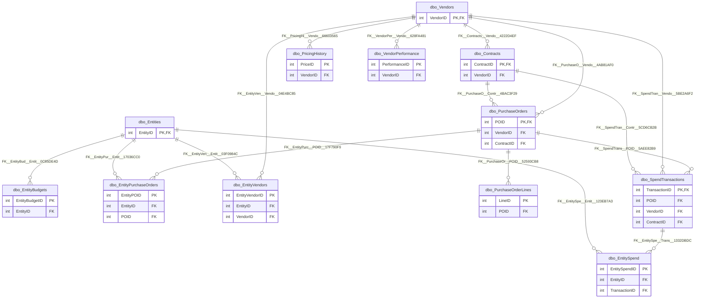

# Database: `ProcurementAnalytics`

[← back to top](../../../SCHEMA.md)

## Schema: `dbo`

### Tables

| Table | Rows | Description |
|-------|------|-------------|
| [`dbo.BudgetAllocations`](dbo.BudgetAllocations.md) | 80 | Org-level budget allocations (department / cost center / project / category) used as the rollup target for entity-level spend analytics. |
| [`dbo.Contracts`](dbo.Contracts.md) | 815 | Cooperative-contract master used for spend analytics. Captures contract value, term, negotiated savings, status, and auto-renew settings per (vendor, contract). |
| [`dbo.Entities`](dbo.Entities.md) | 20 | Customer entities (districts and other public organizations) participating in cooperative procurement — analytics-side master record. Distinct from `EDS.dbo.… |
| [`dbo.EntityBudgets`](dbo.EntityBudgets.md) | 240 | Per-entity, per-fiscal-year budget allocations by category. `AllocatedAmount` is the original amount; `AmendedAmount` reflects mid-year revisions. |
| [`dbo.EntityPurchaseOrders`](dbo.EntityPurchaseOrders.md) | 4035 |  |
| [`dbo.EntitySpend`](dbo.EntitySpend.md) | 12261 | Bridge linking an `Entity` to a `SpendTransaction` so spend can be rolled up by entity without re-traversing the PO chain. |
| [`dbo.EntityVendors`](dbo.EntityVendors.md) | 910 | Many-to-many of which vendors each entity transacts with, including the relationship start date and a primary-vendor flag. |
| [`dbo.PricingHistory`](dbo.PricingHistory.md) | 8480 |  |
| [`dbo.PurchaseOrderLines`](dbo.PurchaseOrderLines.md) | 16159 | PO line detail joined back to its `PurchaseOrders` header. Holds qty, unit price, line total, UoM, and received qty for variance analysis. |
| [`dbo.PurchaseOrders`](dbo.PurchaseOrders.md) | 5355 | PO header — analytics flatten of EDS PO data with denormalized department / cost-center / project-code fields and lifecycle dates. |
| [`dbo.SpendTransactions`](dbo.SpendTransactions.md) | 16159 | Atomic spend events feeding the analytics fact tables. Each row pairs a PO line with a contract (or `IsOffContract = 1` for maverick spend) plus fiscal-perio… |
| [`dbo.VendorPerformance`](dbo.VendorPerformance.md) | 4712 | Periodic vendor scorecards — on-time-delivery percent, quality, defect rate, responsiveness, cost competitiveness, and overall score. Drives vendor ranking a… |
| [`dbo.Vendors`](dbo.Vendors.md) | 750 | Analytics-side vendor master. Smaller and cleaner than `EDS.dbo.Vendors` — kept in sync via the analytics ETL. |

## Entity Relationship Diagram

_Generated by `npm run docs:erd`. Only tables with FK relationships shown. PK and FK columns only._

