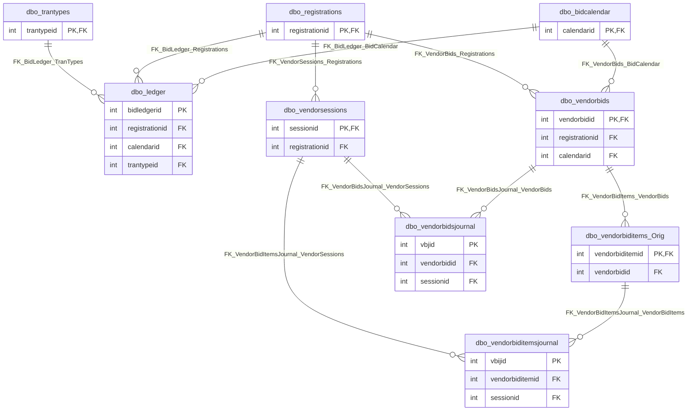

# Database: `VendorBids_TEST`

[← back to top](../../../SCHEMA.md)

## Schema: `dbo`

### Tables

| Table | Rows | Description |
|-------|------|-------------|
| [`dbo.bidcalendar`](dbo.bidcalendar.md) | 6539 |  |
| [`dbo.bidcalendaritems`](dbo.bidcalendaritems.md) | 1642206 |  |
| [`dbo.biddocumentacks`](dbo.biddocumentacks.md) | 18 |  |
| [`dbo.BidDocumentLog`](dbo.BidDocumentLog.md) | 26 |  |
| [`dbo.biddocuments`](dbo.biddocuments.md) | 169971 |  |
| [`dbo.BidManagers`](dbo.BidManagers.md) | 0 |  |
| [`dbo.BidSchedule`](dbo.BidSchedule.md) | 1587 |  |
| [`dbo.BidScheduleCats`](dbo.BidScheduleCats.md) | 3040 |  |
| [`dbo.Categories`](dbo.Categories.md) | 63 |  |
| [`dbo.Cooperatives`](dbo.Cooperatives.md) | 15 |  |
| [`dbo.debugmsgs`](dbo.debugmsgs.md) | 53556 |  |
| [`dbo.DocumentUploads`](dbo.DocumentUploads.md) | 133029 |  |
| [`dbo.DownloadLog`](dbo.DownloadLog.md) | 418063 |  |
| [`dbo.dtproperties`](dbo.dtproperties.md) | 7 |  |
| [`dbo.ledger`](dbo.ledger.md) | 0 |  |
| [`dbo.Regcalendar`](dbo.Regcalendar.md) | 616829 |  |
| [`dbo.regcalsaved`](dbo.regcalsaved.md) | 998 |  |
| [`dbo.registrations`](dbo.registrations.md) | 14126 |  |
| [`dbo.regusers`](dbo.regusers.md) | 13111 |  |
| [`dbo.SavedRegCal`](dbo.SavedRegCal.md) | 42471 |  |
| [`dbo.States`](dbo.States.md) | 2 |  |
| [`dbo.statustable`](dbo.statustable.md) | 2 |  |
| [`dbo.sysdiagrams`](dbo.sysdiagrams.md) | 1 |  |
| [`dbo.testrc`](dbo.testrc.md) | 2117 |  |
| [`dbo.TransmitLog`](dbo.TransmitLog.md) | 4275 |  |
| [`dbo.trantypes`](dbo.trantypes.md) | 3 |  |
| [`dbo.TypeFilters`](dbo.TypeFilters.md) | 3 |  |
| [`dbo.vendorbidimports`](dbo.vendorbidimports.md) | 0 |  |
| [`dbo.vendorbiditemimports`](dbo.vendorbiditemimports.md) | 0 |  |
| [`dbo.vendorbiditems`](dbo.vendorbiditems.md) | 24207430 |  |
| [`dbo.vendorbiditems_Orig`](dbo.vendorbiditems_Orig.md) | 20031681 |  |
| [`dbo.vendorbiditemsjournal`](dbo.vendorbiditemsjournal.md) | 5217289 |  |
| [`dbo.VendorBidMSRPPriceRanges`](dbo.VendorBidMSRPPriceRanges.md) | 522585 |  |
| [`dbo.VendorBidMSRPResults`](dbo.VendorBidMSRPResults.md) | 138158 |  |
| [`dbo.VendorBidMSRPResultsJournal`](dbo.VendorBidMSRPResultsJournal.md) | 137608 |  |
| [`dbo.vendorbids`](dbo.vendorbids.md) | 58080 |  |
| [`dbo.vendorbidsjournal`](dbo.vendorbidsjournal.md) | 58242 |  |
| [`dbo.VendorBidTMAnswers`](dbo.VendorBidTMAnswers.md) | 671619 |  |
| [`dbo.VendorBidTMAnswersJournal`](dbo.VendorBidTMAnswersJournal.md) | 671643 |  |
| [`dbo.VendorEmailLog`](dbo.VendorEmailLog.md) | 778732 |  |
| [`dbo.vendorsessions`](dbo.vendorsessions.md) | 59482 |  |

### Views

| View | Description |
|------|-------------|
| [`dbo.bidcalendardistricts`](dbo.bidcalendardistricts.md) |  |
| [`dbo.BidDocumentsView`](dbo.BidDocumentsView.md) |  |
| [`dbo.BidDocumentsViewByUser`](dbo.BidDocumentsViewByUser.md) |  |
| [`dbo.BidMgrCategoryByBidScheduleIdVendorId`](dbo.BidMgrCategoryByBidScheduleIdVendorId.md) |  |
| [`dbo.BidMgrVendorbidsForImport`](dbo.BidMgrVendorbidsForImport.md) |  |
| [`dbo.BidMgrVendorEmailListView`](dbo.BidMgrVendorEmailListView.md) |  |
| [`dbo.BidMgrVendorEmailLogCount`](dbo.BidMgrVendorEmailLogCount.md) |  |
| [`dbo.BidScheduleView`](dbo.BidScheduleView.md) |  |
| [`dbo.CategoryView`](dbo.CategoryView.md) |  |
| [`dbo.cfv_vendorbidsview`](dbo.cfv_vendorbidsview.md) |  |
| [`dbo.filterCategories`](dbo.filterCategories.md) |  |
| [`dbo.filterStates`](dbo.filterStates.md) |  |
| [`dbo.filterStatuses`](dbo.filterStatuses.md) |  |
| [`dbo.usersView`](dbo.usersView.md) |  |
| [`dbo.vendorbiditemsview`](dbo.vendorbiditemsview.md) |  |
| [`dbo.VendorBidLookup`](dbo.VendorBidLookup.md) |  |
| [`dbo.vendorbidsforimport`](dbo.vendorbidsforimport.md) |  |
| [`dbo.vendorbidsList`](dbo.vendorbidsList.md) |  |
| [`dbo.vendorbidsview`](dbo.vendorbidsview.md) |  |
| [`dbo.vendorbidsviewByUser`](dbo.vendorbidsviewByUser.md) |  |
| [`dbo.vendordocumentsviewByUser`](dbo.vendordocumentsviewByUser.md) |  |
| [`dbo.vw_DocumentUploads`](dbo.vw_DocumentUploads.md) |  |
| [`dbo.vw_UploadedDocuments`](dbo.vw_UploadedDocuments.md) |  |

## Routines

| Schema | Name | Type | Returns |
|--------|------|------|---------|
| `dbo` | `dt_addtosourcecontrol` | PROCEDURE |  |
| `dbo` | `dt_addtosourcecontrol_u` | PROCEDURE |  |
| `dbo` | `dt_adduserobject` | PROCEDURE |  |
| `dbo` | `dt_adduserobject_vcs` | PROCEDURE |  |
| `dbo` | `dt_checkinobject` | PROCEDURE |  |
| `dbo` | `dt_checkinobject_u` | PROCEDURE |  |
| `dbo` | `dt_checkoutobject` | PROCEDURE |  |
| `dbo` | `dt_checkoutobject_u` | PROCEDURE |  |
| `dbo` | `dt_displayoaerror` | PROCEDURE |  |
| `dbo` | `dt_displayoaerror_u` | PROCEDURE |  |
| `dbo` | `dt_droppropertiesbyid` | PROCEDURE |  |
| `dbo` | `dt_dropuserobjectbyid` | PROCEDURE |  |
| `dbo` | `dt_generateansiname` | PROCEDURE |  |
| `dbo` | `dt_getobjwithprop` | PROCEDURE |  |
| `dbo` | `dt_getobjwithprop_u` | PROCEDURE |  |
| `dbo` | `dt_getpropertiesbyid` | PROCEDURE |  |
| `dbo` | `dt_getpropertiesbyid_u` | PROCEDURE |  |
| `dbo` | `dt_getpropertiesbyid_vcs` | PROCEDURE |  |
| `dbo` | `dt_getpropertiesbyid_vcs_u` | PROCEDURE |  |
| `dbo` | `dt_isundersourcecontrol` | PROCEDURE |  |
| `dbo` | `dt_isundersourcecontrol_u` | PROCEDURE |  |
| `dbo` | `dt_removefromsourcecontrol` | PROCEDURE |  |
| `dbo` | `dt_setpropertybyid` | PROCEDURE |  |
| `dbo` | `dt_setpropertybyid_u` | PROCEDURE |  |
| `dbo` | `dt_validateloginparams` | PROCEDURE |  |
| `dbo` | `dt_validateloginparams_u` | PROCEDURE |  |
| `dbo` | `dt_vcsenabled` | PROCEDURE |  |
| `dbo` | `dt_verstamp006` | PROCEDURE |  |
| `dbo` | `dt_verstamp007` | PROCEDURE |  |
| `dbo` | `dt_whocheckedout` | PROCEDURE |  |
| `dbo` | `dt_whocheckedout_u` | PROCEDURE |  |
| `dbo` | `fn_diagramobjects` | FUNCTION | int |
| `dbo` | `sp_AcknowledgeBidDocument` | PROCEDURE |  |
| `dbo` | `sp_alterdiagram` | PROCEDURE |  |
| `dbo` | `sp_AttemptLogin` | PROCEDURE |  |
| `dbo` | `sp_CreateBidDocumentAck` | PROCEDURE |  |
| `dbo` | `sp_createBidItemsJournalEntry` | PROCEDURE |  |
| `dbo` | `sp_CreateBidJournalEntry` | PROCEDURE |  |
| `dbo` | `sp_creatediagram` | PROCEDURE |  |
| `dbo` | `sp_CreateNewBid` | PROCEDURE |  |
| `dbo` | `sp_CreateVendorSession` | PROCEDURE |  |
| `dbo` | `sp_DeleteBid` | PROCEDURE |  |
| `dbo` | `sp_DeleteBidCalendar` | PROCEDURE |  |
| `dbo` | `sp_dropdiagram` | PROCEDURE |  |
| `dbo` | `sp_helpdiagramdefinition` | PROCEDURE |  |
| `dbo` | `sp_helpdiagrams` | PROCEDURE |  |
| `dbo` | `sp_ImportBid` | PROCEDURE |  |
| `dbo` | `sp_ImportBidItem` | PROCEDURE |  |
| `dbo` | `sp_LogBidDocumentDownload` | PROCEDURE |  |
| `dbo` | `sp_LogDownload` | PROCEDURE |  |
| `dbo` | `sp_NewVendorBid` | PROCEDURE |  |
| `dbo` | `sp_ProcessBid` | PROCEDURE |  |
| `dbo` | `sp_RegDistrictsUpdate` | PROCEDURE |  |
| `dbo` | `sp_RegistrationsUpdate` | PROCEDURE |  |
| `dbo` | `sp_RegStatesUpdate` | PROCEDURE |  |
| `dbo` | `sp_renamediagram` | PROCEDURE |  |
| `dbo` | `sp_SubDistrictsUpdate` | PROCEDURE |  |
| `dbo` | `sp_SubmitBid` | PROCEDURE |  |
| `dbo` | `sp_SubmitBidwDate` | PROCEDURE |  |
| `dbo` | `sp_SubStatesUpdate` | PROCEDURE |  |
| `dbo` | `sp_UnDeleteBid` | PROCEDURE |  |
| `dbo` | `sp_upgraddiagrams` | PROCEDURE |  |
| `dbo` | `sp_VBUpload` | PROCEDURE |  |
| `dbo` | `sp_VBUploadItem` | PROCEDURE |  |
| `dbo` | `sp_VBUploadXML` | PROCEDURE |  |
| `dbo` | `sp_VBUploadXMLSaved` | PROCEDURE |  |
| `dbo` | `sp_VBUploadXMLTest` | PROCEDURE |  |
| `dbo` | `sp_VendorBidItemMaint` | PROCEDURE |  |
| `dbo` | `sp_VendorBiditemsView` | PROCEDURE |  |
| `dbo` | `sp_VendorBiditemsViewReport` | PROCEDURE |  |
| `dbo` | `sp_VendorBidMaint` | PROCEDURE |  |
| `dbo` | `sp_VendorBidsView` | PROCEDURE |  |
| `dbo` | `uf_BidCategories` | FUNCTION | varchar |
| `dbo` | `uf_vendorbidanswersview` | FUNCTION | TABLE |
| `dbo` | `uf_vendorbiditemsimportview` | FUNCTION | TABLE |
| `dbo` | `uf_vendorbiditemsview` | FUNCTION | TABLE |
| `dbo` | `uf_vendorbiditemsviewDiscounted` | FUNCTION | TABLE |
| `dbo` | `uf_VendorBidMSRPResultsView` | FUNCTION | TABLE |
| `dbo` | `uf_vendorbidsview` | FUNCTION | TABLE |
| `dbo` | `uf_vendorbidsviewDiscounted` | FUNCTION | TABLE |
| `dbo` | `usp_ReturnBidDocumentStatus` | PROCEDURE |  |

## Entity Relationship Diagram

_Generated by `npm run docs:erd`. Only tables with FK relationships shown. PK and FK columns only._

